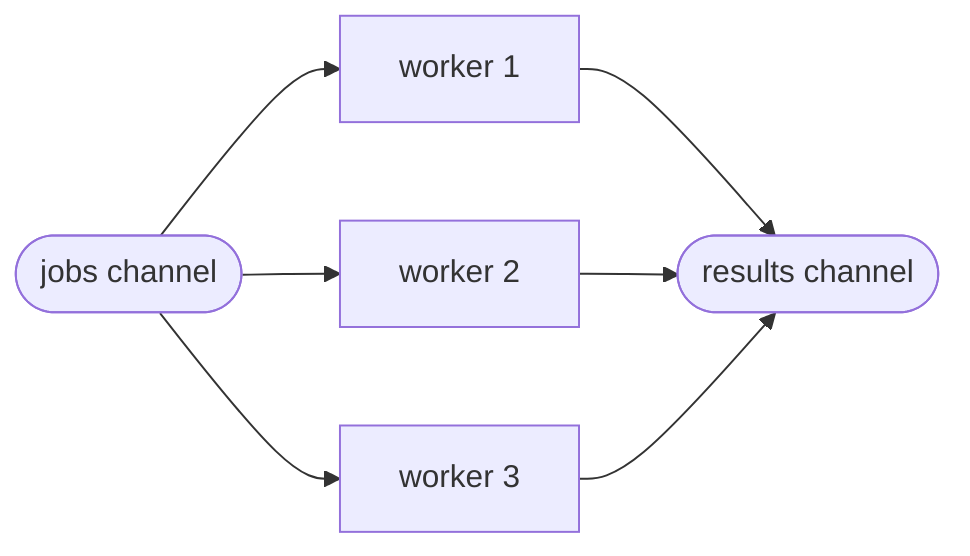
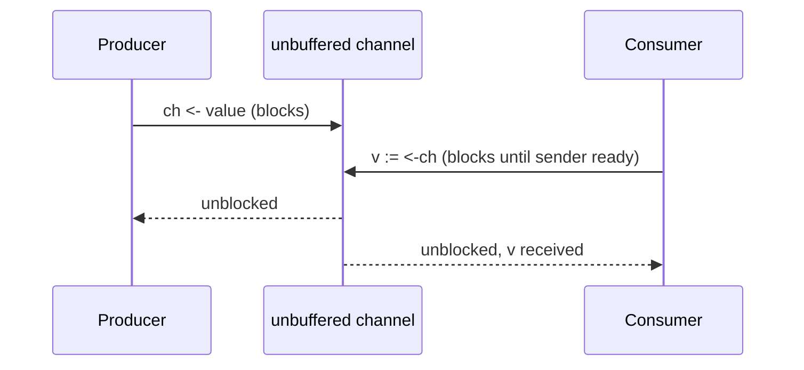

# Concurrency — Revision Notes (with Go)

## Concurrency vs. Parallelism

**Concurrency** is about *structuring* a program as multiple independent
tasks that can make progress without waiting for each other to fully
finish — it's a program design property. **Parallelism** is about
*actually running* multiple tasks at the same literal instant, which
requires multiple CPU cores. A concurrent program can run on a single core
(interleaved) or across many cores (parallel) — concurrency is what makes
parallelism possible, but doesn't require it.

## Visual Overview

A worker pool (see the code further down): one job channel feeds a fixed
number of goroutines, and their results flow into one results channel:



An **unbuffered** channel send blocks until a receiver is ready — that
handshake is itself a synchronization point:



## Goroutines

A goroutine is a lightweight, runtime-managed thread of execution — Go's
scheduler multiplexes many goroutines onto a smaller number of OS threads.
Starting one is cheap (a few KB of initial stack, growable) compared to an
OS thread, so it's normal to start thousands.

```go
go doWork(arg) // starts concurrently; doesn't block the caller
```

**Common pitfall**: the main goroutine exiting doesn't wait for other
goroutines — use a `sync.WaitGroup` or channel to synchronize completion.

## Channels

Channels are typed conduits for communicating between goroutines, embodying
Go's "don't communicate by sharing memory; share memory by communicating"
philosophy.

```go
ch := make(chan int)      // unbuffered: send blocks until a receiver is ready
ch := make(chan int, 10)  // buffered: send blocks only once the buffer is full

ch <- 5       // send
v := <-ch     // receive
v, ok := <-ch // ok is false if the channel is closed and drained
close(ch)     // signals no more values will be sent
```

An unbuffered channel send/receive pair is a synchronization point — the
sender blocks until a receiver is ready, guaranteeing a happens-before
relationship (see the Go Memory Model).

## Mutex / RWMutex

`sync.Mutex` provides exclusive access to a critical section.
`sync.RWMutex` distinguishes readers (many allowed concurrently) from
writers (exclusive) — use it when reads vastly outnumber writes.

```go
var mu sync.Mutex
mu.Lock()
defer mu.Unlock()
sharedState++
```

Prefer channels for *coordinating* goroutines (signaling, pipelines) and
mutexes for protecting *shared mutable state* accessed directly — both are
valid Go idioms depending on the shape of the problem, despite the
"share memory by communicating" slogan.

## Atomic Operations

`sync/atomic` provides lock-free primitives for simple operations (counter
increments, compare-and-swap) faster than a mutex for single-variable
updates, at the cost of only supporting simple operations (not compound
critical sections spanning multiple variables).

```go
var counter atomic.Int64
counter.Add(1)
```

## Race Conditions

Occur when goroutines access shared memory concurrently without
synchronization, and at least one access is a write. Detect them with
`go test -race` / `go run -race` — the race detector instruments memory
accesses and flags conflicting unsynchronized accesses at runtime (it
doesn't guarantee finding every race, since it only observes what
actually executes, but it's the standard first tool to reach for).

## Deadlocks and Starvation

**Deadlock**: goroutines waiting on each other in a cycle (e.g., two
goroutines each holding a lock the other needs) — the Go runtime detects
*global* deadlock (all goroutines asleep) and panics, but can't detect a
partial deadlock among a subset of goroutines while others still run.
**Starvation**: a goroutine perpetually loses out on a resource/lock to
others — `sync.Mutex` in Go is not strictly FIFO-fair, so pathological
patterns can (rarely) starve a goroutine; `sync.RWMutex` writers can starve
under continuous reader load in some implementations.

## Worker Pools

Bound concurrency to a fixed number of workers pulling from a shared job
channel — prevents unbounded goroutine creation from overwhelming a
resource (CPU, downstream service, memory).

```go
func workerPool(jobs <-chan int, results chan<- int, numWorkers int) {
    var wg sync.WaitGroup
    for i := 0; i < numWorkers; i++ {
        wg.Add(1)
        go func() {
            defer wg.Done()
            for job := range jobs {
                results <- process(job)
            }
        }()
    }
    go func() {
        wg.Wait()
        close(results)
    }()
}
```

## Producer/Consumer

A classic pattern where producers send values on a channel and consumers
receive them — the channel itself (buffered, to a chosen capacity) provides
the coordination and backpressure, with no explicit condition
variable/lock bookkeeping needed.

## Fan-In / Fan-Out

**Fan-out**: distribute work from one source across multiple goroutines
(e.g., the worker pool above). **Fan-in**: merge multiple channels' outputs
into a single channel.

```go
func fanIn(channels ...<-chan int) <-chan int {
    out := make(chan int)
    var wg sync.WaitGroup
    wg.Add(len(channels))
    for _, c := range channels {
        go func(c <-chan int) {
            defer wg.Done()
            for v := range c {
                out <- v
            }
        }(c)
    }
    go func() {
        wg.Wait()
        close(out)
    }()
    return out
}
```

## Context Cancellation

`context.Context` propagates cancellation signals, deadlines, and
request-scoped values across API boundaries and goroutines — the standard
way to say "stop what you're doing" to a tree of goroutines.

```go
func worker(ctx context.Context, jobs <-chan int) {
    for {
        select {
        case <-ctx.Done():
            return // cancelled or deadline exceeded
        case job, ok := <-jobs:
            if !ok {
                return
            }
            process(job)
        }
    }
}
```

## Common Interview Questions

- Implement a worker pool with bounded concurrency (above).
- Implement a rate limiter using a ticker/token bucket (see
  `system-design/case-studies/rate-limiter.md` for the design-level
  version).
- What's the difference between a buffered and unbuffered channel, in
  terms of synchronization guarantees?
- When would you use a mutex instead of a channel, and vice versa?
- Explain what `go test -race` actually detects, and what it can't detect.

## Quick Revision

- **Concurrency ≠ parallelism**: structure vs. simultaneous execution.
- **Goroutines**: cheap, runtime-scheduled; remember to synchronize
  completion (`sync.WaitGroup` or channels) — the program doesn't wait for
  them automatically.
- **Channels**: unbuffered = synchronization point; buffered = async up to
  capacity.
- **Mutex/RWMutex**: protect shared mutable state directly; channels
  coordinate goroutines — both are idiomatic depending on the shape of the
  problem.
- **atomic**: lock-free single-variable operations, faster than a mutex for
  simple counters.
- **Worker pool**: bound concurrency via a fixed number of goroutines
  reading from a shared job channel.
- **context.Context**: the standard cancellation/deadline propagation
  mechanism.
