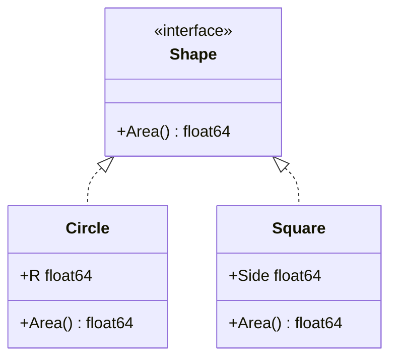

# Object-Oriented Programming — Revision Notes

For the one-screen version, see [`quick-revision.md`](quick-revision.md).
For how these concepts differ across C++, Java, and Go specifically
(virtual functions/vtables, abstract classes vs. interfaces, multiple
inheritance, constructors/destructors, operator overloading), see
[`language-specific-notes.md`](language-specific-notes.md).

## Visual Overview

Structural polymorphism via interfaces (the `Shape` example used
throughout this page) — neither `Circle` nor `Square` declares
`implements Shape` anywhere; each satisfies it purely by having an
`Area()` method:



## Class and Object

**Question:** What's the difference between a class and an object?
**Short Answer:** A class is a blueprint; an object is an instance built
from that blueprint, with its own state.
**Detailed Explanation:** A class defines the structure (fields) and
behavior (methods) shared by all its instances. An object is a concrete
value in memory conforming to that structure, holding its own data. Go
doesn't have classes, but a `struct` plus methods defined on it plays the
same role — `type Account struct { Balance int }` is the "class," and
`Account{Balance: 100}` is an object.
**Example:**
```go
type Account struct {
    Balance int
}
func (a *Account) Deposit(amount int) { a.Balance += amount }
```
**Common Misconception:** That you need class-based inheritance syntax to
"do OOP." Go achieves encapsulation, polymorphism (via interfaces), and
composition without classes or inheritance at all — OOP is a set of
principles, not a specific syntax.

## Encapsulation

**Question:** What is encapsulation and why does it matter?
**Short Answer:** Bundling data with the methods that operate on it, and
restricting direct access to that data from outside.
**Detailed Explanation:** Encapsulation protects an object's internal
invariants — code outside the object can't put it into an inconsistent
state because it can only interact through a controlled interface (methods).
In Go, this is done via capitalization: exported (`Capitalized`) identifiers
are public API; unexported (`lowercase`) identifiers are package-private.
There's no `private`/`protected` keyword — visibility is per-package, not
per-type.
**Example:**
```go
type BankAccount struct {
    balance int // unexported: can't be mutated directly from other packages
}
func (b *BankAccount) Withdraw(amount int) error {
    if amount > b.balance {
        return errors.New("insufficient funds")
    }
    b.balance -= amount
    return nil
}
```
**Common Misconception:** That encapsulation means "make everything private."
It means exposing exactly the operations that preserve your invariants —
sometimes that includes exported fields, if there's no invariant to
protect.

## Abstraction

**Question:** How does abstraction differ from encapsulation?
**Short Answer:** Abstraction hides *complexity* behind a simpler
interface; encapsulation hides *data* behind controlled access.
**Detailed Explanation:** Abstraction is about designing an interface that
lets callers think in terms of "what" rather than "how" — e.g., a
`Sorter` interface lets callers sort without knowing if it's quicksort or
mergesort underneath. Encapsulation is the mechanism (access control) that
often supports abstraction, but they're distinct concerns: you can
encapsulate data with no meaningful abstraction, and you can abstract
behavior (an interface) with no data hiding involved at all.
**Example:** Go's `sort.Interface` (`Len`, `Less`, `Swap`) abstracts "how
to sort" — `sort.Sort` doesn't know or care about the concrete type.
**Common Misconception:** Treating abstraction and encapsulation as
synonyms — they solve different problems and can exist independently.

## Inheritance

**Question:** Does Go support inheritance?
**Short Answer:** No — Go uses composition (struct embedding) and
interfaces instead of classical inheritance.
**Detailed Explanation:** Classical inheritance (as in Java/C++) creates an
"is-a" relationship and lets a subclass override parent behavior, often
leading to fragile hierarchies (the "fragile base class" problem). Go
deliberately omits this. Struct embedding lets one struct "inherit" the
fields/methods of another by composition, promoting them to the outer
type's method set — but there's no dynamic dispatch or overriding; it's
purely a way to reuse and forward calls.
**Example:**
```go
type Animal struct{ Name string }
func (a Animal) Speak() string { return a.Name + " makes a sound" }

type Dog struct{ Animal } // embedding, not inheritance
func (d Dog) Speak() string { return d.Name + " barks" } // shadows Animal.Speak
```
**Common Misconception:** That struct embedding is inheritance. It's
composition with method promotion — there's no polymorphic dispatch through
a base-type reference the way there is with classical inheritance.

*C++ allows multiple inheritance directly (with `virtual` inheritance to
solve the resulting diamond problem); Java allows only single class
inheritance plus multiple interface implementation. See
[`language-specific-notes.md`](language-specific-notes.md#multiple-inheritance-and-the-diamond-problem)
for the details and code.*

## Polymorphism

**Question:** How does Go achieve polymorphism without classes?
**Short Answer:** Via interfaces — any type that implements an interface's
method set satisfies it implicitly, with no `implements` keyword.
**Detailed Explanation:** Go's interfaces are structurally typed
("duck typing" with compile-time checking): a type satisfies an interface
simply by having the right methods, no explicit declaration required. This
gives you the same "write code against an abstraction, swap implementations
freely" benefit as classical polymorphism, but decouples the interface
definition from the implementing type entirely (an interface can even be
defined *after* the type, in a completely different package).
**Example:**
```go
type Shape interface{ Area() float64 }
type Circle struct{ R float64 }
func (c Circle) Area() float64 { return math.Pi * c.R * c.R }
type Square struct{ Side float64 }
func (s Square) Area() float64 { return s.Side * s.Side }

func totalArea(shapes []Shape) float64 {
    sum := 0.0
    for _, s := range shapes {
        sum += s.Area()
    }
    return sum
}
```
**Common Misconception:** That polymorphism requires inheritance. Go proves
otherwise — interface-based (structural) polymorphism is arguably more
flexible since types don't need to be designed together in advance.

## Composition vs. Inheritance

**Question:** Why is "favor composition over inheritance" good advice?
**Short Answer:** Composition ("has-a") couples types more loosely than
inheritance ("is-a"), so changes to one type are less likely to break
others.
**Detailed Explanation:** Deep inheritance hierarchies force subclasses to
depend on their parent's implementation details, and changes to a base
class can silently break every subclass. Composition builds behavior by
combining small, independent pieces — changing one piece doesn't ripple
through a hierarchy. Go's language design (no inheritance at all) is a
direct embodiment of this principle.
**Example:** A `Car` *has an* `Engine` (composition) rather than a `Car`
*is an* `Engine` (which would be inheritance and semantically wrong
anyway).
**Common Misconception:** That composition can't achieve code reuse as
well as inheritance — in practice, composition plus interfaces reuses code
just as effectively while avoiding tight coupling.

## Association, Aggregation, Composition (UML Relationships)

**Question:** What's the difference between association, aggregation, and
composition?
**Short Answer:** Association is a general "uses/knows about" relationship;
aggregation is a "has-a" where the parts can outlive the whole; composition
is a "has-a" where the parts' lifecycle is owned by the whole.
**Detailed Explanation:**
- **Association**: two objects interact, but neither owns the other (a
  `Teacher` and a `Student` both know about a `Course`).
- **Aggregation**: a whole contains parts, but the parts can exist
  independently (a `Department` has `Professors`, but a professor still
  exists if the department is dissolved).
- **Composition**: the whole owns the parts' lifecycle — parts are created
  and destroyed with the whole (a `House` has `Rooms`; rooms don't exist
  independently of the house).
**Example:** In Go, composition is often expressed by embedding a value
type (owned, same lifetime), while aggregation is often expressed with a
pointer/reference to an independently-managed object.
**Common Misconception:** Treating "composition" (this UML sense: ownership
strength) and "composition over inheritance" (a design principle about
building types from parts) as the same concept — they're related but
distinct uses of the word.

## Interfaces vs. Abstract Classes

**Question:** Go has no abstract classes — how do you get similar
behavior?
**Short Answer:** Interfaces define required behavior; a struct embedding
another struct can provide default/shared behavior, but Go has no
enforced "must override this method" mechanism.
**Detailed Explanation:** In languages with abstract classes, you can
define default behavior *and* a contract in one construct. Go splits these
concerns: interfaces are pure contracts (no implementation), and shared
default implementations come from composition/embedding or from plain
helper functions. This is more explicit but requires more deliberate
design — there's no compiler-enforced "abstract method."
**Common Misconception:** That an interface with a large method set is a
substitute for an abstract class with shared logic — it isn't; interfaces
carry zero implementation.

*See [`language-specific-notes.md`](language-specific-notes.md#abstract-classes-vs-interfaces)
for how C++ (no dedicated keyword) and Java (`abstract class` + `interface`,
with `default` methods since Java 8) handle this differently.*

## Method Overloading vs. Method Overriding

**Question:** Does Go support method overloading or overriding?
**Short Answer:** Neither, in the classical sense — Go doesn't allow
multiple methods with the same name and different signatures on the same
type, and there's no inheritance to override through.
**Detailed Explanation:** "Overloading" (same name, different parameter
types/counts) is absent — Go requires unique method names per type;
variadic parameters (`func(nums ...int)`) or accepting an interface
parameter are the usual workarounds. "Overriding" (subclass replaces a
parent's method) doesn't apply since there's no inheritance; struct
embedding lets an outer type define a method with the same name as an
embedded type's method, which *shadows* it for direct calls, but this
isn't dynamic dispatch — it's straightforward method resolution based on
the static type.

*C++ and Java both support real method overloading (resolved by signature
at compile time) — see
[`language-specific-notes.md`](language-specific-notes.md#method-overloading-revisited-per-language)
for the mechanism in each, and how it differs from overriding.*

## Static vs. Dynamic Binding

**Question:** What determines which method implementation runs in Go?
**Short Answer:** Calling a method on a concrete type is resolved
statically (compile-time); calling a method through an interface value is
resolved dynamically (at runtime, based on the value's actual type).
**Detailed Explanation:** This is exactly how Go achieves polymorphism:
an interface variable stores both a value and its type; calling a method
on it looks up that type's implementation at runtime. Calling a method
directly on a concrete struct value has no such indirection — it's a
direct compile-time-resolved call.
**Common Misconception:** Assuming Go has no dynamic dispatch at all
because it has no inheritance — dynamic dispatch happens through
interfaces, just not through class hierarchies.

*C++ and Java implement dynamic dispatch via an explicit vtable mechanism
instead — see
[`language-specific-notes.md`](language-specific-notes.md#virtual-functions-and-the-vtable)
for how the `virtual` keyword and vtables work, and why Java methods are
virtual by default while C++'s are not.*

## SOLID Principles

- **S — Single Responsibility**: a type/function should have one reason to
  change. **Interview angle**: ask what would force a change to this code,
  and check that there's only one such reason.
- **O — Open/Closed**: open for extension, closed for modification — add
  new behavior via new implementations of an interface, not by editing
  existing code. **Go example**: adding a new `Shape` implementation
  doesn't require touching `totalArea`.
- **L — Liskov Substitution**: a supertype's user shouldn't be able to
  tell (or be broken by) a substitution of any subtype/implementation. In
  Go: any type implementing an interface should honor the *behavioral*
  contract implied by that interface, not just the method signatures.
- **I — Interface Segregation**: prefer many small, focused interfaces over
  one large one — Go's standard library exemplifies this (`io.Reader`,
  `io.Writer` are each one method).
- **D — Dependency Inversion**: depend on abstractions (interfaces), not
  concrete implementations — pass an interface into a constructor/function
  rather than hard-coding a concrete type, enabling substitution
  (including for tests, via mocks).

## DRY, KISS, YAGNI

- **DRY (Don't Repeat Yourself)**: duplicated logic means duplicated bugs
  and maintenance cost — but don't over-apply this into premature,
  incorrect abstractions for code that merely *looks* similar today.
- **KISS (Keep It Simple)**: prefer the simplest design that solves the
  actual problem; complexity should be justified by a real requirement.
- **YAGNI (You Aren't Gonna Need It)**: don't build for hypothetical future
  requirements — add the abstraction when a second real use case appears,
  not before.

## Coupling and Cohesion

**Question:** What's the relationship between coupling and cohesion, and
why do we want low coupling / high cohesion?
**Short Answer:** Cohesion measures how focused a single module's
responsibilities are (high is good); coupling measures how much modules
depend on each other's internals (low is good).
**Detailed Explanation:** High cohesion means a module does one
well-defined thing, making it easy to understand and test in isolation.
Low coupling means modules interact through narrow, stable interfaces, so
a change in one module is unlikely to ripple into others. The two work
together: a system of small, highly cohesive modules connected through
narrow interfaces (low coupling) is easier to change safely than a system
of large modules with tangled cross-dependencies.

## Dependency Injection

**Question:** What is dependency injection and why is it useful?
**Short Answer:** Supplying a component's dependencies from the outside
(via constructor/function parameters) instead of having it construct them
itself.
**Detailed Explanation:** DI decouples a component from concrete
implementations of what it depends on, supporting the Dependency Inversion
principle. In Go, this usually means accepting an interface parameter
(e.g., a `Logger` or `Store` interface) in a constructor function, so
production code passes a real implementation and tests pass a fake/mock.
**Example:**
```go
type Store interface{ Get(id string) (string, error) }

type Service struct{ store Store }
func NewService(store Store) *Service { return &Service{store: store} }
```
**Common Misconception:** That DI requires a framework/container. In Go,
"DI" is usually just passing interface values into constructors — no
framework needed for most codebases.

## Common Design Patterns

See [`system-design/design-patterns/README.md`](../../system-design/design-patterns/README.md)
for structure, Go examples, and interview questions on Singleton, Factory,
Strategy, Observer, Decorator, and more.
