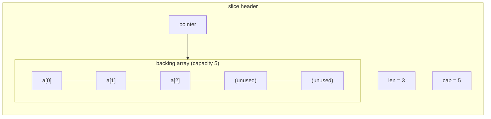

# Array (Slice)

## Concept

A contiguous block of memory holding elements of the same type, allowing
O(1) index-based access. Go doesn't expose fixed-size arrays as the primary
tool — `[]T` slices (a pointer + length + capacity over a backing array)
are what you use in practice, growing dynamically via `append`.

## Visual Overview



`len` is how many elements are in use; `cap` is how much backing-array
room exists before the next `append` must allocate a new, larger array.

## Operations & Complexity

| Operation | Complexity | Notes |
|---|---|---|
| Index access `a[i]` | O(1) | |
| Append (amortized) | O(1) amortized | Occasional O(n) reallocation when capacity is exceeded |
| Insert/delete at index | O(n) | Requires shifting elements |
| Search (unsorted) | O(n) | |
| Search (sorted) | O(log n) | Binary search |

## When to Use

- Need O(1) random access by index.
- Data size is known or grows incrementally and order matters.
- The default choice unless you specifically need faster
  insert/delete-in-the-middle (linked list) or key-based lookup (map).

## Go Reference

```go
a := make([]int, 0, 10) // length 0, capacity 10 — avoids early reallocation
a = append(a, 1, 2, 3)

// Remove index i (order not preserved, O(1)):
a[i] = a[len(a)-1]
a = a[:len(a)-1]

// Remove index i (order preserved, O(n)):
a = append(a[:i], a[i+1:]...)

// Insert x at index i (order preserved, O(n)):
a = append(a[:i], append([]int{x}, a[i:]...)...)
```

Note: `append(a[:i], a[i+1:]...)` and the insert idiom above mutate the
underlying array in place — be careful about aliasing if other slices share
the same backing array.

## Common Interview Questions

- Reverse an array in place.
- Rotate an array by `k` positions (in-place via three reversals is the
  O(1)-extra-space idiomatic answer).
- Remove duplicates from a sorted array in place (two-pointer, see
  `dsa/two-pointers`).
- Explain slice growth: why does `append` sometimes reallocate, and what's
  the amortized cost?
