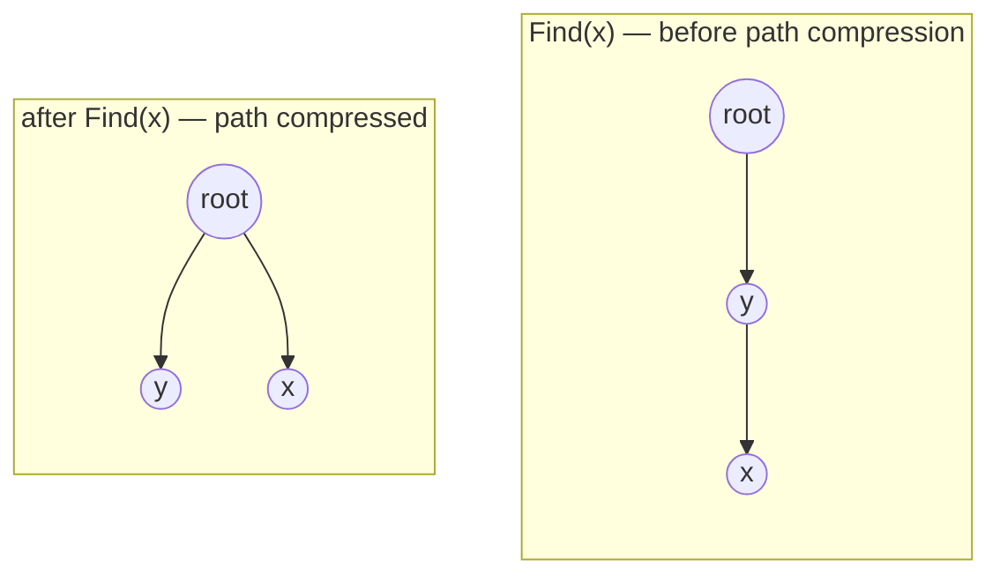
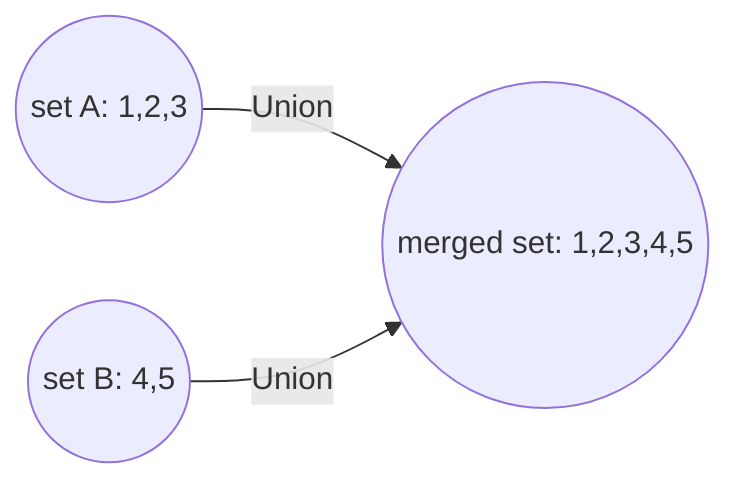

# Disjoint Set Union (Union-Find)

## Concept

Maintains a collection of disjoint sets, supporting two operations:
`Find(x)` (which set does `x` belong to?) and `Union(x, y)` (merge the sets
containing `x` and `y`). With two optimizations — **path compression** and
**union by rank/size** — both operations run in nearly O(1) amortized time
(technically O(α(n)), the inverse Ackermann function, which is ≤ 4 for any
practical `n`).

## Visual Overview





Path compression (top) flattens every node visited during a `Find` so it
points straight at the root — future `Find` calls on those same nodes
become O(1). `Union` (bottom) attaches one set's root under the other's.

## Operations & Complexity

| Operation | Complexity (with both optimizations) |
|---|---|
| Find | O(α(n)) amortized |
| Union | O(α(n)) amortized |

Without path compression and union by rank, a naive implementation
degrades to O(n) per operation in the worst case (a long chain).

## When to Use

- Dynamic connectivity: "are these two elements in the same group?" with
  merges happening over time (as opposed to a static graph, where BFS/DFS
  connected-components would suffice for a one-time query).
- Cycle detection while building an undirected graph incrementally (used
  in Kruskal's MST algorithm: adding an edge that connects two nodes
  already in the same set would create a cycle).
- Counting connected components as edges are added one at a time.

## Go Reference

```go
type DSU struct {
    parent []int
    rank   []int
}

func NewDSU(n int) *DSU {
    parent := make([]int, n)
    for i := range parent {
        parent[i] = i
    }
    return &DSU{parent: parent, rank: make([]int, n)}
}

func (d *DSU) Find(x int) int {
    if d.parent[x] != x {
        d.parent[x] = d.Find(d.parent[x]) // path compression
    }
    return d.parent[x]
}

func (d *DSU) Union(x, y int) bool {
    rootX, rootY := d.Find(x), d.Find(y)
    if rootX == rootY {
        return false // already connected — this edge would form a cycle
    }
    // Union by rank: attach the shorter tree under the taller one.
    if d.rank[rootX] < d.rank[rootY] {
        rootX, rootY = rootY, rootX
    }
    d.parent[rootY] = rootX
    if d.rank[rootX] == d.rank[rootY] {
        d.rank[rootX]++
    }
    return true
}
```

## Common Interview Questions

- Number of Connected Components in an Undirected Graph.
- Redundant Connection (find the edge that creates a cycle).
- Accounts Merge (union accounts sharing an email).
- Kruskal's MST algorithm (union-find to skip edges that would form a
  cycle).
- Number of Islands II (dynamic connectivity as land is added).
