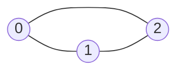

# Graph

## Concept

A set of nodes connected by edges, directed or undirected, weighted or
unweighted. See [`dsa/graphs`](../dsa/graphs/README.md) for the full set of
algorithms (BFS, DFS, topological sort, shortest path, MST). This note
covers representation choices only.

## Visual Overview

The same undirected graph as an adjacency list vs. an adjacency matrix:



```
adjacency list                 adjacency matrix
  0: [1, 2]                        0  1  2
  1: [0, 2]                    0 [ 0, 1, 1 ]
  2: [0, 1]                    1 [ 1, 0, 1 ]
                                2 [ 1, 1, 0 ]
```

The list only stores real edges (O(V+E) space); the matrix reserves a
cell for every possible pair regardless of whether an edge exists there
(O(V²) space), trading memory for an O(1) "are u and v connected?" check.

## Representations & Complexity

| Representation | Space | Edge check | Iterate neighbors |
|---|---|---|---|
| Adjacency list | O(V+E) | O(degree) | O(degree) |
| Adjacency matrix | O(V²) | O(1) | O(V) |

## When to Use Which

- **Adjacency list**: the default for sparse graphs (most interview
  problems, real-world graphs). `map[int][]int` or `[][]int` indexed by
  node ID.
- **Adjacency matrix**: dense graphs, or when O(1) "are u and v connected"
  checks matter more than memory (Floyd-Warshall is naturally matrix-based).
- **Implicit graph**: grids (4/8-directional neighbors), word-transformation
  graphs (Word Ladder), state-space search — don't build an explicit
  structure; generate neighbors on the fly.

## Go Reference

```go
// Adjacency list, unweighted:
adj := make(map[int][]int)
adj[u] = append(adj[u], v)
adj[v] = append(adj[v], u) // omit for a directed graph

// Adjacency list, weighted:
type Edge struct{ To, Weight int }
adj := make(map[int][]Edge)
adj[u] = append(adj[u], Edge{To: v, Weight: w})

// Adjacency matrix:
matrix := make([][]int, n)
for i := range matrix {
    matrix[i] = make([]int, n)
}
```

## Common Interview Questions

See `dsa/graphs/README.md` and `PATTERN-MAP.md` for the full graph-pattern
breakdown (BFS/DFS, cycle detection, topological sort, shortest path, MST).
