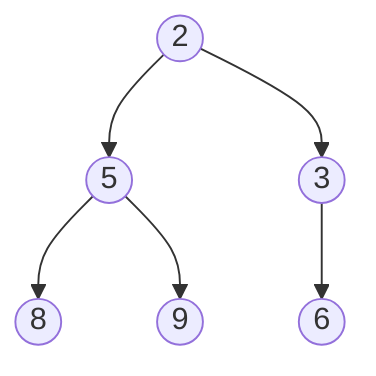

# Heap / Priority Queue

## Concept

A binary heap is a complete binary tree (stored as an array) satisfying the
heap property: every parent is ≤ (min-heap) or ≥ (max-heap) its children.
It gives O(log n) insert and O(log n) removal of the min/max element, with
O(1) peek.

## Visual Overview

A min-heap (every parent ≤ its children) — note this is only *partially*
ordered: `3` and `8` aren't directly comparable, only each is ≥ its parent
`2`:



The minimum is always the root (`2`), readable in O(1). Removing it
requires re-heapifying — moving a leaf into the root and sifting it down
until the heap property holds again, which takes O(log n).

## Operations & Complexity

| Operation | Complexity |
|---|---|
| Peek min/max | O(1) |
| Insert | O(log n) |
| Remove min/max | O(log n) |
| Build heap from n elements | O(n) (not O(n log n) — heapify is linear) |

## When to Use

- Need repeated access to the current min/max while the set changes
  (priority queues, scheduling).
- "Top K" / "K closest" / "K-th largest" problems — a heap of size `k`
  keeps the running answer in O(n log k) instead of sorting everything.
- Merge K sorted lists — a min-heap over the current head of each list.
- Dijkstra's algorithm relies on a min-heap keyed by current shortest
  distance.

## Go Reference

Go's `container/heap` package requires implementing `sort.Interface` plus
`Push`/`Pop`:

```go
type IntHeap []int

func (h IntHeap) Len() int            { return len(h) }
func (h IntHeap) Less(i, j int) bool  { return h[i] < h[j] } // min-heap
func (h IntHeap) Swap(i, j int)       { h[i], h[j] = h[j], h[i] }
func (h *IntHeap) Push(x interface{}) { *h = append(*h, x.(int)) }
func (h *IntHeap) Pop() interface{} {
    old := *h
    n := len(old)
    item := old[n-1]
    *h = old[:n-1]
    return item
}

// Usage:
h := &IntHeap{5, 2, 8}
heap.Init(h)
heap.Push(h, 1)
min := heap.Pop(h).(int)
```

For a max-heap, flip `Less` to `h[i] > h[j]`.

## Common Interview Questions

- Kth Largest Element in an Array/Stream.
- Merge K Sorted Lists.
- Top K Frequent Elements.
- Find Median from a Data Stream (two heaps: a max-heap for the lower half,
  a min-heap for the upper half).
- Task Scheduler / meeting room scheduling (heap keyed by end time).
