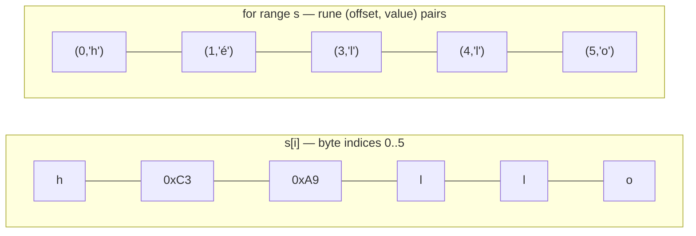

# String

## Concept

In Go, a `string` is an immutable, read-only sequence of bytes (typically
UTF-8 encoded). Iterating with `for range` yields runes (decoded Unicode
code points) and their byte offsets, not individual bytes — an important
distinction when a string contains multi-byte characters.

## Visual Overview

Byte iteration vs. rune iteration on a string containing a multi-byte
character (`"héllo"` — `é` is 2 UTF-8 bytes):



Indexing `s[i]` always gives a **byte**; `é` needs two of them (`0xC3
0xA9` in UTF-8). `for range` decodes one full rune per step instead,
which is why the rune loop has only 5 steps but skips from offset 1 to 3.

## Operations & Complexity

| Operation | Complexity | Notes |
|---|---|---|
| Index access `s[i]` | O(1) | Returns a **byte**, not necessarily a full character |
| Concatenation `a + b` | O(n+m) | Allocates a new string each time — O(n²) if done in a loop |
| Substring `s[i:j]` | O(1) | Shares the underlying array (no copy) |
| `strings.Builder` append | O(1) amortized | The correct way to build strings in a loop |

## When to Use

- Immutable text data. For building strings incrementally, use
  `strings.Builder` (or `bytes.Buffer`) instead of repeated `+=`
  concatenation, which is O(n²) overall due to repeated allocation.
- For heavy in-place character manipulation, convert to `[]byte` (ASCII) or
  `[]rune` (full Unicode) first, mutate, then convert back.

## Go Reference

```go
var sb strings.Builder
for _, w := range words {
    sb.WriteString(w)
    sb.WriteByte(' ')
}
result := sb.String()

// Byte vs rune iteration:
for i := 0; i < len(s); i++ {
    _ = s[i] // byte
}
for _, r := range s {
    _ = r // rune (decoded Unicode code point)
}
```

## Common Interview Questions

- Reverse a string (careful: reversing `[]byte` naively breaks multi-byte
  UTF-8 characters — convert to `[]rune` first for correctness).
- Check if two strings are anagrams (see `dsa/hashing/problems/group-anagrams`).
- Implement `strStr` (substring search) — naive O(n·m), or KMP for O(n+m).
- Explain why repeated `s += x` in a loop is O(n²) and how `strings.Builder`
  avoids it.
