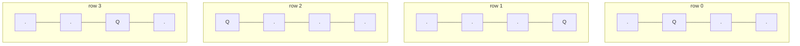

# Problem: N-Queens

## Problem Statement

Place `n` queens on an `n x n` chessboard such that no two queens attack
each other (no shared row, column, or diagonal). Return all distinct
solutions, each as a board configuration.

## Difficulty

Hard

## Technique

Backtracking + Constraint Pruning

## Problem Type

Backtracking

## Key Insight

Since no two queens can share a row, place exactly one queen per row and
recurse row by row — this alone eliminates the row-conflict dimension of
the search entirely. For column and diagonal conflicts, track which
columns and diagonals are already occupied using sets (or boolean arrays),
so checking "is this cell safe?" is O(1) instead of re-scanning the whole
board.

Diagonals have a useful indexing trick: every cell on the same
"positive" diagonal (`\`) shares the value `row - col`, and every cell on
the same "negative" diagonal (`/`) shares `row + col`. Tracking occupied
values of `row-col` and `row+col` in two sets covers all diagonal
conflicts in O(1) per check.

## Visual Overview

One of the two `n=4` solutions (`.Q..` / `...Q` / `Q...` / `..Q.`) — one
queen per row, no shared column or diagonal:

## How to Recognize This Pattern

- "Place items on a grid/board such that no two conflict" with row/column/
  diagonal-style constraints is a classic backtracking-with-pruning
  problem.
- The one-queen-per-row observation is a common trick for reducing a
  2D placement problem to a 1D backtracking problem (choose a column for
  each row).

## Approach 1 — Brute Force

### Idea
Try placing queens in every possible cell combination, validating the full
board only once all `n` queens are placed.

### Algorithm
Generate all `C(n², n)` placements (or all `nⁿ` column choices per row) and
filter valid ones.

### Complexity
Time: extremely high — at best `O(n!)` without pruning, at worst much more
Space: O(n²) per board

## Approach 2 — Optimized (Backtracking with O(1) Conflict Checks)

### Idea
Place one queen per row, choosing a column at each step. Track occupied
columns and both diagonal families in sets. Prune immediately if a column
or diagonal is already taken; only recurse into safe placements.

### Algorithm
1. `cols`, `diag1` (`row-col`), `diag2` (`row+col`) — three sets, initially
   empty.
2. `place(row)`:
   - If `row == n`: record the current board configuration; return.
   - For `col` from `0` to `n-1`:
     - If `col` in `cols`, or `row-col` in `diag1`, or `row+col` in
       `diag2`: skip (conflict).
     - Mark `cols[col]`, `diag1[row-col]`, `diag2[row+col]` as occupied;
       place the queen.
     - `place(row+1)`.
     - Unmark all three (undo); remove the queen.
3. Call `place(0)`.

### Complexity
Time: pruned exponential — much better in practice than the unpruned
brute force, though still exponential in the worst case (there is no known
polynomial solution to N-Queens).
Space: O(n) for the tracking sets and recursion depth, plus O(n²) per
solution stored.

## Sample Solution

See [`solution.go`](./solution.go).

## Dry Run

`n = 4` (one known solution)

- `row=0`: try `col=0` → safe → place; mark `cols={0}`, `diag1={0}`,
  `diag2={0}`.
- `row=1`: `col=0` conflicts (`cols`), `col=1` conflicts (`diag1: 1-1=0`
  already used), `col=2` safe → place; mark `cols={0,2}`, `diag1={0,-1}`,
  `diag2={0,3}`.
- `row=2`: `col=0` conflicts, `col=1` conflicts (`diag2: 2+1=3` used),
  `col=2` conflicts, `col=3` conflicts (`diag1: 2-3=-1` used) → **no valid
  column** → backtrack to `row=1`.
- `row=1`: try `col=3` → safe → place; mark `cols={0,3}`, `diag1={0,-2}`,
  `diag2={0,4}`.
- `row=2`: `col=1` is safe → place.
- `row=3`: `col=... ` continue similarly until a full valid placement
  (`[1,3,0,2]` as column-per-row, one of the two 4-queens solutions) is
  found, then backtrack to find the other.
- Total for `n=4`: exactly 2 solutions.

## Edge Cases

- `n = 1` → one trivial solution (single queen).
- `n = 2` or `n = 3` → no solutions exist (return an empty result).
- Larger `n` (e.g., 8) → 92 solutions — a good sanity check value.

## Common Mistakes

- Recomputing full-board validity from scratch at every placement instead
  of maintaining O(1) conflict-check sets — this is what turns a
  "technically correct but slow" solution into a fast one.
- Forgetting to unmark all three tracking sets on backtrack, corrupting
  later sibling branches.
- Off-by-one in the diagonal formulas (`row-col` vs `col-row` — either is
  fine as long as it's used consistently, but `row-col` and `row+col`
  together must uniquely capture both diagonal directions).

## Interview Follow-ups

- N-Queens II: return just the *count* of solutions, not the boards
  themselves — same algorithm, skip building board strings.
- Solve for the first valid solution only, not all of them — stop
  recursion as soon as one is found.

## Related Problems

- N-Queens II (count only)
- Sudoku Solver (same constraint-tracking backtracking shape, more
  constraint types)
