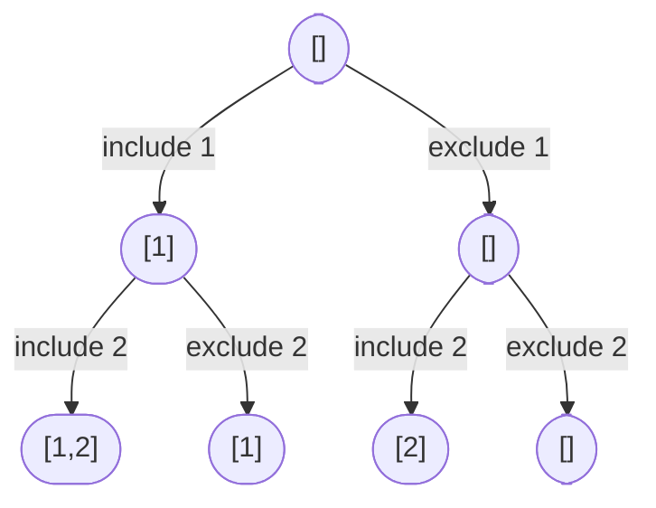

# Problem: Subsets

🔗 **[Try it on LeetCode](https://leetcode.com/problems/subsets/)**

## Problem Statement

Given an array `nums` of distinct integers, return all possible subsets
(the power set). The solution set must not contain duplicate subsets.

## Difficulty

Medium

## Technique

Backtracking

## Problem Type

Array

## Key Insight

Every element has exactly two states relative to any subset: included or
excluded. Walking through the array once and, at each element, branching
into "include it" and "exclude it" recursive calls generates every one of
the `2ⁿ` subsets exactly once.

## Visual Overview

`nums = [1, 2]` — the full include/exclude decision tree (see
`dsa/backtracking/README.md` for the same diagram in the general case):

## How to Recognize This Pattern

- "Return all subsets/the power set" is the direct include/exclude
  backtracking signal.
- Distinct elements simplify things — no need to worry about generating
  duplicate subsets from equal values (see Subsets II for that variant).

## Approach 1 — Brute Force (Bitmask Enumeration)

### Idea
Every subset corresponds to one of `2ⁿ` bitmasks over the `n` elements; for
each mask, include element `i` if bit `i` is set.

### Algorithm
For `mask` from `0` to `2ⁿ-1`, build the subset by checking each bit.

### Complexity
Time: O(n · 2ⁿ)
Space: O(n · 2ⁿ) for the output

## Approach 2 — Backtracking (Include/Exclude)

### Idea
Recurse through indices `0..n-1`. At each index, first recurse having
included `nums[i]` in the current path, then recurse having excluded it
(undoing the inclusion in between).

### Algorithm
1. `backtrack(index, path)`:
   - If `index == n`: record a copy of `path`; return.
   - Include: `path = append(path, nums[index])`; `backtrack(index+1,
     path)`; undo: `path = path[:len(path)-1]`.
   - Exclude: `backtrack(index+1, path)` (path unchanged).
2. Call `backtrack(0, [])`.

### Complexity
Time: O(n · 2ⁿ) — `2ⁿ` subsets, each up to `O(n)` to copy into the result
Space: O(n) recursion depth, plus O(n · 2ⁿ) for the output

## Sample Solution

See [`solution.go`](https://github.com/xudipta/prep/blob/main/dsa/backtracking/problems/subsets/solution.go).

It also has a C++ port at [`cpp/solution.cpp`](https://github.com/xudipta/prep/blob/main/dsa/backtracking/problems/subsets/cpp/solution.cpp), a self-contained file with its own `assert`-based `main()` as its test suite.

## Dry Run

`nums = [1, 2]`

- `backtrack(0, [])`:
  - Include `1`: `path=[1]` → `backtrack(1, [1])`:
    - Include `2`: `path=[1,2]` → `backtrack(2, [1,2])` → record `[1,2]`.
    - Exclude `2`: `backtrack(2, [1])` → record `[1]`.
  - Exclude `1`: `backtrack(1, [])`:
    - Include `2`: `path=[2]` → `backtrack(2, [2])` → record `[2]`.
    - Exclude `2`: `backtrack(2, [])` → record `[]`.
- Result: `[[1,2], [1], [2], []]` (order may vary by implementation).

## Edge Cases

- Empty input array → only the empty subset `[[]]`.
- Single element → `[[x], []]`.
- Larger arrays — verify the count is always exactly `2ⁿ`.

## Common Mistakes

- Appending the live `path` slice directly to results instead of copying it
  — since `path` is mutated (grown and shrunk) throughout the recursion,
  all stored "answers" end up aliasing the same backing array and reflect
  only its final state.
- Forgetting the "exclude" branch entirely and only generating subsets that
  use a contiguous prefix of chosen elements.
- Off-by-one when checking the base case (`index == n`, not `index == n-1`).

## Interview Follow-ups

- Subsets II: input may contain duplicates — sort first, then skip over
  duplicate values at the same recursion depth to avoid duplicate subsets.
- Return subsets of a specific size `k` only — same template with an early
  prune when `len(path) > k`, and only recording when `len(path) == k`.

## Related Problems

- Subsets II (with duplicates)
- Combination Sum
- Permutations
