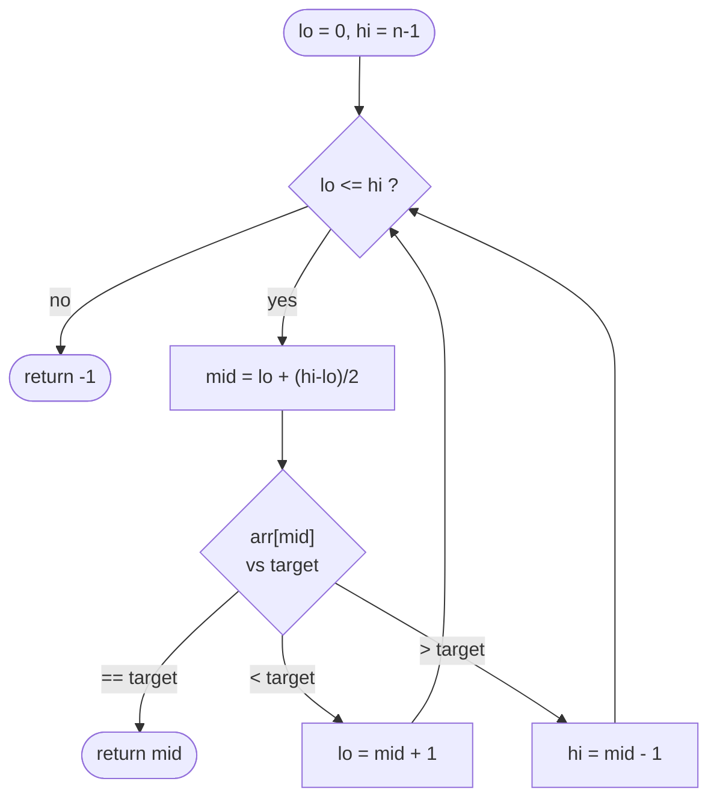

# Binary Search

## Definition

Binary Search repeatedly halves a search space by testing its midpoint,
eliminating one half based on a monotonic predicate. It applies not just to
"find a value in a sorted array" but to any problem where you can define a
boolean predicate over a range that is monotonic (all `false` then all
`true`, or vice versa).

## Core Intuition

If you can answer "is the answer ≤ x?" (or "≥ x?") for any candidate `x`,
and that answer flips exactly once as `x` increases across the search
space, you can binary search on `x` directly — even if `x` isn't an index
into an array at all (it might be a speed, a capacity, a time). This is the
generalization interviewers look for beyond "binary search a sorted array."

## Recognition Patterns

- The input is sorted, or a rotated/otherwise-structured version of sorted.
- Keywords: "find the smallest/largest value such that...", "minimize the
  maximum...", "maximize the minimum...".
- A brute-force linear/exhaustive search over a **monotonic** feasibility
  function ("can we finish in time T?", "is capacity C enough?").
- The answer space itself (not the input array) is what you should binary
  search over.

## Visual Overview

**Classic search** (matches the `lo <= hi` template below):



Every comparison discards one whole half of the remaining range — that
halving is what turns O(n) into O(log n).

## Generic Template

**Classic search in a sorted array**:

```go
lo, hi := 0, len(arr)-1
for lo <= hi {
    mid := lo + (hi-lo)/2
    switch {
    case arr[mid] == target:
        return mid
    case arr[mid] < target:
        lo = mid + 1
    default:
        hi = mid - 1
    }
}
return -1 // not found
```

**Binary search on the answer** (find smallest `x` in `[lo, hi]` such that
`feasible(x)` is true, given `feasible` is monotonic false→true):

```go
lo, hi := minPossible, maxPossible
for lo < hi {
    mid := lo + (hi-lo)/2
    if feasible(mid) {
        hi = mid // mid could be the answer; keep it in range
    } else {
        lo = mid + 1 // mid is too small; answer is strictly greater
    }
}
return lo // lo == hi, the smallest feasible value
```

## Variations

- **Exact match** in a sorted array (classic template).
- **Lower/upper bound** search (first index `>= target`, first index
  `> target` — Go's `sort.Search` implements this pattern).
- **Search in rotated sorted array**: at each step, determine which half is
  properly sorted, then decide whether the target could lie in that half.
- **Binary search on the answer**: search over a value space (capacity,
  speed, time, distance) using a monotonic feasibility check rather than
  indexing into an array at all.

## Complexity

O(log n) time where `n` is the size of the search space, O(1) space
(iterative) or O(log n) (recursive, due to call stack).

## Common Mistakes

- Infinite loops from an incorrect midpoint update (e.g., `hi = mid`
  without shrinking `lo` in a `while lo < hi` loop when `mid` could equal
  `lo`).
- Integer overflow computing `mid = (lo+hi)/2` in languages with fixed-width
  integers — use `mid := lo + (hi-lo)/2` instead (rarely an issue with Go's
  64-bit `int` on modern platforms, but good practice and often asked about
  in interviews).
- Off-by-one in the loop condition (`lo <= hi` vs `lo < hi`) not matching
  how `lo`/`hi` are updated.
- Applying binary search when the predicate isn't actually monotonic —
  always verify monotonicity before reaching for this technique.

## Interview Tips

- State the loop invariant explicitly: "the answer, if it exists, is always
  within `[lo, hi]`."
- For binary-search-on-the-answer problems, explicitly define and justify
  the `feasible(x)` predicate and argue why it's monotonic before coding.
- Decide up front whether you're searching `lo <= hi` (exact match, `-1` on
  failure) or `lo < hi` (bound-finding, converges to a single point) — mixing
  the two templates is the most common source of bugs.

## Example

Koko Eating Bananas: instead of searching the array, binary search over
possible eating speeds `k`. `feasible(k)` = "can Koko finish all piles within
H hours at speed k?" is monotonic (larger `k` can only help), so binary
search finds the minimum feasible `k` in O(n log(max pile)). See
[`problems/koko-eating-bananas`](problems/koko-eating-bananas/README.md).

## When to Use

- Sorted or rotated-sorted arrays needing a value/index.
- Any monotonic decision problem where you can check feasibility of a
  candidate answer efficiently (binary search on the answer).

## When NOT to Use

- The data isn't sorted and there's no way to define a monotonic predicate
  over it.
- The "search space" is small enough that linear scan is simpler and the
  log-factor savings don't matter (don't over-engineer trivial inputs).
- The feasibility check itself is expensive enough that O(log n) calls to
  it doesn't beat a smarter direct-computation approach.

## Quick Revision

- **Classic search**: `lo <= hi`, `mid := lo + (hi-lo)/2`, move `lo`/`hi`
  based on comparison, return `-1` if not found.
- **Binary search on the answer**: define a monotonic `feasible(x)`; use
  `lo < hi` loop, `hi = mid` / `lo = mid + 1`, converge to the boundary.
- **Rotated array**: at each step, one half is guaranteed sorted — check
  which one and whether the target lies within its range.
- **Complexity**: O(log n).
- **Watch for**: infinite loops from bad midpoint updates, mismatched loop
  conditions, unverified monotonicity assumptions.
