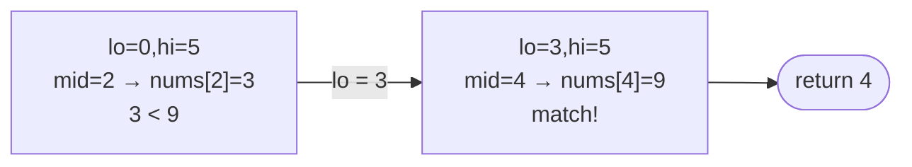

# Problem: Binary Search (Basic)

🔗 **[Try it on LeetCode](https://leetcode.com/problems/binary-search/)**

## Problem Statement

Given a sorted array of distinct integers `nums` and a target value, return
the index of `target` if it exists in `nums`, otherwise return `-1`.

## Difficulty

Easy

## Technique

Binary Search

## Problem Type

Array

## Key Insight

Because the array is sorted, comparing the target to the middle element
tells you which half can be discarded entirely — you never need to look at
the discarded half.

## Visual Overview

`nums = [-1,0,3,5,9,12]`, `target = 9`:

## How to Recognize This Pattern

- Sorted array + "find a value" is the canonical binary search signal.
- Distinct elements simplify the halving logic (no need to think about
  duplicate handling for this basic form).

## Approach 1 — Brute Force

### Idea
Scan the array linearly looking for `target`.

### Algorithm
1. For `i` from `0` to `n-1`, if `nums[i] == target`, return `i`.

### Complexity
Time: O(n)
Space: O(1)

## Approach 2 — Optimized (Binary Search)

### Idea
Maintain a search range `[lo, hi]` known to contain `target` if it's
present. Compare `target` to the midpoint; discard the half that can't
contain it.

### Algorithm
1. `lo, hi := 0, len(nums)-1`.
2. While `lo <= hi`:
   - `mid := lo + (hi-lo)/2`.
   - If `nums[mid] == target`, return `mid`.
   - If `nums[mid] < target`, `lo = mid + 1`.
   - Else, `hi = mid - 1`.
3. Return `-1`.

### Complexity
Time: O(log n)
Space: O(1)

## Sample Solution

See [`solution.go`](./solution.go).

## Dry Run

`nums = [-1, 0, 3, 5, 9, 12]`, `target = 9`

- `lo=0, hi=5`, `mid=2 (nums[2]=3)`: `3 < 9` → `lo=3`.
- `lo=3, hi=5`, `mid=4 (nums[4]=9)`: match → return `4`.

## Edge Cases

- Empty array → immediately returns `-1` (`lo=0 > hi=-1`).
- Target smaller than every element or larger than every element → returns
  `-1` after the range shrinks to nothing.
- Single-element array → one comparison decides the result.

## Common Mistakes

- Using `mid := (lo+hi)/2` instead of `mid := lo + (hi-lo)/2` (overflow risk
  in languages with fixed-width integers; good habit regardless).
- Off-by-one: using `lo < hi` here would exit before checking the final
  candidate element.
- Forgetting to update `lo`/`hi` to `mid+1`/`mid-1` (using `mid` directly
  causes infinite loops).

## Interview Follow-ups

- Find the first/last occurrence in an array with duplicates (lower/upper
  bound variant).
- Find the insertion point for a value not present (`sort.Search` in Go
  implements exactly this).

## Related Problems

- Search Insert Position
- Search in Rotated Sorted Array
- Find First and Last Position of Element in Sorted Array
