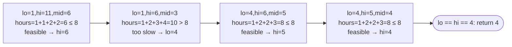

# Problem: Koko Eating Bananas

## Problem Statement

Koko has `piles[i]` bananas in pile `i`. She eats at a constant speed of `k`
bananas per hour: from a chosen pile, she eats `min(k, piles[i])` bananas
that hour (never starting a second pile within the same hour). Given `h`
hours before the guards return, find the minimum integer speed `k` such
that she can eat all the bananas within `h` hours.

## Difficulty

Medium

## Technique

Binary Search on the Answer

## Problem Type

Array

## Key Insight

The array `piles` is not what you binary search over — the **eating speed
`k`** is. Define `feasible(k)` = "can Koko finish all piles within `h` hours
at speed `k`?" This is monotonic: if speed `k` is feasible, any speed `> k`
is also feasible (eating faster never takes more hours). That monotonicity
is exactly what lets you binary search directly on `k`.

## Visual Overview

`piles = [3,6,7,11]`, `h = 8` — binary searching the **speed** `k`, not
the array, using `hoursNeeded(k) <= h` as the feasibility check:

## How to Recognize This Pattern

- "Find the minimum/maximum X such that [condition]" where X isn't an array
  index but a quantity (speed, capacity, distance, time).
- You can write a function that, given a candidate X, determines
  feasibility in reasonable time (here, O(n) per check), and that function
  is monotonic in X.

## Approach 1 — Brute Force

### Idea
Try every speed starting from `1` upward, checking feasibility, and return
the first one that works.

### Algorithm
1. For `k` from `1` to `max(piles)`, compute hours needed; return the first
   `k` where `hoursNeeded(k) <= h`.

### Complexity
Time: O(max(piles) · n)
Space: O(1)

## Approach 2 — Optimized (Binary Search on the Answer)

### Idea
Binary search `k` over `[1, max(piles)]`. For each candidate `k`, compute
the total hours needed (`sum of ceil(piles[i] / k)` for each pile). If that
total is `<= h`, `k` is feasible — try smaller; otherwise, try larger.

### Algorithm
1. `lo, hi := 1, max(piles)`.
2. While `lo < hi`:
   - `mid := lo + (hi-lo)/2`.
   - If `hoursNeeded(mid) <= h`, `hi = mid` (feasible; look for something
     smaller or equal).
   - Else, `lo = mid + 1` (too slow; need to go faster).
3. Return `lo`.

Where `hoursNeeded(k) = sum(ceil(pile / k) for pile in piles)`.

### Complexity
Time: O(n · log(max(piles)))
Space: O(1)

## Sample Solution

See [`solution.go`](./solution.go).

## Dry Run

`piles = [3, 6, 7, 11]`, `h = 8`

- `lo=1, hi=11`. `mid=6`: hours = `ceil(3/6)+ceil(6/6)+ceil(7/6)+ceil(11/6)
  = 1+1+2+2 = 6 <= 8` → feasible, `hi=6`.
- `lo=1, hi=6`. `mid=3`: hours = `1+2+3+4 = 10 > 8` → not feasible, `lo=4`.
- `lo=4, hi=6`. `mid=5`: hours = `1+2+2+3 = 8 <= 8` → feasible, `hi=5`.
- `lo=4, hi=5`. `mid=4`: hours = `1+2+2+3 = 8 <= 8` → feasible, `hi=4`.
- `lo=4, hi=4` → return `4`.

## Edge Cases

- `h` exactly equal to `len(piles)` — Koko must eat each pile in one hour;
  `k` must be at least `max(piles)`.
- A single pile — `hoursNeeded` reduces to `ceil(pile / k)`.
- `piles` already very small relative to `h` — smallest feasible `k` may be
  `1`.

## Common Mistakes

- Computing `ceil(a/b)` incorrectly with integer division — the correct
  integer formula is `(a + b - 1) / b` (careful with overflow in other
  languages; not a practical concern for Go's 64-bit `int`).
- Confusing which direction is "feasible" — larger `k` reduces hours, so
  the feasibility function is monotonically *easier* to satisfy as `k`
  grows, meaning you search for the *smallest* feasible `k`.
- Using `lo <= hi` with this convergence-style template — it must be
  `lo < hi` since this style finds the single boundary point rather than
  an exact match.

## Interview Follow-ups

- What if she can switch piles mid-hour? Changes the hours-needed formula
  entirely (would likely no longer be a simple per-pile ceiling sum).
- Minimize the *maximum* pile eaten in one sitting given a fixed number of
  hours — same binary-search-on-the-answer structure applied to a
  different feasibility function (this is essentially "Split Array Largest
  Sum" / "Capacity To Ship Packages Within D Days").

## Related Problems

- Capacity To Ship Packages Within D Days (identical pattern, different
  feasibility function)
- Split Array Largest Sum
- Minimum Number of Days to Make m Bouquets
