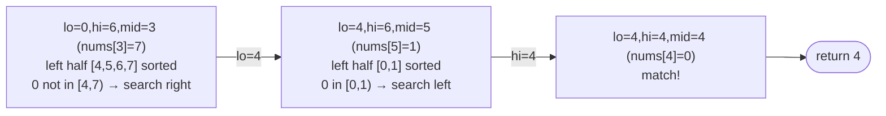

# Problem: Search in Rotated Sorted Array

🔗 **[Try it on LeetCode](https://leetcode.com/problems/search-in-rotated-sorted-array/)**

## Problem Statement

An array of distinct integers, originally sorted ascending, has been rotated
at an unknown pivot (e.g., `[0,1,2,4,5,6,7]` → `[4,5,6,7,0,1,2]`). Given the
rotated array and a target, return its index, or `-1` if not present, in
O(log n) time.

## Difficulty

Medium

## Technique

Binary Search (on a structurally-modified sorted space)

## Problem Type

Array

## Key Insight

Although the whole array isn't sorted, **at least one half** of any
`[lo, hi]` range is always properly sorted (since only one rotation point
exists). Check which half is sorted by comparing `nums[lo]` to `nums[mid]`,
then decide whether the target lies within that sorted half's value range —
if not, it must be in the other half.

## Visual Overview

`nums = [4,5,6,7,0,1,2]`, `target = 0` — at each step, one half is
always properly sorted; check whether the target's value falls in that
half's range:

## How to Recognize This Pattern

- "Sorted array, but rotated/shifted" is a strong signal: classic binary
  search doesn't directly apply, but a modified halving decision does.
- The requirement for O(log n) rules out linear scan, which is the
  "obvious" fallback for a non-fully-sorted array.

## Approach 1 — Brute Force

### Idea
Scan linearly for the target.

### Algorithm
1. For each index, check if it equals target.

### Complexity
Time: O(n)
Space: O(1)

## Approach 2 — Optimized (Modified Binary Search)

### Idea
At each step, determine whether `nums[lo..mid]` or `nums[mid..hi]` is the
properly sorted half by comparing `nums[lo]` and `nums[mid]`. Then check if
`target` falls within that sorted half's range; if so, search there,
otherwise search the other half.

### Algorithm
1. `lo, hi := 0, len(nums)-1`.
2. While `lo <= hi`:
   - `mid := lo + (hi-lo)/2`; if `nums[mid] == target`, return `mid`.
   - If `nums[lo] <= nums[mid]` (left half `[lo, mid]` is sorted):
     - If `nums[lo] <= target < nums[mid]`, search left: `hi = mid - 1`.
     - Else, search right: `lo = mid + 1`.
   - Else (right half `[mid, hi]` is sorted):
     - If `nums[mid] < target <= nums[hi]`, search right: `lo = mid + 1`.
     - Else, search left: `hi = mid - 1`.
3. Return `-1`.

### Complexity
Time: O(log n)
Space: O(1)

## Sample Solution

See [`solution.go`](https://github.com/xudipta/prep/blob/main/dsa/binary-search/problems/search-in-rotated-sorted-array/solution.go).

It also has a C++ port at [`cpp/solution.cpp`](https://github.com/xudipta/prep/blob/main/dsa/binary-search/problems/search-in-rotated-sorted-array/cpp/solution.cpp), a self-contained file with its own `assert`-based `main()` as its test suite.

## Dry Run

`nums = [4,5,6,7,0,1,2]`, `target = 0`

- `lo=0, hi=6, mid=3 (nums[3]=7)`: not target. `nums[0]=4 <= nums[3]=7` →
  left half sorted. Is `4 <= 0 < 7`? No → search right: `lo=4`.
- `lo=4, hi=6, mid=5 (nums[5]=1)`: not target. `nums[4]=0 <= nums[5]=1` →
  left half sorted. Is `0 <= 0 < 1`? Yes → search left: `hi=4`.
- `lo=4, hi=4, mid=4 (nums[4]=0)`: match → return `4`.

## Edge Cases

- No rotation (array is fully sorted) — the logic still works; one "half"
  check will always succeed correctly.
- Single-element array.
- Target equals `nums[lo]` or `nums[hi]` exactly — boundary conditions in
  the range checks (`<=` vs `<`) must be exact.
- Target not present anywhere → returns `-1`.

## Common Mistakes

- Using strict `<` instead of `<=` (or vice versa) when checking
  `nums[lo] <= nums[mid]`, mishandling the two/three-element case where
  `lo == mid`.
- Checking `target` against the wrong half's range bounds.
- Assuming duplicates aren't present when the problem allows them (a
  follow-up variant — see below) — the "which half is sorted" check breaks
  when `nums[lo] == nums[mid]` but the halves differ.

## Interview Follow-ups

- What if duplicates are allowed (Search in Rotated Sorted Array II)? When
  `nums[lo] == nums[mid] == nums[hi]`, you can't tell which half is sorted;
  shrink the range by one from both ends and retry, degrading worst-case
  to O(n).
- Find the minimum element in a rotated sorted array (a related, simpler
  binary search).

## Related Problems

- Find Minimum in Rotated Sorted Array
- Search in Rotated Sorted Array II (with duplicates)
