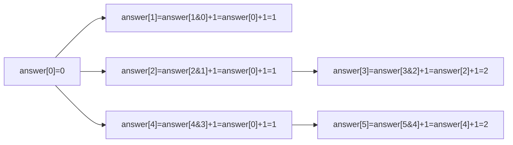

# Problem: Counting Bits

🔗 **[Try it on LeetCode](https://leetcode.com/problems/counting-bits/)**

## Problem Statement

Given an integer `n`, return an array `answer` of length `n+1` where
`answer[i]` is the number of `1` bits (population count) in the binary
representation of `i`, for every `i` from `0` to `n`.

## Difficulty

Easy

## Technique

Bit Manipulation + Dynamic Programming

## Problem Type

Bit Manipulation / 1D DP

## Key Insight

`n & (n-1)` clears the lowest set bit of `n`, producing a smaller number
whose popcount you've *already computed* earlier in the same pass. So
`bits(n) = bits(n & (n-1)) + 1` — a DP recurrence expressed entirely in
terms of a bit trick, letting every value from `0` to `n` be computed in
O(1) additional work each, for O(n) total instead of O(n log n) (which
you'd get by counting bits of each number independently, bit by bit).

## Visual Overview

`n = 5` — each `answer[i]` reuses an already-computed smaller entry:

## How to Recognize This Pattern

- "Compute a per-number property for every number up to n" is a strong
  signal to look for a recurrence relating `f(n)` to `f(some smaller
  number already computed)` — turning independent O(log n)-per-number work
  into O(1)-per-number amortized DP.
- Popcount specifically has two equally valid recurrences worth knowing:
  `bits(n) = bits(n & (n-1)) + 1` (clear lowest set bit) and
  `bits(n) = bits(n >> 1) + (n & 1)` (drop the lowest bit, whatever its
  value).

## Approach 1 — Brute Force

### Idea
For each `i` from `0` to `n`, count its set bits independently by
repeatedly checking and shifting.

### Algorithm
For each `i`, loop while `i != 0`: increment a counter, `i &= i-1` (or
`i >>= 1`).

### Complexity
Time: O(n log n) — each of the `n` numbers takes up to O(log n) bit checks
Space: O(1) extra (excluding output)

## Approach 2 — Optimized (DP + Bit Trick)

### Idea
Build the answer array incrementally. For each `i`, reuse the already-
computed answer for `i & (i-1)` (a smaller number processed earlier in the
same pass) and add 1 for the bit that was just cleared.

### Algorithm
1. `answer := make([]int, n+1)`; `answer[0] = 0` (base case).
2. For `i` from `1` to `n`: `answer[i] = answer[i&(i-1)] + 1`.
3. Return `answer`.

### Complexity
Time: O(n)
Space: O(n) for the output (O(1) additional working space)

## Sample Solution

See [`solution.go`](./solution.go).

## Dry Run

`n = 5`

- `answer[0] = 0`.
- `i=1`: `1 & 0 = 0` → `answer[1] = answer[0] + 1 = 1`.
- `i=2`: `2 & 1 = 0` (binary `10 & 01 = 00`) → `answer[2] = answer[0] + 1 =
  1`.
- `i=3`: `3 & 2 = 2` (binary `11 & 10 = 10`) → `answer[3] = answer[2] + 1 =
  2`.
- `i=4`: `4 & 3 = 0` (binary `100 & 011 = 000`) → `answer[4] = answer[0] +
  1 = 1`.
- `i=5`: `5 & 4 = 4` (binary `101 & 100 = 100`) → `answer[5] = answer[4] +
  1 = 2`.
- Result: `[0, 1, 1, 2, 1, 2]`.

## Edge Cases

- `n = 0` → `answer = [0]`.
- Powers of two (`1, 2, 4, 8, ...`) → always have popcount `1`, and the
  recurrence confirms this since `n & (n-1) == 0` for any power of two.
- Large `n` — the recurrence stays O(1) per step regardless of `n`'s
  magnitude, since it only ever looks at one already-computed, strictly
  smaller index.

## Common Mistakes

- Recomputing each number's popcount independently (still correct, but
  misses the point of the DP relation and costs an extra log factor).
- Using the wrong recurrence direction — `answer[i] = answer[i&(i-1)] + 1`
  requires `i & (i-1)` to always be *strictly less than* `i` (true for all
  `i >= 1`, since clearing a set bit always decreases the value), which is
  what makes the left-to-right iteration order valid.
- Off-by-one on the output array's length (`n+1` entries, for indices `0`
  through `n` inclusive).

## Interview Follow-ups

- Which recurrence is better in practice: `i & (i-1)` (clear lowest bit) or
  `i >> 1` (drop lowest bit)? Both are O(1) per step and O(n) total;
  either is an acceptable answer, but be ready to state both.
- Number of 1 Bits (Hamming Weight): the single-number version of this
  same popcount computation, without the DP table.

## Related Problems

- Number of 1 Bits (Hamming Weight)
- Power of Two / Power of Four (popcount-adjacent bit tricks)
- Single Number (different bit trick: XOR self-cancellation)
