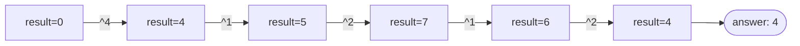

# Problem: Single Number

🔗 **[Try it on LeetCode](https://leetcode.com/problems/single-number/)**

## Problem Statement

Given a non-empty array of integers where every element appears exactly
twice except for one, find that single element. Must run in O(n) time
using O(1) extra space.

## Difficulty

Easy

## Technique

Bit Manipulation (XOR)

## Problem Type

Array

## Key Insight

XOR is commutative, associative, and self-canceling: `x ^ x = 0` and
`x ^ 0 = x`. XOR-ing every element in the array together cancels every
pair of duplicates (in any order, since XOR is commutative/associative),
leaving only the single unpaired element.

## Visual Overview

`nums = [4,1,2,1,2]` — XOR-ing left to right, in the exact array order:

## How to Recognize This Pattern

- "Every element appears twice except one" combined with an explicit O(1)
  space requirement (ruling out a hash set, which would be the obvious
  O(n)-space approach) is the canonical XOR signal.

## Approach 1 — Brute Force (Hashing)

### Idea
Count occurrences of each value in a hash map; return the one with count 1.

### Algorithm
Single pass building counts, second pass (or combined) to find the count-1
value.

### Complexity
Time: O(n)
Space: O(n)

## Approach 2 — Optimized (XOR)

### Idea
XOR every element together in a single pass. Every duplicated value cancels
itself out; only the unique value survives.

### Algorithm
1. `result := 0`.
2. For each `v` in `nums`: `result ^= v`.
3. Return `result`.

### Complexity
Time: O(n)
Space: O(1)

## Sample Solution

See [`solution.go`](https://github.com/xudipta/prep/blob/main/dsa/bit-manipulation/problems/single-number/solution.go).

It also has a C++ port at [`cpp/solution.cpp`](https://github.com/xudipta/prep/blob/main/dsa/bit-manipulation/problems/single-number/cpp/solution.cpp), a self-contained file with its own `assert`-based `main()` as its test suite.

## Dry Run

`nums = [4, 1, 2, 1, 2]`

- `result = 0`
- `result ^= 4 → 4`
- `result ^= 1 → 5`
- `result ^= 2 → 7`
- `result ^= 1 → 6` (since `7 ^ 1 = 6`)
- `result ^= 2 → 4` (since `6 ^ 2 = 4`)
- Answer: `4`.

(Note that XOR being commutative/associative means the pairs `1` and `2`
cancel regardless of the order they appear in — the dry run above just
happens to process them interleaved with `4`, but the final result is the
same as if all elements were reordered first.)

## Edge Cases

- Single-element array → that element is trivially the answer (`0 ^ v =
  v`).
- The unique element is `0` → still works correctly; XOR handles zero
  identically to any other value.
- Negative numbers — XOR operates on the underlying bit representation
  (two's complement for negative integers in Go), and self-cancellation
  still holds.

## Common Mistakes

- Reaching for a hash set out of habit despite the explicit O(1) space
  requirement in the problem statement.
- Assuming XOR only works if duplicates are adjacent — it doesn't need
  that; XOR's commutativity/associativity means order is irrelevant.

## Interview Follow-ups

- Single Number II: every element appears **three** times except one — XOR
  alone doesn't work (it only cancels pairs); requires tracking bit counts
  modulo 3 across all 32/64 bit positions.
- Single Number III: **two** elements are unique (everyone else appears
  twice) — XOR everything to get `a ^ b`, then use any set bit in that
  result to partition the array into two groups, each containing exactly
  one of the unique elements.

## Related Problems

- Single Number II (appears three times except one)
- Single Number III (two unique elements)
- Missing Number (XOR-based, using indices as the "expected" sequence)
