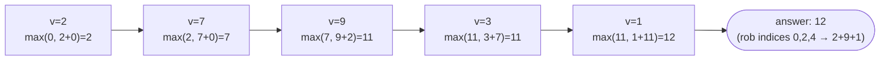

# Problem: House Robber

🔗 **[Try it on LeetCode](https://leetcode.com/problems/house-robber/)**

## Problem Statement

Given an array `nums` where `nums[i]` is the amount of money in house `i`,
determine the maximum amount you can rob without robbing two directly
adjacent houses.

## Difficulty

Medium

## Technique

Dynamic Programming — 1D DP (Take/Skip)

## Problem Type

1D DP

## Key Insight

At each house, you make a binary decision: rob it (and add its value to the
best result excluding the *previous* house, since it's now off-limits), or
skip it (keeping the best result up to the previous house unchanged). The
answer only needs to track the best achievable result up to each prefix.

## How to Recognize This Pattern

- "Maximize/minimize a sum subject to a no-two-adjacent-chosen constraint"
  is the take/skip 1D DP signal.
- The decision at index `i` ("take or skip") only needs to know the best
  results for `i-1` and `i-2` — a small, fixed lookback window, same shape
  as Climbing Stairs but with a max instead of a sum.

## Visual Overview

`nums = [2,7,9,3,1]` — rolling `prev2, prev1` (dp two steps back, one
step back):



## Deriving the Recurrence

1. **Decision**: at house `i`, rob it or skip it.
2. **State**: `dp[i]` = the maximum money obtainable considering houses
   `0..i` (whether or not house `i` itself is robbed — this is the key
   choice that keeps the state 1-dimensional instead of needing to track
   "was the last house robbed" as a separate boolean).
3. **Transition**: if you rob house `i`, you get `nums[i] + dp[i-2]` (house
   `i-1` must be left alone); if you skip it, you get `dp[i-1]`. Take the
   max: `dp[i] = max(dp[i-1], nums[i] + dp[i-2])`.
4. **Base case**: `dp[-1] = 0` (no houses), `dp[0] = nums[0]`.
5. **Answer**: `dp[n-1]`.
6. **Iteration order**: increasing `i`, since `dp[i]` depends only on
   `dp[i-1]` and `dp[i-2]`.

```
State:            dp[i] = max money obtainable from houses 0..i
Transition:       dp[i] = max(dp[i-1], nums[i] + dp[i-2])
Base Case:        dp[-1] = 0, dp[0] = nums[0]
Answer:           dp[n-1]
Iteration Order:  i = 1 .. n-1
Time Complexity:  O(n)
Space Complexity: O(1) with rolling variables
```

## Approach 1 — Brute Force (Plain Recursion)

### Idea
At each house, recursively try both "rob" and "skip" and take the max.

### Algorithm
`rob(i) = max(rob(i-1), nums[i] + rob(i-2))`, recursively, without caching.

### Complexity
Time: O(2ⁿ)
Space: O(n) recursion stack

## Approach 2 — Optimized (Bottom-Up, Space-Optimized)

### Idea
Track only the previous two `dp` values as rolling variables.

### Algorithm
1. `prev2, prev1 := 0, 0` (representing `dp[-1]`, `dp[-2]`... conceptually
   "nothing robbed yet").
2. For each `v` in `nums`: `curr := max(prev1, v+prev2)`; shift
   `prev2, prev1 = prev1, curr`.
3. Return `prev1`.

### Complexity
Time: O(n)
Space: O(1)

## Sample Solution

See [`solution.go`](https://github.com/xudipta/prep/blob/main/dsa/dynamic-programming/problems/house-robber/solution.go).

It also has a C++ port at [`cpp/solution.cpp`](https://github.com/xudipta/prep/blob/main/dsa/dynamic-programming/problems/house-robber/cpp/solution.cpp), a self-contained file with its own `assert`-based `main()` as its test suite.

## Dry Run

`nums = [2, 7, 9, 3, 1]`

- `prev2=0, prev1=0`
- `v=2`: `curr=max(0, 2+0)=2`; `prev2=0, prev1=2`
- `v=7`: `curr=max(2, 7+0)=7`; `prev2=2, prev1=7`
- `v=9`: `curr=max(7, 9+2)=11`; `prev2=7, prev1=11`
- `v=3`: `curr=max(11, 3+7)=11`; `prev2=11, prev1=11`
- `v=1`: `curr=max(11, 1+11)=12`; `prev2=11, prev1=12`
- Answer: `12` (rob houses at indices 0, 2, 4: `2+9+1=12`).

## Edge Cases

- Empty array → `0`.
- Single house → rob it, `nums[0]`.
- Two houses → rob the larger one.
- All zeros → `0`.

## Common Mistakes

- Tracking "was the previous house robbed" as explicit boolean state
  instead of folding that information into `dp[i]` being "best up to `i`
  regardless of whether `i` was robbed" — adds unnecessary state dimensions.
- Off-by-one when initializing the rolling variables for the first one or
  two houses.
- Forgetting this is a *maximization*, not a count — the recurrence uses
  `max`, not `+`, unlike Climbing Stairs' Fibonacci sum.

## Interview Follow-ups

- House Robber II: houses are arranged in a circle (house 0 and house n-1
  are adjacent). Solve by running this exact algorithm twice — once
  excluding house 0, once excluding house n-1 — and taking the max.
- House Robber III: houses form a binary tree; requires Tree DP returning a
  pair `(bestIncludingNode, bestExcludingNode)` per node.

## Related Problems

- House Robber II (circular arrangement)
- House Robber III (tree structure)
- Climbing Stairs (same lookback-2 shape, sum instead of max)
