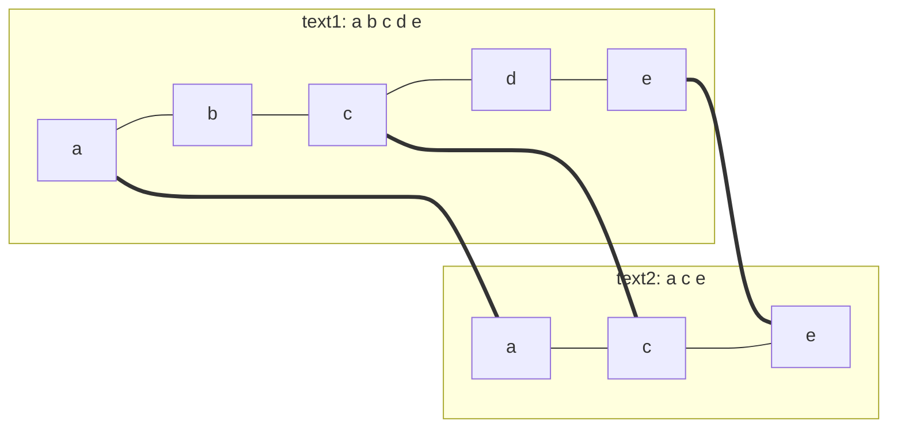

# Problem: Longest Common Subsequence

## Problem Statement

Given two strings `text1` and `text2`, return the length of their longest
common subsequence (a subsequence need not be contiguous, but must
preserve relative order) — or `0` if none exists.

## Difficulty

Medium

## Technique

Dynamic Programming — String DP (LCS family)

## Problem Type

String DP

## Key Insight

Compare the strings character by character from the end (or start). At
each pair `(i, j)`, either the current characters match — in which case
they must both be part of the LCS, and the answer reduces to
`1 + LCS(rest of text1, rest of text2)` — or they don't match, in which
case the LCS of the two full remaining strings is the better of "drop the
current character of text1" or "drop the current character of text2."

## How to Recognize This Pattern

- "Longest common subsequence/substring" comparing **two sequences** is the
  canonical 2D string-DP signal — the state needs one dimension per
  string's position.
- Distinguish from "longest common **substring**" (must be contiguous) —
  that's a related but different recurrence (resets to 0 on a mismatch
  instead of taking a max).

## Visual Overview

`text1 = "abcde"`, `text2 = "ace"` — the matched characters, in order:



`a`, `c`, `e` appear in the same relative order in both strings (`b` and
`d` are simply skipped) — that shared, order-preserving subsequence has
length 3, the answer.

## Deriving the Recurrence

1. **Decision**: for positions `i` in `text1` and `j` in `text2`, do the
   characters `text1[i-1]` and `text2[j-1]` match? (Using 1-indexed DP
   table positions so index `0` cleanly represents "no characters
   considered yet.")
2. **State**: `dp[i][j]` = length of the LCS of `text1[0:i]` and
   `text2[0:j]`.
3. **Transition**:
   - If `text1[i-1] == text2[j-1]`: `dp[i][j] = 1 + dp[i-1][j-1]` (this
     matching pair extends the LCS found using one fewer character from
     each string).
   - Else: `dp[i][j] = max(dp[i-1][j], dp[i][j-1])` (the LCS can't use both
     current characters together, so take the better of dropping one or
     the other).
4. **Base case**: `dp[0][j] = 0` for all `j`, `dp[i][0] = 0` for all `i`
   (an empty string has no common subsequence with anything).
5. **Answer**: `dp[len(text1)][len(text2)]`.
6. **Iteration order**: increasing `i` and `j` (each cell depends only on
   `dp[i-1][j-1]`, `dp[i-1][j]`, `dp[i][j-1]` — all strictly "earlier" in a
   row-major or column-major scan).

```
State:            dp[i][j] = LCS length of text1[0:i], text2[0:j]
Transition:       dp[i][j] = 1 + dp[i-1][j-1]              if text1[i-1] == text2[j-1]
                   dp[i][j] = max(dp[i-1][j], dp[i][j-1])   otherwise
Base Case:        dp[0][j] = dp[i][0] = 0
Answer:           dp[len(text1)][len(text2)]
Iteration Order:  i ascending, j ascending (row by row)
Time Complexity:  O(n * m)
Space Complexity: O(m) with a rolling two-row optimization (O(n*m) for the full table)
```

## Approach 1 — Brute Force (Recursion)

### Idea
Recursively try "match if possible, else try dropping a character from
either string," without caching.

### Algorithm
`lcs(i, j) = 1 + lcs(i-1, j-1)` if characters match, else
`max(lcs(i-1, j), lcs(i, j-1))`.

### Complexity
Time: O(2^(n+m)) — exponential without memoization
Space: O(n+m) recursion stack

## Approach 2 — Optimized (Bottom-Up, Space-Optimized)

### Idea
Fill the DP table row by row, keeping only the previous and current row
since each cell only depends on the row above and the current row's
earlier entries.

### Algorithm
1. `prev := make([]int, m+1)` (all zero, representing `dp[0][*]`).
2. For each row `i` (1-indexed character of `text1`):
   - `curr := make([]int, m+1)`.
   - For each column `j`: apply the transition using `prev` (for
     `dp[i-1][*]`) and `curr` (for `dp[i][j-1]`, already computed this
     row).
   - `prev = curr`.
3. Return `prev[m]`.

### Complexity
Time: O(n·m)
Space: O(m)

## Sample Solution

See [`solution.go`](./solution.go).

## Dry Run

`text1 = "abcde"`, `text2 = "ace"`

- Building the table conceptually: matches occur at `a` (both strings'
  first character), `c` (text1[2], text2[1]), `e` (text1[4], text2[2]).
- `dp[1][1] = 1` (`a` matches `a`).
- `dp[3][2] = 2` (`a`,`c` both matched by this point).
- `dp[5][3] = 3` (`a`,`c`,`e` all matched).
- Answer: `3` (`"ace"`).

## Edge Cases

- Either string empty → LCS length `0`.
- No characters in common → `0`.
- One string is a subsequence of the other → the answer equals the shorter
  string's length.
- Identical strings → the answer equals the shared length.

## Common Mistakes

- Off-by-one between the DP table's 1-indexed positions and the strings'
  0-indexed characters (`text1[i-1]`, not `text1[i]`, when filling row `i`).
- Forgetting the base row/column of zeros, or initializing them
  incorrectly.
- Confusing LCS (subsequence, can skip characters) with "longest common
  substring" (must be contiguous) — the recurrence for the substring
  version resets to `0` on a mismatch instead of taking a max.

## Interview Follow-ups

- Reconstruct the actual LCS string, not just its length — requires
  keeping the full 2D table (not the space-optimized version) and
  backtracking from `dp[n][m]`.
- Edit Distance: a closely related string-DP problem with three possible
  operations (insert/delete/replace) instead of LCS's two (skip from
  either string).
- Longest Common Substring: same table shape, different recurrence (reset
  to 0 on mismatch, track a running max over all cells).

## Related Problems

- Longest Increasing Subsequence (different DP shape, single sequence)
- Edit Distance
- Shortest Common Supersequence
