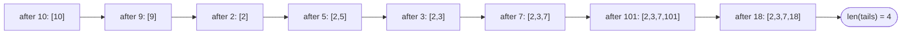

# Problem: Longest Increasing Subsequence

🔗 **[Try it on LeetCode](https://leetcode.com/problems/longest-increasing-subsequence/)**

## Problem Statement

Given an integer array `nums`, return the length of the longest strictly
increasing subsequence (elements need not be contiguous, but must appear
in increasing order of both index and value).

## Difficulty

Medium

## Technique

Dynamic Programming — LIS family (with a DP + Binary Search optimization)

## Problem Type

Sequence DP

## Key Insight

For each index `i`, the longest increasing subsequence *ending exactly at*
`i` is `1 + ` the best LIS ending at any earlier index `j` whose value is
smaller than `nums[i]`. That's an O(n²) DP. The faster O(n log n) approach
reframes the problem: greedily maintain the smallest possible "tail" value
for every achievable subsequence length seen so far, and use binary search
to find where each new element belongs — because that array of tails is
always sorted (a non-obvious but provable invariant).

## How to Recognize This Pattern

- "Longest strictly increasing/non-decreasing subsequence" is the direct
  LIS signal.
- If asked for O(n log n), that's a strong hint toward the patience-sorting
  + binary search technique rather than the more intuitive O(n²) DP.

## Visual Overview

`nums = [10,9,2,5,3,7,101,18]` — how `tails` evolves (patience sorting):



## Deriving the Recurrence (O(n²) DP)

1. **Decision**: for each index `i`, which earlier index (if any) does the
   increasing subsequence ending at `i` extend?
2. **State**: `dp[i]` = length of the longest increasing subsequence that
   **ends exactly at index `i`** (not just "using the first i elements" —
   this distinction matters, since the LIS ending at `i` specifically
   requires `nums[i]` to be its last element).
3. **Transition**: `dp[i] = 1 + max(dp[j] for all j < i where nums[j] <
   nums[i])`, or `dp[i] = 1` if no such `j` exists.
4. **Base case**: `dp[i] = 1` for all `i` (every element is trivially an
   increasing subsequence of length 1 on its own).
5. **Answer**: `max(dp[i] for all i)` — the LIS can end anywhere, not
   necessarily at the last index.
6. **Iteration order**: increasing `i`, since `dp[i]` depends only on
   `dp[j]` for `j < i`.

```
State:            dp[i] = length of the LIS ending exactly at index i
Transition:       dp[i] = 1 + max(dp[j]) over all j < i with nums[j] < nums[i]
Base Case:        dp[i] = 1 for all i
Answer:           max(dp[i]) over all i
Iteration Order:  i ascending; for each i, scan all j < i
Time Complexity:  O(n^2)
Space Complexity: O(n)
```

## Approach 1 — O(n²) DP

### Idea
As derived above: for each index, scan all earlier indices with a smaller
value and take the best extension.

### Algorithm
Nested loop: outer over `i`, inner over `j < i`, updating `dp[i]` when
`nums[j] < nums[i]`.

### Complexity
Time: O(n²)
Space: O(n)

## Approach 2 — Optimized (Patience Sorting + Binary Search)

### Idea
Maintain an array `tails`, where `tails[k]` is the smallest possible tail
value among all increasing subsequences of length `k+1` found so far. For
each new number, binary search `tails` for the first position whose value
is `>= num` (using `sort.Search`), and replace it (or append, if `num` is
larger than every tail so far). The final length of `tails` is the LIS
length. This works because replacing a tail with a smaller value can only
help future extensions, never hurt — the *count* of achievable lengths is
what's tracked, not the actual subsequence.

### Algorithm
1. `tails := []int{}`.
2. For each `num` in `nums`:
   - `pos := sort.Search(len(tails), func(i int) bool { return tails[i] >=
     num })`.
   - If `pos == len(tails)`: append `num` (it extends the longest
     subsequence found so far).
   - Else: `tails[pos] = num` (found a smaller tail for a subsequence of
     that length, improving future extension chances).
3. Return `len(tails)`.

### Complexity
Time: O(n log n)
Space: O(n)

## Sample Solution

See [`solution.go`](./solution.go) (implements the O(n log n) approach as
the primary solution, since it demonstrates the DP + Binary Search
pattern this technique is named for).

## Dry Run

`nums = [10, 9, 2, 5, 3, 7, 101, 18]`

- `10`: `tails=[]` → append → `tails=[10]`.
- `9`: first tail `>= 9` is index 0 (`10`) → replace → `tails=[9]`.
- `2`: first tail `>= 2` is index 0 (`9`) → replace → `tails=[2]`.
- `5`: no tail `>= 5` → append → `tails=[2,5]`.
- `3`: first tail `>= 3` is index 1 (`5`) → replace → `tails=[2,3]`.
- `7`: no tail `>= 7` → append → `tails=[2,3,7]`.
- `101`: no tail `>= 101` → append → `tails=[2,3,7,101]`.
- `18`: first tail `>= 18` is index 3 (`101`) → replace → `tails=[2,3,7,18]`.
- Final `len(tails) = 4` (a valid LIS: `2, 3, 7, 18` or `2, 3, 7, 101`).

**Important**: `tails` is *not* necessarily an actual valid subsequence at
the end — it only tracks the smallest tail achievable per length. The
*length* it converges to is always correct, even though the array's final
contents may not represent one real subsequence.

## Edge Cases

- Empty array → `0`.
- Strictly decreasing array → LIS length `1` (every element replaces
  `tails[0]`, `tails` never grows past length 1).
- Strictly increasing array → LIS length `n` (`tails` grows by one each
  step, nothing is ever replaced).
- Duplicate values — since the LIS here is **strictly** increasing, use
  `tails[i] >= num` as the search condition (finds the leftmost position
  to replace), which correctly prevents equal values from extending the
  subsequence.

## Common Mistakes

- Confusing strictly increasing vs. non-decreasing — changes the binary
  search condition (`>=` vs `>`) and therefore the result on inputs with
  duplicates.
- Assuming the final `tails` array is a valid LIS itself and trying to
  return it directly — it's only valid for computing the *length*.
- Reaching for the O(n²) approach when O(n log n) is explicitly required,
  or vice versa over-engineering when O(n²) is perfectly fine for the
  given constraints.

## Interview Follow-ups

- Reconstruct the actual LIS, not just its length — requires tracking
  predecessor indices during the O(n²) DP (the binary search approach
  doesn't directly support easy reconstruction without extra bookkeeping).
- Longest Increasing Subsequence with at most one deletion allowed, or
  Russian Doll Envelopes (LIS applied after sorting pairs — a 2D
  extension of this exact pattern).

## Related Problems

- Longest Common Subsequence (different DP shape, two sequences)
- Russian Doll Envelopes (LIS on sorted pairs)
- Maximum Length of Pair Chain
