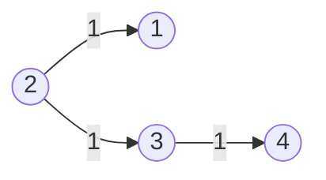
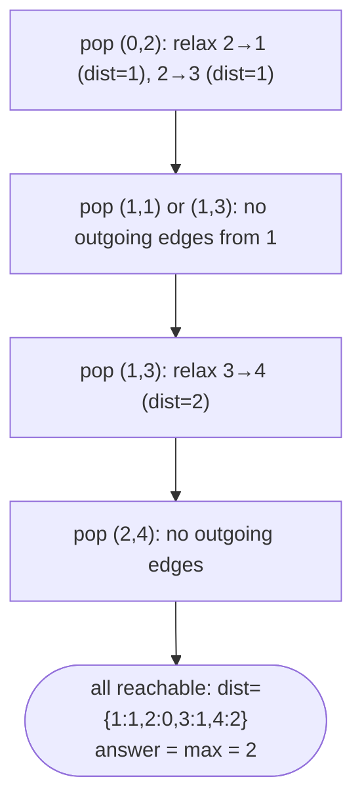

# Problem: Network Delay Time

## Problem Statement

There are `n` network nodes labeled `1` to `n`. Given directed weighted
edges `times[i] = [u, v, w]` (a signal from `u` to `v` takes `w` time), and
a source node `k`, return the minimum time for a signal starting at `k` to
reach every node. If some node is unreachable, return `-1`.

## Difficulty

Medium

## Technique

Dijkstra's Algorithm (Shortest Path)

## Problem Type

Graph / Shortest Path

## Key Insight

This is single-source shortest path with non-negative edge weights —
exactly Dijkstra's specialty. Dijkstra always finalizes the closest
not-yet-finalized node next (using a min-heap keyed by current best
distance), which is correct precisely because edge weights are
non-negative: once a node is popped with its minimum distance, no future
(necessarily longer) path can ever improve it.

## Visual Overview

`times=[[2,1,1],[2,3,1],[3,4,1]]`, `n=4`, `k=2` — Dijkstra finalizes the
closest unvisited node first, popped off a min-heap by current distance:

## How to Recognize This Pattern

- "Minimum time/cost/distance from a single source to all other nodes,"
  weighted edges, non-negative weights → Dijkstra.
- "Time for a signal to reach every node" specifically asks for the *max*
  over all shortest distances (the last node to receive the signal) — a
  small wrapper around standard single-source shortest paths.

## Approach 1 — Brute Force (Bellman-Ford Style)

### Idea
Relax every edge up to `n-1` times (Bellman-Ford), which works for
non-negative weights too, just less efficiently.

### Algorithm
Repeat `n-1` times: for every edge `(u, v, w)`, if `dist[u] + w <
dist[v]`, update `dist[v]`.

### Complexity
Time: O(V · E)
Space: O(V)

## Approach 2 — Optimized (Dijkstra with a Min-Heap)

### Idea
Maintain a min-heap of `(distance, node)` pairs, starting with
`(0, k)`. Repeatedly pop the smallest-distance entry; if it's stale
(a better distance was already finalized), skip it. Otherwise, finalize
it and relax all outgoing edges, pushing any improved distances.

### Algorithm
1. Build an adjacency list from `times`.
2. `dist := map[node]int` initialized to infinity for all nodes except
   `dist[k] = 0`.
3. Min-heap seeded with `(0, k)`.
4. While the heap is non-empty:
   - Pop `(d, u)`. If `d > dist[u]`, skip (stale entry).
   - For each edge `(u, v, w)`: if `d + w < dist[v]`, update `dist[v]` and
     push `(dist[v], v)`.
5. If any node's distance is still infinity, return `-1`; otherwise return
   the maximum distance across all `n` nodes.

### Complexity
Time: O((V + E) log V) using a binary heap
Space: O(V + E)

## Sample Solution

See [`solution.go`](./solution.go).

## Dry Run

`times = [[2,1,1],[2,3,1],[3,4,1]]`, `n = 4`, `k = 2`

- `dist = {2:0, others: inf}`. Heap: `[(0,2)]`.
- Pop `(0,2)`: relax `2->1 (w=1)`: `dist[1]=1`, push `(1,1)`. Relax
  `2->3 (w=1)`: `dist[3]=1`, push `(1,3)`.
- Pop `(1,1)` (or `(1,3)`, order between equal-priority entries doesn't
  matter): no outgoing edges from `1` in this example.
- Pop `(1,3)`: relax `3->4 (w=1)`: `dist[4]=2`, push `(2,4)`.
- Pop `(2,4)`: no outgoing edges.
- Final distances: `{1:1, 2:0, 3:1, 4:2}` — all reachable. Answer:
  `max(1,0,1,2) = 2`.

## Edge Cases

- A node unreachable from `k` → its distance stays infinity → return `-1`.
- `k` itself — `dist[k] = 0`, contributes `0` to the max (doesn't affect
  the answer unless it's the only node).
- Multiple edges between the same pair of nodes with different weights —
  Dijkstra naturally picks the shorter one during relaxation; no special
  handling needed.
- Self-loops — irrelevant to shortest paths from other nodes; naturally
  ignored since they'd never produce a shorter distance to any node.

## Common Mistakes

- Using Dijkstra with **negative** edge weights — it can produce wrong
  answers, since Dijkstra assumes a finalized node's distance can never be
  improved by a longer path (false when negative edges exist). Use
  Bellman-Ford instead if negative weights are possible.
- Forgetting the staleness check (`if d > dist[u]: skip`) when popping from
  the heap — since a node can be pushed multiple times with different
  distances, without this check you'd process outdated entries and
  potentially relax edges using a worse-than-final distance.
- Forgetting to check that *all* `n` nodes are reachable before returning
  the max — a node never reached at all (never pushed to the heap) simply
  won't appear in `dist`, and must be treated as `-1`, not silently
  ignored.

## Interview Follow-ups

- What if edge weights could be negative? Switch to Bellman-Ford
  (O(V·E), also detects negative cycles).
- What if you needed shortest paths between *all* pairs, not just from one
  source? Floyd-Warshall (O(V³)) if V is small, or running Dijkstra from
  every node (O(V·(V+E) log V)) if the graph is sparse.

## Related Problems

- Cheapest Flights Within K Stops (Bellman-Ford-style, bounded by stop
  count)
- Path with Maximum Probability (Dijkstra variant, maximizing a product
  instead of minimizing a sum)
