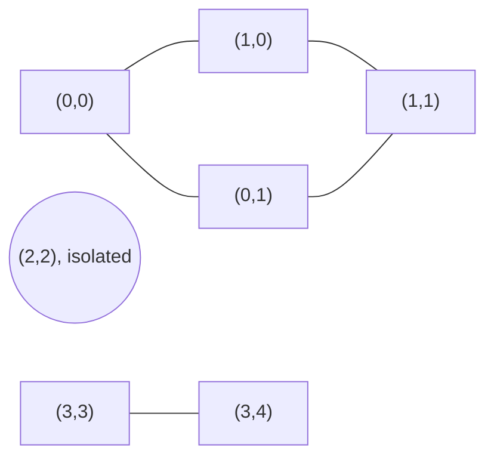

# Problem: Number of Islands

🔗 **[Try it on LeetCode](https://leetcode.com/problems/number-of-islands/)**

## Problem Statement

Given an `m x n` grid of `'1'` (land) and `'0'` (water), return the number of
islands. An island is formed by connecting adjacent land cells horizontally
or vertically (4-directional).

## Difficulty

Medium

## Technique

Graph Traversal (BFS/DFS on an implicit grid graph)

## Problem Type

Grid / Graph

## Key Insight

Treat the grid as an implicit graph: each land cell is a node, and it's
connected to its 4 orthogonal neighbors if they're also land. Counting
islands is exactly counting connected components — flood-fill (BFS or DFS)
from every unvisited land cell, incrementing a counter once per fill, and
mark every cell reached as visited so it's never counted again.

## Visual Overview

```
11000        island 1: (0,0),(0,1),(1,0),(1,1)
11000        island 2: (2,2)
00100        island 3: (3,3),(3,4)
00011
```



Three connected components of `'1'` cells → 3 islands.

## How to Recognize This Pattern

- A grid where "connectivity" is defined by adjacency between cells with a
  shared property (here, both being land) is a classic implicit-graph
  signal.
- "Count the number of connected groups/regions" = count connected
  components.

## Approach 1 — Brute Force

There isn't a meaningfully different "brute force" here — the direct
connected-components approach *is* the natural solution. (A slower
alternative would be a naive union-find with poor rank/path compression,
which is more complex for no benefit on this problem's constraints.)

## Approach 2 — Flood Fill (BFS or DFS)

### Idea
Scan every cell. When an unvisited land cell is found, it's the start of a
new island: flood-fill outward (BFS or DFS) marking every reachable land
cell as visited, then increment the island count.

### Algorithm
1. `count := 0`.
2. For each cell `(r, c)`:
   - If `grid[r][c] == '1'` and not yet visited:
     - `count++`.
     - Flood-fill from `(r, c)`, marking all connected land cells visited
       (mutate the grid in place by setting visited cells to `'0'`, or use
       a separate `visited` matrix).
3. Return `count`.

### Complexity
Time: O(m·n) — every cell is visited a constant number of times.
Space: O(m·n) worst case for the BFS queue or DFS recursion stack (e.g., an
all-land grid).

## Sample Solution

See [`solution.go`](./solution.go).

## Dry Run

```
11000
11000
00100
00011
```

- `(0,0)='1'`, unvisited → island #1; flood fill marks `(0,0),(0,1),(1,0),
  (1,1)` as visited.
- Scan continues; `(2,2)='1'`, unvisited → island #2; flood fill marks just
  `(2,2)`.
- `(3,3)='1'`, unvisited → island #3; flood fill marks `(3,3),(3,4)`.
- Total: `3` islands.

## Edge Cases

- Empty grid → `0` islands.
- All water → `0` islands.
- All land → `1` island.
- Diagonal-only adjacency (not connected in this problem's 4-directional
  definition) — two diagonal land cells with water orthogonally between
  them count as separate islands.

## Common Mistakes

- Using 8-directional adjacency when the problem specifies 4-directional
  (or vice versa) — always confirm which is intended.
- Forgetting to mark visited cells, causing infinite recursion or repeated
  counting.
- Off-by-one / missing bounds checks when examining neighbors near grid
  edges.
- Mutating the input grid when the interviewer expects it preserved — use a
  separate `visited` matrix if that matters.

## Interview Follow-ups

- Number of Islands II (dynamic version: islands form as land is added one
  cell at a time) — solved with Union-Find, not flood fill, since
  recomputing from scratch after each addition would be too slow.
- Count islands by size, or find the largest island (Max Area of Island —
  same flood fill, but return the size of each component instead of just
  counting them).

## Related Problems

- Max Area of Island
- Number of Islands II (Union-Find)
- Surrounded Regions (flood fill from the border inward)
