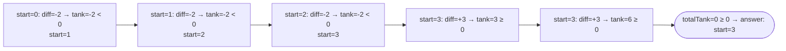

# Problem: Gas Station

🔗 **[Try it on LeetCode](https://leetcode.com/problems/gas-station/)**

## Problem Statement

There are `n` gas stations in a circle. `gas[i]` is the fuel available at
station `i`; `cost[i]` is the fuel needed to travel from station `i` to
station `i+1`. Starting with an empty tank at some station, return the
starting station index that allows completing the full circuit, or `-1` if
none exists. If a solution exists, it is guaranteed to be unique.

## Difficulty

Medium

## Technique

Greedy

## Problem Type

Array

## Key Insight

Two facts combine into an O(n) greedy solution:

1. A valid starting station exists **if and only if**
   `sum(gas) >= sum(cost)` overall (otherwise there simply isn't enough
   total fuel to complete the circuit, regardless of starting point).
2. If the total fuel suffices, then whenever the running "tank" (cumulative
   `gas[i] - cost[i]`) starting from some candidate goes negative at
   station `i`, **no station between the current candidate and `i`
   (inclusive) can be a valid start** — starting from any of them would
   hit the same or an earlier shortfall. So the next candidate to try is
   `i+1`.

## Visual Overview

`gas=[1,2,3,4,5]`, `cost=[3,4,5,1,2]` — every candidate start from 0
through 2 fails and is ruled out at once; station 3 is where the tank
never goes negative again:

## How to Recognize This Pattern

- "Find a valid starting point for a circular resource-feasibility
  problem" is the running-deficit greedy signal.
- The guarantee of a *unique* solution (when one exists) is a strong hint
  that a single greedy pass suffices — if multiple valid answers were
  possible, you'd more likely need to enumerate them.

## Approach 1 — Brute Force

### Idea
Try every starting station; simulate the full circuit, checking if the
tank ever goes negative.

### Algorithm
For each candidate start, simulate all `n` steps, tracking the running
tank; if it never goes negative, that start is valid.

### Complexity
Time: O(n²)
Space: O(1)

## Approach 2 — Optimized (Greedy, Single Pass)

### Idea
Track `totalTank` (cumulative surplus/deficit across the whole circuit) and
`currentTank` (surplus/deficit since the current candidate start).
Whenever `currentTank` goes negative at station `i`, reset the candidate
start to `i+1` and reset `currentTank` to `0` — every station from the old
candidate through `i` has been ruled out. At the end, if `totalTank >= 0`,
the final candidate start is the answer; otherwise no solution exists.

### Algorithm
1. `totalTank, currentTank, start := 0, 0, 0`.
2. For `i` from `0` to `n-1`:
   - `diff := gas[i] - cost[i]`.
   - `totalTank += diff`; `currentTank += diff`.
   - If `currentTank < 0`: `start = i + 1`; `currentTank = 0`.
3. If `totalTank >= 0`, return `start`; else return `-1`.

### Complexity
Time: O(n)
Space: O(1)

## Sample Solution

See [`solution.go`](./solution.go).

## Dry Run

`gas = [1, 2, 3, 4, 5]`, `cost = [3, 4, 5, 1, 2]`

- `i=0`: `diff=1-3=-2`; `totalTank=-2`; `currentTank=-2` → negative:
  `start=1`, `currentTank=0`.
- `i=1`: `diff=2-4=-2`; `totalTank=-4`; `currentTank=-2` → negative:
  `start=2`, `currentTank=0`.
- `i=2`: `diff=3-5=-2`; `totalTank=-6`; `currentTank=-2` → negative:
  `start=3`, `currentTank=0`.
- `i=3`: `diff=4-1=3`; `totalTank=-3`; `currentTank=3` (not negative).
- `i=4`: `diff=5-2=3`; `totalTank=0`; `currentTank=6` (not negative).
- `totalTank == 0 >= 0` → return `start = 3`.

## Edge Cases

- `sum(gas) < sum(cost)` → no valid start exists, return `-1` (caught by
  the final `totalTank >= 0` check).
- Exactly enough fuel overall (`totalTank == 0`) → still counts as
  feasible, since the tank can dip to exactly zero without going negative.
- Single station → valid iff `gas[0] >= cost[0]`.

## Common Mistakes

- Forgetting the "if total fuel is insufficient, no start works" shortcut
  and trying to brute-force-verify every remaining candidate anyway.
- Not resetting `currentTank` to `0` when advancing the candidate start —
  the deficit that caused the failure shouldn't carry over to the new
  candidate's accounting.
- Assuming the *first* station where local `gas[i] >= cost[i]` is
  necessarily a valid start — it's not; the running-deficit logic is what
  actually determines validity, not a single-station comparison.

## Interview Follow-ups

- Prove why any station between the failed candidate and the failure point
  can be safely skipped (exchange argument: starting from any station in
  that range would accumulate at least as much deficit by the failure
  point as the original candidate did, since all the intermediate partial
  sums from the original candidate onward were non-negative up until the
  failure).
- What if multiple valid starting points could exist — how would you find
  all of them? (This greedy approach relies on uniqueness; a different
  algorithm would be needed to enumerate all valid starts.)

## Related Problems

- Jump Game (similar running-feasibility greedy shape)
- Candy (greedy with a two-pass forward/backward scan)
