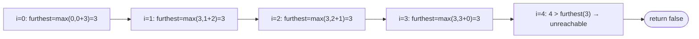

# Problem: Jump Game

🔗 **[Try it on LeetCode](https://leetcode.com/problems/jump-game/)**

## Problem Statement

Given an array `nums` where `nums[i]` is the maximum jump length from index
`i`, starting at index `0`, determine whether you can reach the last index.

## Difficulty

Medium

## Technique

Greedy

## Problem Type

Array

## Key Insight

Track the furthest index reachable so far while scanning left to right. If
you ever reach an index beyond that furthest-reachable bound, the last
index is unreachable — return `false` immediately. This is greedy because
extending the reachable frontier as far as possible at each step can never
hurt: a farther reach is strictly at least as good for every future
decision.

## Visual Overview

`nums = [3,2,1,0,4]` — a `0` at index 3 traps you before index 4 is ever
reachable:

## How to Recognize This Pattern

- "Can you reach the end, given a per-position maximum move" is a classic
  running-reachability greedy signal.
- The key metric (furthest reachable index) only ever needs to grow — once
  established, it can be updated in O(1) per step with no backtracking
  needed, which is exactly what makes the greedy approach safe here.

## Approach 1 — Brute Force (Backtracking / DP)

### Idea
From each index, try every possible jump length and recursively check if
any leads to a successful path to the end.

### Algorithm
Recursive exploration of every reachable index from the current one,
memoized to avoid recomputation (this becomes DP: `dp[i] = true` if index
`i` can reach the end).

### Complexity
Time: O(n²) with memoization (DP), O(2ⁿ) without
Space: O(n)

## Approach 2 — Optimized (Greedy)

### Idea
Maintain `furthest`, the maximum index reachable using jumps decided so
far. Scan left to right; if the current index exceeds `furthest`, it's
unreachable — fail immediately. Otherwise, update
`furthest = max(furthest, i + nums[i])`.

### Algorithm
1. `furthest := 0`.
2. For `i` from `0` to `n-1`:
   - If `i > furthest`, return `false` (index `i` is unreachable).
   - `furthest = max(furthest, i+nums[i])`.
3. Return `true` (the loop completing means every index, including the
   last, was reachable).

### Complexity
Time: O(n)
Space: O(1)

## Sample Solution

See [`solution.go`](https://github.com/xudipta/prep/blob/main/dsa/greedy/problems/jump-game/solution.go).

It also has a C++ port at [`cpp/solution.cpp`](https://github.com/xudipta/prep/blob/main/dsa/greedy/problems/jump-game/cpp/solution.cpp), a self-contained file with its own `assert`-based `main()` as its test suite.

## Dry Run

`nums = [2, 3, 1, 1, 4]`

- `i=0`: `0 <= furthest(0)`; `furthest = max(0, 0+2) = 2`.
- `i=1`: `1 <= 2`; `furthest = max(2, 1+3) = 4`.
- `i=2`: `2 <= 4`; `furthest = max(4, 2+1) = 4`.
- `i=3`: `3 <= 4`; `furthest = max(4, 3+1) = 4`.
- `i=4`: `4 <= 4`; `furthest = max(4, 4+4) = 8`.
- Loop completes → `true`.

`nums = [3, 2, 1, 0, 4]`

- `i=0`: `furthest = 3`.
- `i=1`: `furthest = max(3, 3) = 3`.
- `i=2`: `furthest = max(3, 3) = 3`.
- `i=3`: `furthest = max(3, 3) = 3`.
- `i=4`: `4 > furthest(3)` → return `false` (index 3's zero jump traps you).

## Edge Cases

- Single-element array → trivially `true` (already at the last index).
- A `0` at the very first index with `len(nums) > 1` → immediately
  unreachable past index 0.
- All jump lengths large enough to reach the end in one move → `true`
  quickly, without needing to scan the whole array (though this
  implementation scans fully regardless, an early `return true` once
  `furthest >= n-1` is a valid micro-optimization).

## Common Mistakes

- Checking `i >= furthest` instead of `i > furthest` — being *at* the
  current furthest boundary is fine (you can still jump from there);
  only exceeding it is a failure.
- Resetting or not properly accumulating `furthest` (must take the max
  across all steps, never decrease it).
- Overcomplicating with backtracking/DP when the greedy proof (furthest
  reachable only ever needs to grow) applies directly.

## Interview Follow-ups

- Jump Game II: find the *minimum* number of jumps to reach the end (a
  slightly more involved greedy: track the current jump's boundary and the
  furthest reachable within the next jump, incrementing a jump counter
  when the current boundary is exhausted).
- What if backward jumps were allowed? Changes the problem to a graph
  reachability/BFS problem instead of a clean greedy one.

## Related Problems

- Jump Game II (minimum jumps)
- Gas Station (similar running-feasibility greedy shape)
