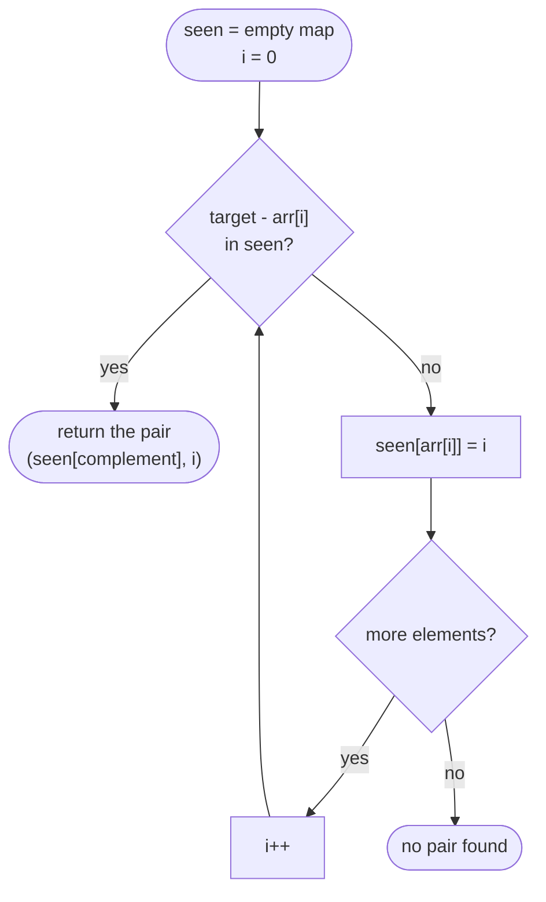

# Hashing

## Definition

Hashing uses a hash map or hash set to achieve average O(1) lookup,
insertion, and deletion, trading memory for speed by mapping keys to
values (or membership) via a hash function instead of scanning linearly.

## Core Intuition

Whenever a brute-force solution's inner loop is "search for a value in the
rest of the array/list," ask: can I remember what I've already seen (or
what I still need) in a hash map, so each lookup becomes O(1) instead of
O(n)? This is almost always how an O(n²) brute force becomes O(n).

## Recognition Patterns

- "Does there exist a pair/element such that..." — complement or
  membership lookups.
- "Group items by some derived key" (anagrams, same remainder mod k).
- "Count occurrences" / "find the first non-repeating..." / "find
  duplicates."
- You need O(1) existence checks while iterating once (e.g., "does this
  value already exist in the set / has this state been visited before").

## Visual Overview

The complement-lookup pattern (Two Sum-style), matching the template below:



The complement is checked **before** the current value is inserted, which
is exactly what stops an element from pairing with itself.

## Generic Template

**Complement lookup** (Two Sum-style):

```go
seen := make(map[int]int) // value -> index (or count)
for i, v := range nums {
    if j, ok := seen[target-v]; ok {
        return []int{j, i}
    }
    seen[v] = i
}
```

**Group by canonical key**:

```go
groups := make(map[string][]string)
for _, s := range items {
    key := canonicalKey(s)
    groups[key] = append(groups[key], s)
}
```

**Set membership** (dedup / visited tracking):

```go
seen := make(map[int]struct{})
for _, v := range nums {
    if _, ok := seen[v]; ok {
        // duplicate
    }
    seen[v] = struct{}{}
}
```

## Variations

- **Value → index/count** maps for complement/frequency problems.
- **Canonical-key grouping** (sorted string, character-count signature) for
  equivalence-class problems.
- **Set for O(1) membership** — used to avoid recomputation (e.g., only
  start counting a consecutive run from a value that has no predecessor in
  the set, turning an apparent O(n²) scan into O(n)).
- **Prefix-sum + hash map**: store prefix sums seen so far to answer
  "subarray sum equals K" in O(n) (a common hashing + prefix-sum
  combination).

## Complexity

O(n) time, O(n) space, assuming a reasonable hash function and load factor
(Go's built-in `map` handles this). Worst-case O(n) per operation only under
adversarial hash collisions, which is not a practical concern for typical
interview inputs.

## Common Mistakes

- Forgetting that map iteration order in Go is randomized — never rely on
  it for deterministic output ordering.
- Using a slice/array key naively as a map key (not allowed in Go — use a
  string or array of fixed size instead of a slice).
- Off-by-one when using prefix sums with a hash map (remember to seed the
  map with `{0: 1}` count or `{0: -1}` index before iterating, depending on
  whether you're counting or locating subarrays).
- Not clearing/resetting maps between use in multi-test-case contexts.

## Interview Tips

- Explicitly state what you're using as the key and why it uniquely
  identifies the group/state you care about.
- Mention the space/time tradeoff: O(n) extra space to get O(n) (or O(1)
  amortized per operation) time.
- If asked to solve with O(1) space, that's usually a hint hashing is *not*
  the intended technique for that follow-up (e.g., use sorting or bit
  tricks instead).

## Example

Longest Consecutive Sequence: put all numbers in a set, then only start
counting a run from numbers whose `value-1` is *not* in the set (a sequence
head). This avoids re-scanning the same run multiple times, giving O(n)
total despite looking like nested loops. See
[`problems/longest-consecutive-sequence`](problems/longest-consecutive-sequence/README.md).

## When to Use

- Need O(1) average lookup/membership/counting while scanning once.
- Need to group elements by a derived equivalence key.
- Need to detect duplicates or complements efficiently.

## When NOT to Use

- Order matters and hashing would lose it (unless you also track
  indices/order alongside the map).
- Memory is tightly constrained and O(1) extra space is required — consider
  sorting, two pointers, or bit manipulation instead.
- The key space is unbounded and collision-heavy in a way that breaks the
  average-case guarantee (rare in interviews, but worth mentioning that
  worst-case hash map operations are O(n) if forced to acknowledge it).

## Quick Revision

- **Idea**: trade memory for O(1) average lookups instead of O(n) linear
  scans.
- **Complement pattern**: `seen[target-v]` while iterating once.
- **Grouping pattern**: canonical key (sorted string, count signature) → 
  bucket.
- **Set pattern**: O(1) membership checks, dedup, "have I visited this
  state."
- **Complexity**: O(n) time & space typical.
- **Watch for**: Go map iteration order is random; slices aren't valid map
  keys.
