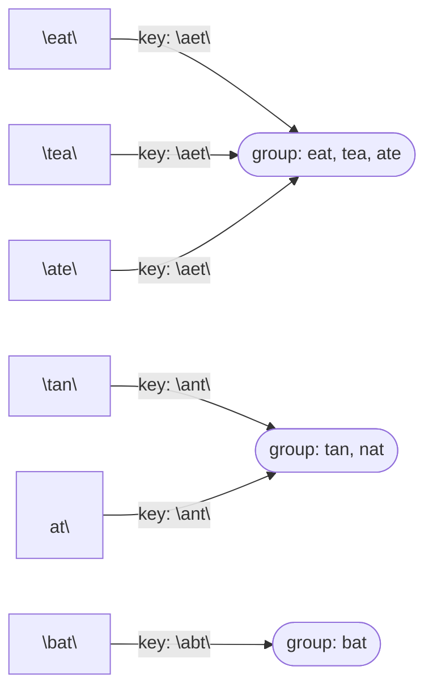

# Problem: Group Anagrams

🔗 **[Try it on LeetCode](https://leetcode.com/problems/group-anagrams/)**

## Problem Statement

Given an array of strings `strs`, group the anagrams together. Return the
groups in any order.

## Difficulty

Medium

## Technique

Hashing (canonical-key grouping)

## Problem Type

String

## Key Insight

Two strings are anagrams of each other if and only if they have the same
sorted character sequence (or the same per-character count signature).
Using that sorted string (or count signature) as a hash map key groups all
anagrams together in a single pass.

## Visual Overview

## How to Recognize This Pattern

- "Group items that are equivalent under some transformation" — the
  transformation gives you a canonical key.
- Anagram/permutation equivalence specifically always reduces to "same
  multiset of characters," which is exactly what sorting or counting
  characters captures.

## Approach 1 — Brute Force

### Idea
For each string, compare it against one representative of each existing
group (checking anagram-equality) to decide which group it belongs to.

### Algorithm
1. Maintain a list of groups. For each new string, scan existing groups for
   an anagram match; if found, append; otherwise, start a new group.

### Complexity
Time: O(n² · k log k) where `k` is the max string length (comparing against
each group requires re-sorting or re-comparing)
Space: O(n · k)

## Approach 2 — Optimized (Canonical Key Hashing)

### Idea
For each string, compute a canonical key — its characters sorted
alphabetically (or a fixed-size count array turned into a string). Use that
key to bucket strings in a hash map.

### Algorithm
1. `groups := map[string][]string{}`.
2. For each `s` in `strs`:
   - `key := sortedString(s)` (or a count-signature string).
   - `groups[key] = append(groups[key], s)`.
3. Return the map's values.

### Complexity
Time: O(n · k log k) for sorting each string (or O(n · k) using a
count-signature key instead of sorting)
Space: O(n · k)

## Sample Solution

See [`solution.go`](./solution.go).

## Dry Run

`strs = ["eat", "tea", "tan", "ate", "nat", "bat"]`

- `"eat"` → key `"aet"` → `groups["aet"] = ["eat"]`.
- `"tea"` → key `"aet"` → `groups["aet"] = ["eat", "tea"]`.
- `"tan"` → key `"ant"` → `groups["ant"] = ["tan"]`.
- `"ate"` → key `"aet"` → `groups["aet"] = ["eat", "tea", "ate"]`.
- `"nat"` → key `"ant"` → `groups["ant"] = ["tan", "nat"]`.
- `"bat"` → key `"abt"` → `groups["abt"] = ["bat"]`.
- Result: `[["eat","tea","ate"], ["tan","nat"], ["bat"]]` (order of groups
  and order within groups may vary).

## Edge Cases

- Empty input slice → empty result.
- Strings with repeated characters — sorting/counting still produces a
  correct canonical key.
- A string that has no anagram partner — forms a group of one.
- Case sensitivity — decide (and state) whether `"Eat"` and `"tea"` are
  anagrams; this implementation treats input as case-sensitive, matching
  typical problem statements that specify lowercase-only input.

## Common Mistakes

- Using string concatenation of counts without a fixed format (e.g.,
  `"1,0,2,..."` vs `"102..."`), which can produce key collisions between
  different count distributions.
- Forgetting that map iteration order (and therefore output group order) is
  randomized in Go — don't test against an exact output order.
- Sorting when a linear count-based key would be faster for long strings
  over a small alphabet.

## Interview Follow-ups

- For a small, fixed alphabet (e.g., lowercase English letters), replace
  the O(k log k) sort with an O(k) 26-count signature for a faster key.
- What if the strings can contain Unicode? A count map keyed by rune,
  serialized deterministically, still works but costs more per string.

## Related Problems

- Valid Anagram (pairwise check, same underlying idea)
- Group Shifted Strings (canonical key is the pattern of character
  differences, not sorted characters)
