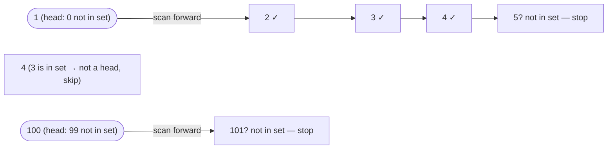

# Problem: Longest Consecutive Sequence

🔗 **[Try it on LeetCode](https://leetcode.com/problems/longest-consecutive-sequence/)**

## Problem Statement

Given an unsorted array of integers `nums`, find the length of the longest
run of consecutive integers (e.g., `[100, 4, 200, 1, 3, 2]` contains the
consecutive run `1, 2, 3, 4`, length 4). Must run in O(n) time.

## Difficulty

Medium

## Technique

Hashing (set membership + sequence-head trick)

## Problem Type

Array

## Key Insight

Put every number in a hash set. A number `v` is the **start** of a
consecutive run if and only if `v-1` is not in the set. By only counting
runs from their start, every number is visited by the inner `while` loop at
most once across the *entire* algorithm — even though there's a loop inside
a loop, the total work is O(n), not O(n²).

## Visual Overview

`nums = [100,4,200,1,3,2]` — only `1` is a sequence head (`0` isn't in
the set), so only it triggers a forward scan; `4` is skipped because `3`
is present:

Run length 4 (`1,2,3,4`) beats the length-1 run from `100` — final
answer `4`.

## How to Recognize This Pattern

- "Longest run/streak of consecutive values" with an O(n) requirement,
  ruling out the obvious O(n log n) sort-then-scan approach.
- A nested-loop-looking approach where you suspect (but need to prove) that
  the inner loop's total work across all outer iterations is bounded.

## Approach 1 — Brute Force / Sort-Based

### Idea
Sort the array, then scan for the longest run of consecutive values
(handling duplicates).

### Algorithm
1. Sort `nums`.
2. Scan left to right, extending a running streak length when
   `nums[i] == nums[i-1] + 1`, resetting on gaps, skipping exact duplicates.

### Complexity
Time: O(n log n) — dominated by the sort
Space: O(1) extra (or O(n) if sorting isn't allowed to mutate input)

## Approach 2 — Optimized (Hash Set + Sequence Heads)

### Idea
Insert all numbers into a set. For each number that is a sequence *head*
(its predecessor is absent from the set), count forward
(`v+1, v+2, ...`) while each successor is present, tracking the run length.
Skip numbers that aren't heads — they'll be counted as part of some head's
run.

### Algorithm
1. `set := make(map[int]struct{})`; insert all of `nums`.
2. `best := 0`.
3. For each `v` in `set`:
   - If `v-1` is in `set`, skip (not a sequence head).
   - Otherwise, count forward: `length := 1`; while `v+length` is in
     `set`, `length++`. Update `best`.
4. Return `best`.

### Complexity
Time: O(n) — amortized, since the inner loop only ever executes for
sequence heads, and the total steps across all heads can't exceed `n`
(each number is visited by the inner loop at most once, from its own
head).
Space: O(n)

## Sample Solution

See [`solution.go`](https://github.com/xudipta/prep/blob/main/dsa/hashing/problems/longest-consecutive-sequence/solution.go).

It also has a C++ port at [`cpp/solution.cpp`](https://github.com/xudipta/prep/blob/main/dsa/hashing/problems/longest-consecutive-sequence/cpp/solution.cpp), a self-contained file with its own `assert`-based `main()` as its test suite.

## Dry Run

`nums = [100, 4, 200, 1, 3, 2]` → `set = {100, 4, 200, 1, 3, 2}`

- `v=100`: `99` not in set → head. Count forward: `101` not in set →
  `length=1`. `best=1`.
- `v=4`: `3` **is** in set → not a head, skip.
- `v=200`: `199` not in set → head. `201` not in set → `length=1`.
- `v=1`: `0` not in set → head. Count forward: `2` in set (`length=2`), `3`
  in set (`length=3`), `4` in set (`length=4`), `5` not in set → stop.
  `best=4`.
- `v=3`, `v=2`: not heads, skipped.
- Answer: `4`.

## Edge Cases

- Empty array → `0`.
- All identical values (`[5,5,5]`) → longest run is `1` (duplicates collapse
  into a single set entry).
- Already-consecutive input → the whole array is one run.
- Negative numbers — set membership and arithmetic work identically.

## Common Mistakes

- Forgetting the "only start from a head" check, which degrades the
  algorithm back to O(n²) (or worse, if not careful, infinite-ish
  re-scanning) because every element would restart a full forward scan.
- Sorting when the problem explicitly asks for O(n) — using `sort.Ints`
  technically produces a working but non-conforming O(n log n) solution;
  useful as a fallback if you're stuck, but say so explicitly.
- Not deduplicating via the set — iterating over the raw slice instead of
  the set can double-count runs for duplicate values.

## Interview Follow-ups

- Return the actual sequence, not just its length (track and update the
  best run's start value alongside its length).
- What if the input can be a stream and you need the answer after each
  insertion? That needs a different data structure (e.g., a union-find over
  contiguous ranges) since the simple hash-set approach recomputes from
  scratch.

## Related Problems

- Longest Consecutive Sequence II (with duplicates counted / different
  variants)
- Binary Search-based "missing ranges" problems (different technique, same
  "consecutive values" theme)
