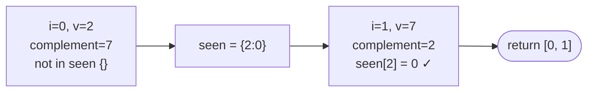

# Problem: Two Sum

🔗 **[Try it on LeetCode](https://leetcode.com/problems/two-sum/)**

## Problem Statement

Given an array of integers `nums` and an integer `target`, return the
indices of the two numbers that add up to `target`. Assume exactly one
solution exists, and you may not use the same element twice.

## Difficulty

Easy

## Technique

Hashing

## Problem Type

Array

## Key Insight

For each number `v`, the only thing that matters is whether its complement
`target - v` has already been seen. A hash map from value to index lets you
check that in O(1), so a single pass suffices.

## Visual Overview

`nums = [2,7,11,15]`, `target = 9`:

## How to Recognize This Pattern

- "Find a pair such that a + b == target" is the canonical complement-lookup
  signal.
- The array is unsorted (if it were sorted, converging two pointers would
  also work in O(1) extra space, at the cost of returning values instead of
  original indices unless you track them).

## Approach 1 — Brute Force

### Idea
Check every pair of indices.

### Algorithm
1. For `i` from `0` to `n-1`, for `j` from `i+1` to `n-1`, check if
   `nums[i]+nums[j]==target`.

### Complexity
Time: O(n²)
Space: O(1)

## Approach 2 — Optimized (Hashing)

### Idea
Walk the array once. For each value, check whether its complement is
already in a map of previously seen `value -> index`. If found, return the
pair immediately; otherwise, record the current value and index.

### Algorithm
1. `seen := map[int]int{}`.
2. For `i, v := range nums`:
   - If `j, ok := seen[target-v]; ok`, return `[j, i]`.
   - `seen[v] = i`.
3. (Problem guarantees a solution exists, so no not-found path is needed in
   the happy path — but return a clear sentinel if it doesn't.)

### Complexity
Time: O(n)
Space: O(n)

## Sample Solution

See [`solution.go`](https://github.com/xudipta/prep/blob/main/dsa/hashing/problems/two-sum/solution.go).

It also has a C++ port at [`cpp/solution.cpp`](https://github.com/xudipta/prep/blob/main/dsa/hashing/problems/two-sum/cpp/solution.cpp), a self-contained file with its own `assert`-based `main()` as its test suite.

## Dry Run

`nums = [2, 7, 11, 15]`, `target = 9`

- `i=0, v=2`: complement `7` not in `seen` (`{}`) → `seen = {2:0}`.
- `i=1, v=7`: complement `2` **is** in `seen` at index `0` → return `[0, 1]`.

## Edge Cases

- Duplicate values where the pair uses the same value twice (`[3,3]`,
  `target=6`) — works correctly since the map is checked *before* inserting
  the current value, so an index can't pair with itself.
- No solution exists — this implementation returns `nil, false`.
- Negative numbers and zero — hashing works identically regardless of sign.

## Common Mistakes

- Inserting into the map before checking for the complement, which would
  incorrectly allow an element to pair with itself.
- Returning values instead of indices (read the problem statement
  carefully — some variants want values).
- Assuming the array is sorted and trying to binary search without first
  checking the problem's constraints.

## Interview Follow-ups

- What if the array is sorted and you want O(1) extra space? Use converging
  two pointers instead (see `dsa/two-pointers`).
- What if there could be multiple valid pairs and you need all of them
  (not just one)? Adjust to collect all matches instead of returning early.
- What if the input is a stream (values arrive one at a time)? The hash map
  approach adapts directly — process each new value against the map built
  so far.

## Related Problems

- 3Sum, 4Sum (extend the complement idea to more elements, usually via
  fixing anchors + two pointers once sorted)
- Two Sum II — Input Array Is Sorted (two pointers instead of hashing)
