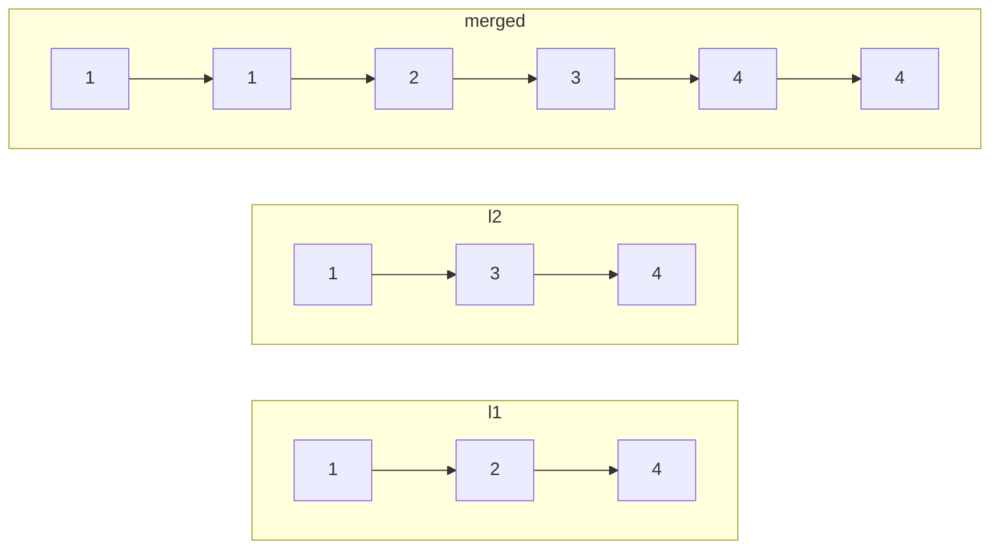

# Problem: Merge Two Sorted Lists

## Problem Statement

Given the heads of two sorted linked lists `l1` and `l2`, merge them into
one sorted list and return its head.

## Difficulty

Easy

## Technique

Linked List (dummy head + pointer merge)

## Problem Type

Linked List

## Key Insight

Since both lists are already sorted, the smallest not-yet-used node is
always at the front of one of the two lists. Repeatedly take whichever
front node is smaller and append it to the result — exactly the merge step
of merge sort, adapted to linked lists (which, unlike arrays, let you
splice nodes in O(1) instead of copying).

## Visual Overview

`l1 = 1->2->4`, `l2 = 1->3->4` → merged `1->1->2->3->4->4`:

At each step, whichever list's front node is smaller (ties go to `l1`)
gets spliced onto the result; once one list runs out, the other's
already-sorted remainder is spliced on directly.

## How to Recognize This Pattern

- "Merge two/several **sorted** structures" is the canonical signal for a
  pointer-per-structure comparison merge.
- The output needs to build a new list (or reuse existing nodes) whose
  head isn't known in advance — a strong **dummy head** signal.

## Approach 1 — Brute Force

### Idea
Collect all values from both lists into an array, sort it, then rebuild a
linked list from the sorted array.

### Algorithm
Traverse both lists into a slice, `sort.Ints`, then construct a new list.

### Complexity
Time: O((n+m) log(n+m)) — dominated by the sort (unnecessary, since the
inputs are already sorted)
Space: O(n+m)

## Approach 2 — Optimized (Two-Pointer Merge)

### Idea
Use a dummy head for the result. Compare the current fronts of `l1` and
`l2`; splice whichever is smaller onto the result and advance that list's
pointer. Once one list is exhausted, splice the remainder of the other
list directly (it's already sorted, so no further comparison is needed).

### Algorithm
1. `dummy := &ListNode{}`; `tail := dummy`.
2. While `l1 != nil && l2 != nil`:
   - If `l1.Val <= l2.Val`: `tail.Next = l1`; `l1 = l1.Next`.
   - Else: `tail.Next = l2`; `l2 = l2.Next`.
   - `tail = tail.Next`.
3. `tail.Next = l1` if `l1 != nil`, else `tail.Next = l2` (splice the
   remaining, already-sorted tail directly).
4. Return `dummy.Next`.

### Complexity
Time: O(n+m)
Space: O(1) extra (reuses existing nodes; the dummy node itself is O(1))

## Sample Solution

See [`solution.go`](./solution.go).

## Dry Run

`l1 = 1 -> 2 -> 4`, `l2 = 1 -> 3 -> 4`

- `l1.Val=1 <= l2.Val=1` → splice `l1(1)`; `l1 = 2->4`; `tail = 1`.
- `l1.Val=2 > l2.Val=1`? `2 <= 1` false → splice `l2(1)`; `l2 = 3->4`;
  `tail = 1->1`.
- `l1.Val=2 <= l2.Val=3` → splice `l1(2)`; `l1 = 4`; `tail = 1->1->2`.
- `l1.Val=4 <= l2.Val=3`? false → splice `l2(3)`; `l2 = 4`;
  `tail = 1->1->2->3`.
- `l1.Val=4 <= l2.Val=4` → splice `l1(4)`; `l1 = nil`;
  `tail = 1->1->2->3->4`.
- `l1 == nil` → loop ends. `tail.Next = l2 (which is 4)`.
- Result: `1 -> 1 -> 2 -> 3 -> 4 -> nil`.

## Edge Cases

- One list is empty → the result is simply the other list (handled
  correctly by the final splice step, or immediately if the loop never
  executes).
- Both lists empty → result is `nil` (`dummy.Next` was never set).
- Duplicate values across lists — the `<=` comparison ensures a stable
  merge (ties favor `l1`, an arbitrary but consistent choice).

## Common Mistakes

- Forgetting the dummy head and having to special-case which list's first
  node becomes the overall head.
- Using `<` instead of `<=` (or vice versa) — doesn't affect correctness of
  sortedness, but changes tie-breaking order, which occasionally matters
  if the problem cares about stability.
- Forgetting to splice the *remainder* of the non-exhausted list at the
  end — a common bug is trying to keep comparing node-by-node until both
  lists are fully `nil`, which is unnecessary extra work once one list is
  exhausted (the other is already sorted).

## Interview Follow-ups

- Merge k Sorted Lists: generalize with a min-heap over the current head of
  each list (see `data-structures/heap.md`), giving O(N log k) where `N` is
  the total number of nodes and `k` is the number of lists.
- Merge two sorted **arrays** in place (a different problem — see
  `dsa/two-pointers`, since arrays require shifting rather than splicing).

## Related Problems

- Merge k Sorted Lists
- Sort List (merge sort adapted to a linked list)
- Merge Sorted Array (the array analog, two pointers from the back)
