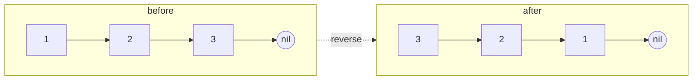

# Problem: Reverse Linked List

## Problem Statement

Given the head of a singly linked list, reverse the list and return the new
head.

## Difficulty

Easy

## Technique

Linked List (in-place pointer reversal)

## Problem Type

Linked List

## Key Insight

Reversing means every node's `.Next` pointer must point to the node that
came *before* it. Walking forward while tracking the previously-processed
node (`prev`) and carefully saving the next node *before* overwriting the
current node's pointer is enough to reverse the whole list in one pass
with no extra memory.

## Visual Overview

`1 -> 2 -> 3 -> nil` becomes `3 -> 2 -> 1 -> nil`, one link rewired per
step:

## How to Recognize This Pattern

- "Reverse a linked list" is the canonical iterative pointer-reversal
  signal — the standard template applies directly with no variation
  needed.

## Approach 1 — Brute Force (Extra Storage)

### Idea
Copy all node values into a slice, then rebuild the list (or overwrite
values in place) in reverse order.

### Algorithm
Traverse once to collect values, then traverse again assigning reversed
values.

### Complexity
Time: O(n)
Space: O(n) for the extra slice

## Approach 2 — Optimized (In-Place Iterative Reversal)

### Idea
Track `prev` (initially `nil`) and `curr` (initially `head`). At each
step, save `curr.Next` before overwriting it to point to `prev`, then
advance both `prev` and `curr` forward.

### Algorithm
1. `prev := nil`; `curr := head`.
2. While `curr != nil`:
   - `next := curr.Next`.
   - `curr.Next = prev`.
   - `prev = curr`; `curr = next`.
3. Return `prev` (the new head).

### Complexity
Time: O(n)
Space: O(1)

## Sample Solution

See [`solution.go`](./solution.go).

## Dry Run

`1 -> 2 -> 3 -> nil`

- `prev=nil, curr=1`: `next=2`; `1.Next=nil`; `prev=1, curr=2`.
- `prev=1, curr=2`: `next=3`; `2.Next=1`; `prev=2, curr=3`.
- `prev=2, curr=3`: `next=nil`; `3.Next=2`; `prev=3, curr=nil`.
- Loop ends (`curr == nil`). Return `prev = 3` → list is now
  `3 -> 2 -> 1 -> nil`.

## Edge Cases

- Empty list (`head == nil`) → returns `nil` immediately (loop never
  executes).
- Single-node list → returns that same node, with `.Next` set to `nil`
  (already correct, since `prev` starts as `nil`).
- Already-reversed input — the algorithm doesn't care about prior order; it
  produces a correct reversal regardless.

## Common Mistakes

- Overwriting `curr.Next` *before* saving it to `next` — this loses the
  rest of the list, since there's no other reference to it.
- Returning `head` instead of `prev` at the end — `head` now points to the
  *last* node of the original list (correctly reversed to be first... but
  by the end of the loop, `head`/`curr` is `nil`, so this is doubly wrong;
  `prev` is the only correct return value).
- Forgetting to handle `head == nil` explicitly if writing a version that
  doesn't naturally short-circuit (the loop-based version above handles it
  for free).

## Interview Follow-ups

- Reverse Linked List II: reverse only a sub-range `[left, right]` — same
  core technique, applied to a bounded segment with careful reconnection
  to the untouched parts before and after.
- Implement the reversal recursively instead of iteratively (trades O(1)
  space for O(n) recursion stack space, but is a common follow-up to test
  recursive thinking on a familiar problem).

## Related Problems

- Reverse Linked List II (partial reversal)
- Reverse Nodes in k-Group
- Palindrome Linked List (uses reversal of the second half as a subroutine)
