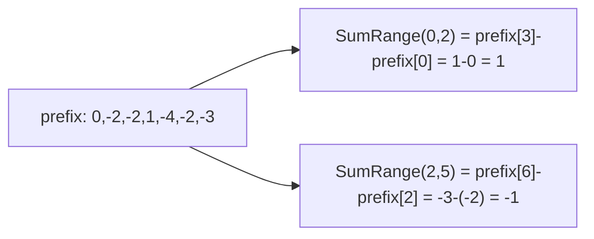

# Problem: Range Sum Query - Immutable

🔗 **[Try it on LeetCode](https://leetcode.com/problems/range-sum-query-immutable/)**

## Problem Statement

Given an integer array `nums` that does not change, design a structure
supporting `SumRange(i, j)`, returning the sum of `nums[i..j]` (inclusive),
called many times.

## Difficulty

Easy

## Technique

Prefix Sum

## Problem Type

Array

## Key Insight

Since the array never changes, precompute a prefix-sum array once. Each
`SumRange(i, j)` query then reduces to a single subtraction:
`prefix[j+1] - prefix[i]`.

## Visual Overview

`nums = [-2,0,3,-5,2,-1]` → `prefix = [0,-2,-2,1,-4,-2,-3]`:

## How to Recognize This Pattern

- "The array doesn't change" + "many range queries" together are the exact
  conditions where paying an O(n) one-time cost to make every subsequent
  query O(1) is worth it.
- If the array *could* change between queries, this specific approach
  breaks down — that's the cue to reach for a Fenwick/Segment Tree instead
  (see the "When NOT to Use" note in `dsa/prefix-sum/README.md`).

## Approach 1 — Brute Force

### Idea
Sum `nums[i..j]` directly on every call.

### Algorithm
Loop from `i` to `j`, accumulating the sum, on every `SumRange` call.

### Complexity
Time: O(n) per query
Space: O(1) extra

## Approach 2 — Optimized (Prefix Sum)

### Idea
Build `prefix[k] = sum(nums[0..k-1])` once at construction time. Answer
each query in O(1) via `prefix[j+1] - prefix[i]`.

### Algorithm
1. Constructor: `prefix := make([]int, len(nums)+1)`; for each index `i`,
   `prefix[i+1] = prefix[i] + nums[i]`.
2. `SumRange(i, j)`: return `prefix[j+1] - prefix[i]`.

### Complexity
Time: O(n) one-time construction, O(1) per query
Space: O(n) for the prefix array

## Sample Solution

See [`solution.go`](https://github.com/xudipta/prep/blob/main/dsa/prefix-sum/problems/range-sum-query-immutable/solution.go).

It also has a C++ port at [`cpp/solution.cpp`](https://github.com/xudipta/prep/blob/main/dsa/prefix-sum/problems/range-sum-query-immutable/cpp/solution.cpp), a self-contained file with its own `assert`-based `main()` as its test suite.

## Dry Run

`nums = [-2, 0, 3, -5, 2, -1]`

- `prefix = [0, -2, -2, 1, -4, -2, -3]`.
- `SumRange(0, 2)`: `prefix[3] - prefix[0] = 1 - 0 = 1` (matches
  `-2+0+3=1`).
- `SumRange(2, 5)`: `prefix[6] - prefix[2] = -3 - (-2) = -1` (matches
  `3-5+2-1=-1`).

## Edge Cases

- `i == j` (single-element range) → still correct: `prefix[i+1] -
  prefix[i] == nums[i]`.
- Query covering the entire array (`i=0, j=n-1`) → `prefix[n] - prefix[0] =
  prefix[n]`, the total sum.
- Empty `nums` → `prefix = [0]`, no valid queries possible.

## Common Mistakes

- Off-by-one: forgetting the `prefix` array has length `n+1`, or confusing
  `prefix[i]` (sum of the first `i` elements) with `nums[i]`.
- Recomputing the prefix array on every query instead of once at
  construction — defeats the entire point of precomputing.

## Interview Follow-ups

- Range Sum Query - Mutable: the array *can* be updated between queries —
  requires a Fenwick Tree (Binary Indexed Tree) or Segment Tree for O(log
  n) updates and queries, since a plain prefix-sum array would need O(n) to
  rebuild after each update.
- 2D Range Sum Query - Immutable: extend to rectangle-sum queries over a
  matrix using a 2D prefix sum.

## Related Problems

- Range Sum Query - Mutable (Fenwick Tree / Segment Tree)
- Range Sum Query 2D - Immutable
- Subarray Sum Equals K (prefix sum + hashing)
