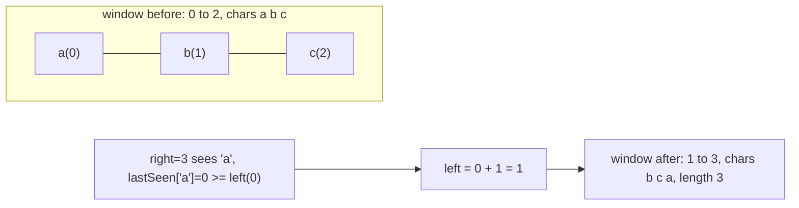

# Problem: Longest Substring Without Repeating Characters

## Problem Statement

Given a string `s`, find the length of the longest substring without
repeating characters.

## Difficulty

Medium

## Technique

Sliding Window (variable size, maximize)

## Problem Type

String

## Key Insight

Expand the window by moving `right` forward. Whenever the incoming character
already exists in the current window, shrink `left` forward until the
duplicate is removed — tracked efficiently by remembering the **last seen
index** of each character, letting `left` jump directly past it instead of
stepping one at a time.

## Visual Overview

`s = "abcabcbb"` — when `right` reaches the second `'a'` (index 3), its
last-seen index (0) is inside the current window, so `left` jumps past it:

## How to Recognize This Pattern

- "Longest/shortest substring such that [constraint]" is the classic
  variable-window signal.
- The constraint ("no repeating characters") can be checked and updated in
  O(1) as the window's edges move, using a hash map of last-seen positions
  or counts.

## Approach 1 — Brute Force

### Idea
Check every substring for repeated characters.

### Algorithm
1. For each `i`, extend `j` from `i` while no repeat is found, tracking the
   max window length.

### Complexity
Time: O(n²) or O(n³) depending on how repeat-checking is done
Space: O(min(n, alphabet size))

## Approach 2 — Optimized (Sliding Window + Last-Seen Map)

### Idea
Maintain `lastSeen[char] = index` for characters currently "in view."
Expand `right`. If `s[right]` was last seen at an index `>= left`, jump
`left` to `lastSeen[s[right]] + 1` (skip past the duplicate in one step).
Update `lastSeen[s[right]] = right` and the best length.

### Algorithm
1. `left := 0`, `best := 0`, `lastSeen := map[byte]int{}`.
2. For `right` from `0` to `len(s)-1`:
   - If `idx, ok := lastSeen[s[right]]; ok && idx >= left`, set
     `left = idx + 1`.
   - `lastSeen[s[right]] = right`.
   - `best = max(best, right-left+1)`.
3. Return `best`.

### Complexity
Time: O(n) — each character is visited once by `right`; `left` only moves
forward.
Space: O(min(n, alphabet size)) for the map.

## Sample Solution

See [`solution.go`](./solution.go).

## Dry Run

`s = "abcabcbb"`

- `right=0 ('a')`: not seen → `lastSeen['a']=0`; window `[0,0]`, best=1.
- `right=1 ('b')`: not seen → `lastSeen['b']=1`; window `[0,1]`, best=2.
- `right=2 ('c')`: not seen → `lastSeen['c']=2`; window `[0,2]`, best=3.
- `right=3 ('a')`: seen at 0 ≥ left(0) → `left=1`; `lastSeen['a']=3`; window
  `[1,3]`, best=3.
- `right=4 ('b')`: seen at 1 ≥ left(1) → `left=2`; `lastSeen['b']=4`; window
  `[2,4]`, best=3.
- `right=5 ('c')`: seen at 2 ≥ left(2) → `left=3`; `lastSeen['c']=5`; window
  `[3,5]`, best=3.
- `right=6 ('b')`: seen at 4 ≥ left(3) → `left=5`; window `[5,6]`, best=3.
- `right=7 ('b')`: seen at 6 ≥ left(5) → `left=7`; window `[7,7]`, best=3.
- Answer: `3` (`"abc"`).

## Edge Cases

- Empty string → `0`.
- All identical characters (`"aaaa"`) → `1`.
- All distinct characters → the whole string's length.
- `idx >= left` check matters: without it, a stale `lastSeen` entry from
  *before* the current window could incorrectly shrink `left` backward past
  where it already is.

## Common Mistakes

- Forgetting the `idx >= left` guard, causing `left` to move backward.
- Off-by-one in `left = idx + 1`.
- Using a fixed 26-letter array when the input can contain arbitrary
  Unicode/ASCII characters (use a map, or a 256/128-entry array for byte
  input, or a `map[rune]int` for full Unicode).

## Interview Follow-ups

- Return the actual substring, not just its length (track the best window's
  bounds).
- At most K distinct characters instead of zero repeats — same template
  with a count map and a "distinct count > K" shrink condition.

## Related Problems

- Longest Substring with At Most K Distinct Characters
- Minimum Window Substring (variable window, minimize)
