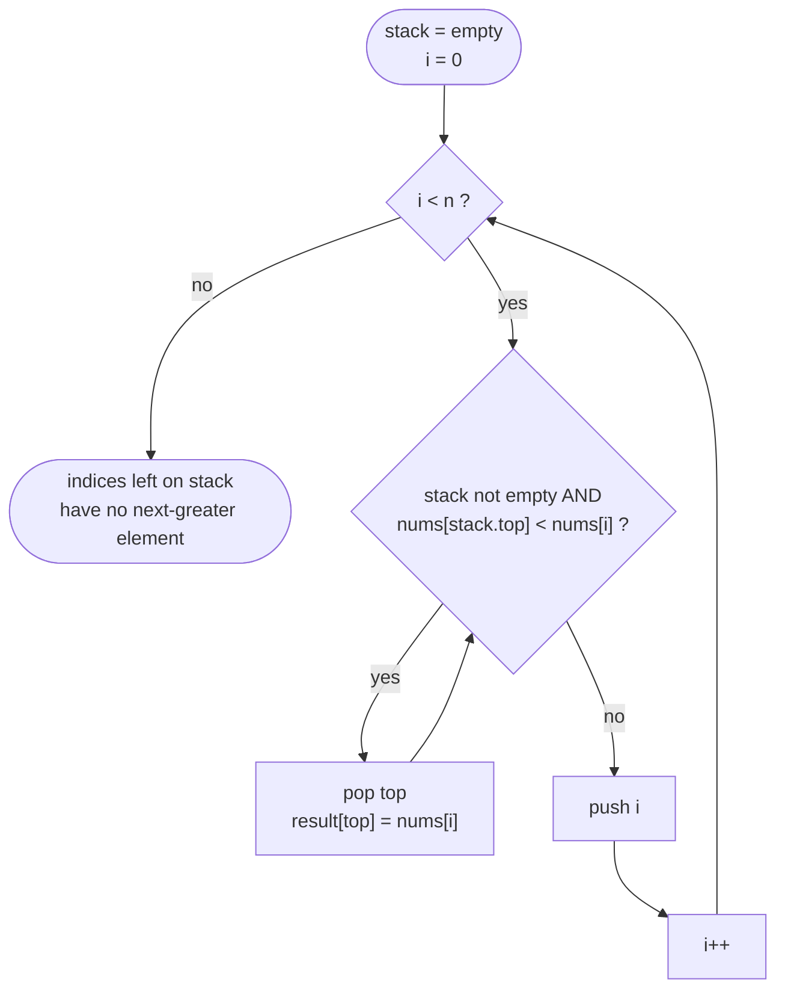

# Stack / Monotonic Stack

## Definition

A stack (LIFO) is the base structure; a **monotonic stack** additionally
maintains its elements in strictly increasing or decreasing order by
popping elements that would violate that order before pushing a new one.
This lets you answer "next/previous greater/smaller element" queries for
every element in O(n) total, instead of O(n²) with a naive nested scan.

## Core Intuition

Plain stacks solve matching/nesting problems (an opening token must be
closed by the most recently unclosed opener). Monotonic stacks solve a
different class: "for each element, what's the nearest element to the
left/right that's greater/smaller?" The key insight is that once an
element is popped because a *smaller* (or larger) element arrived, it can
never be the answer for anything further right — so each element is pushed
and popped **at most once**, giving O(n) total work despite the
nested-looking while loop inside the main loop.

## Recognition Patterns

- Matching/nesting: balanced parentheses, nested tags, valid expressions.
- "Next greater/smaller element," "next warmer day," "span of days until a
  price drops" — anything about the nearest qualifying neighbor in a
  sequence.
- Histogram/skyline problems (largest rectangle in a histogram) — the
  monotonic stack tracks bar indices whose heights form an increasing
  sequence, popping when a shorter bar is found.

## Visual Overview

**Monotonic stack** — how "next greater element" resolves each index in
amortized O(1), matching the template below:



Every index is pushed exactly once and popped at most once across the
*entire* run — that bounded total work is what makes the algorithm O(n)
despite the loop nested inside a loop.

## Generic Template

**Matching (plain stack)**:

```go
stack := []byte{}
pairs := map[byte]byte{')': '(', ']': '[', '}': '{'}
for i := 0; i < len(s); i++ {
    c := s[i]
    if opener, isCloser := pairs[c]; isCloser {
        if len(stack) == 0 || stack[len(stack)-1] != opener {
            return false
        }
        stack = stack[:len(stack)-1]
    } else {
        stack = append(stack, c)
    }
}
return len(stack) == 0
```

**Monotonic stack (next greater element)**:

```go
result := make([]int, len(nums))
for i := range result {
    result[i] = -1
}
var stack []int // indices; nums[stack[...]] strictly decreasing bottom-to-top
for i, v := range nums {
    for len(stack) > 0 && nums[stack[len(stack)-1]] < v {
        top := stack[len(stack)-1]
        stack = stack[:len(stack)-1]
        result[top] = v
    }
    stack = append(stack, i)
}
```

## Variations

- **Matching/validity**: balanced parentheses, valid expression parsing.
- **Next/previous greater/smaller element**: monotonic stack of indices.
- **Sliding window maximum/minimum**: a monotonic *deque* (see
  `data-structures/queue.md`) rather than a stack, since elements can also
  expire from the front.
- **Histogram-style area problems**: monotonic stack tracking indices with
  increasing bar heights, computing area when a shorter bar forces a pop.

## Complexity

O(n) — each element is pushed and popped from the stack at most once,
across the entire algorithm, even though there's a loop inside a loop.

## Common Mistakes

- Storing values instead of indices on a monotonic stack when you need to
  know *where* the qualifying element is (e.g., for computing a
  distance/span, not just the value).
- Getting the strictness wrong (`<` vs `<=`) when popping — affects
  whether equal elements count as "greater."
- Forgetting the stack can remain non-empty at the end — those elements
  have no valid next-greater/smaller element and should default to a
  sentinel (`-1`, or the array's own length, depending on the problem).

## Interview Tips

- Explicitly state the invariant being maintained (values on the stack are
  strictly increasing/decreasing bottom to top) and why an element being
  popped means it can never be the answer for future elements.
- For matching problems, state the invariant as "the stack always holds
  currently-unmatched openers, most recent on top."

## Example

Daily Temperatures: for each day, find how many days until a warmer
temperature. A monotonic decreasing stack of indices lets each day be
resolved in O(1) amortized time — when a warmer day arrives, it resolves
every colder day still sitting on the stack in one pass. See
[`problems/daily-temperatures`](problems/daily-temperatures/README.md).

## When to Use

- Nesting/matching validation.
- "Nearest greater/smaller element" queries for every array position.
- Problems where a nested-loop brute force's inner loop only ever needs to
  go until it finds the first qualifying element — that's the tell that
  each element does bounded total work across the whole array.

## When NOT to Use

- You need the *k* nearest qualifying elements, not just the first — a
  monotonic stack naturally finds only the nearest one.
- The comparison isn't based on simple ordering (greater/smaller) but on
  some other relation that doesn't produce a clean monotonic invariant.

## Quick Revision

- **Plain stack**: matching/nesting — push openers, pop and compare on
  closers.
- **Monotonic stack**: maintain increasing/decreasing order by popping
  before pushing; used for next/previous greater/smaller element queries.
- **Complexity**: O(n) — each element pushed/popped at most once overall.
- **Store indices, not just values**, when you need position/distance
  information.
- **Representative problems**: Valid Parentheses (matching), Daily
  Temperatures (monotonic stack, next greater element).
