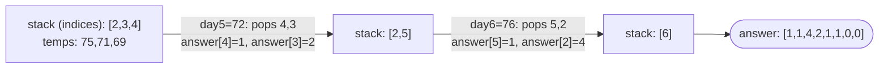

# Problem: Daily Temperatures

🔗 **[Try it on LeetCode](https://leetcode.com/problems/daily-temperatures/)**

## Problem Statement

Given an array `temperatures`, return an array `answer` where `answer[i]`
is the number of days until a warmer temperature; if no such day exists,
`answer[i] = 0`.

## Difficulty

Medium

## Technique

Monotonic Stack

## Problem Type

Array

## Key Insight

Maintain a stack of indices whose temperatures are **not yet resolved**
(no warmer day found yet), kept in decreasing order of temperature bottom
to top. When a new day's temperature is warmer than the temperature at the
index on top of the stack, that resolves the top index — pop it, compute
the day difference, and repeat until the stack's top is no longer colder
than today (or the stack is empty). Each index is pushed once and popped
at most once, giving O(n) total work.

## Visual Overview

`temperatures = [73,74,75,71,69,72,76,73]` — day 6 (76°) resolves three
stacked days at once:

## How to Recognize This Pattern

- "Days until a warmer/colder value" is the canonical "next greater
  element with distance" signal — needing both *whether* a qualifying
  element exists and *how far away* it is (hence storing indices, not just
  values).

## Approach 1 — Brute Force

### Idea
For each day, scan forward until a warmer day is found.

### Algorithm
Nested loop: outer over each day, inner scanning forward for the first
warmer temperature.

### Complexity
Time: O(n²)
Space: O(1) extra (excluding output)

## Approach 2 — Optimized (Monotonic Stack)

### Idea
Scan left to right, maintaining a stack of indices with temperatures in
decreasing order (bottom to top). For each new day, pop and resolve every
stacked index whose temperature is lower than today's, then push today's
index.

### Algorithm
1. `answer := make([]int, n)`; `stack := []int{}` (holds indices).
2. For `i` from `0` to `n-1`:
   - While `stack` non-empty and `temperatures[stack.top] <
     temperatures[i]`: pop `top`; `answer[top] = i - top`.
   - Push `i`.
3. Any indices remaining on the stack at the end keep `answer[i] = 0`
   (never resolved — no warmer day exists later).

### Complexity
Time: O(n) — each index is pushed once and popped at most once
Space: O(n) for the stack (worst case: strictly decreasing temperatures)

## Sample Solution

See [`solution.go`](https://github.com/xudipta/prep/blob/main/dsa/stack/problems/daily-temperatures/solution.go).

It also has a C++ port at [`cpp/solution.cpp`](https://github.com/xudipta/prep/blob/main/dsa/stack/problems/daily-temperatures/cpp/solution.cpp), a self-contained file with its own `assert`-based `main()` as its test suite.

## Dry Run

`temperatures = [73, 74, 75, 71, 69, 72, 76, 73]`

- `i=0 (73)`: stack empty → push. `stack=[0]`.
- `i=1 (74)`: `temp[0]=73 < 74` → pop `0`, `answer[0]=1-0=1`. Stack empty →
  push `1`. `stack=[1]`.
- `i=2 (75)`: `temp[1]=74 < 75` → pop `1`, `answer[1]=2-1=1`. Push `2`.
  `stack=[2]`.
- `i=3 (71)`: `temp[2]=75` not `< 71` → push `3`. `stack=[2,3]`.
- `i=4 (69)`: `temp[3]=71` not `< 69` → push `4`. `stack=[2,3,4]`.
- `i=5 (72)`: `temp[4]=69 < 72` → pop `4`, `answer[4]=5-4=1`.
  `temp[3]=71 < 72` → pop `3`, `answer[3]=5-3=2`. `temp[2]=75` not `< 72`
  → push `5`. `stack=[2,5]`.
- `i=6 (76)`: `temp[5]=72 < 76` → pop `5`, `answer[5]=6-5=1`.
  `temp[2]=75 < 76` → pop `2`, `answer[2]=6-2=4`. Push `6`. `stack=[6]`.
- `i=7 (73)`: `temp[6]=76` not `< 73` → push `7`. `stack=[6,7]`.
- End: indices `6, 7` remain unresolved → `answer[6]=0, answer[7]=0`.
- Final: `[1, 1, 4, 2, 1, 1, 0, 0]`.

## Edge Cases

- Strictly decreasing temperatures → every index remains on the stack,
  every `answer[i] = 0`.
- Strictly increasing temperatures → each day resolves the previous one
  immediately (`answer[i] = 1` for all but the last).
- Single day → `answer = [0]` (no future day to compare against).

## Common Mistakes

- Storing temperatures on the stack instead of indices — makes it
  impossible to compute the day distance (`i - top`).
- Using `<=` instead of `<` when comparing — changes whether equal
  temperatures resolve each other (they shouldn't; "warmer" means
  strictly greater).
- Forgetting that indices left on the stack at the end correctly default
  to `0` (no code path needs to explicitly set this if `answer` is
  zero-initialized, which Go slices are by default).

## Interview Follow-ups

- Next Greater Element I / II (same monotonic-stack template, varying
  whether the array is circular or values need to be looked up by value
  instead of index).
- What if you needed the *temperature*, not the day count? Trivial
  variant — store the value instead of/alongside the distance.

## Related Problems

- Next Greater Element I
- Next Greater Element II (circular array)
- Largest Rectangle in Histogram (monotonic stack, area computation)
