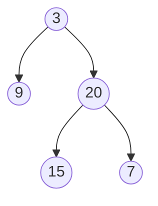

# Trees

## Definition

A tree is a connected, acyclic graph — most interview problems use rooted
binary trees or binary search trees (BSTs). Trees are a special case of
graphs, so BFS/DFS both apply directly, but the acyclic, rooted structure
lets you skip visited-tracking entirely (you never revisit a node by
walking parent→child links, so no cycles to worry about).

## Visual Overview

The same small tree, visited in each of the four orders described below:



| Traversal | Visit order | Rule |
|---|---|---|
| Preorder | 3, 9, 20, 15, 7 | node, then left, then right |
| Inorder | 9, 3, 15, 20, 7 | left, then node, then right (sorted order on a BST) |
| Postorder | 9, 15, 7, 20, 3 | left, then right, then node |
| Level order | 3, 9, 20, 15, 7 | BFS, one level at a time |

## Traversal Templates

**DFS — Preorder (node, left, right)**: used when you need to process a
node before its children (e.g., copying/serializing a tree top-down).

```go
func preorder(node *TreeNode, visit func(*TreeNode)) {
    if node == nil {
        return
    }
    visit(node)
    preorder(node.Left, visit)
    preorder(node.Right, visit)
}
```

**DFS — Inorder (left, node, right)**: for a BST, this visits nodes in
sorted order — the single most important traversal fact for BST problems.

```go
func inorder(node *TreeNode, visit func(*TreeNode)) {
    if node == nil {
        return
    }
    inorder(node.Left, visit)
    visit(node)
    inorder(node.Right, visit)
}
```

**DFS — Postorder (left, right, node)**: used when a node's answer depends
on its children's answers first (bottom-up/Tree DP — height, diameter,
subtree sums).

```go
func postorder(node *TreeNode) int {
    if node == nil {
        return 0
    }
    left := postorder(node.Left)
    right := postorder(node.Right)
    return 1 + max(left, right) // e.g., height
}
```

**BFS — Level Order**: process nodes level by level using a queue; capture
the current queue length before processing a level to know exactly which
nodes belong to it.

```go
func levelOrder(root *TreeNode) [][]int {
    if root == nil {
        return nil
    }
    var result [][]int
    queue := []*TreeNode{root}
    for len(queue) > 0 {
        levelSize := len(queue)
        level := make([]int, 0, levelSize)
        for i := 0; i < levelSize; i++ {
            node := queue[0]
            queue = queue[1:]
            level = append(level, node.Val)
            if node.Left != nil {
                queue = append(queue, node.Left)
            }
            if node.Right != nil {
                queue = append(queue, node.Right)
            }
        }
        result = append(result, level)
    }
    return result
}
```

## Binary Search Trees (BSTs)

**Invariant**: for every node, all values in its left subtree are smaller,
all values in its right subtree are larger. This lets you navigate in
O(height) instead of O(n) — at each node, decide "go left or right" without
searching both.

**When to use the BST property instead of generic tree traversal**: any
time you're told (or can confirm) the tree is a BST, prefer exploiting the
ordering — it turns O(n) searches into O(height) ones.

## Lowest Common Ancestor (LCA)

- **Generic binary tree**: DFS from the root; a node is the LCA of `p` and
  `q` if `p` and `q` are found in different subtrees of it (or it *is* `p`
  or `q` and the other is found in the subtree).
- **BST**: use the ordering — walk from the root; if both `p` and `q` are
  smaller, go left; if both are larger, go right; otherwise, the current
  node is the LCA (this is the "split point" where the two values diverge).

## Diameter

The diameter (longest path between any two nodes) is computed with
postorder DFS: at each node, the longest path *through* it is
`height(left) + height(right)`, and the answer is the max of that value
across all nodes — not necessarily through the root.

## Serialize / Deserialize

Preorder traversal with explicit null markers lets you reconstruct a tree
from a flat representation — the null markers are what make the
reconstruction unambiguous.

## Path Problems

Most "path sum" variants are postorder DFS: compute a value bottom-up
(subtree sum, max path through a node) while tracking a global best that
may span through — not just down from — the current node.

## Balanced Trees (Conceptual)

AWS/AVL/Red-Black trees maintain O(log n) height via rotations after
insert/delete. Interviews rarely ask you to implement rotations from
scratch, but you should be able to explain *why* balancing matters (an
unbalanced BST degrades to a linked list, O(n) operations) and recognize
when a language's built-in balanced structure (e.g., a sorted map) is the
right tool instead of a hand-rolled BST.

## Complexity

Traversals: O(n) time, O(h) space for recursion (h = height; O(log n)
balanced, O(n) worst case skewed) or O(w) for BFS (w = max width).

## Common Mistakes

- Forgetting the `nil` base case in recursive traversals.
- Confusing preorder/inorder/postorder — pick based on when you need the
  node's own value relative to its children's results.
- Not using the BST property when available, falling back to generic O(n)
  search unnecessarily.
- In level-order BFS, forgetting to snapshot `len(queue)` before the inner
  loop starts appending new nodes — this silently breaks level boundaries.

## Interview Tips

- Name the traversal order you're using and justify it based on when you
  need each node's value relative to its subtrees.
- For BST problems, always mention the O(height) implication explicitly.
- Diameter/path-sum style problems: state clearly that the answer may not
  pass through the root, and that's why a global variable/return value
  pair is needed alongside the recursive height computation.

## Quick Revision

- **Preorder**: node → left → right (top-down processing, serialization).
- **Inorder**: left → node → right (sorted order on a BST).
- **Postorder**: left → right → node (bottom-up, Tree DP, height/diameter).
- **Level order**: BFS with a queue, snapshot level size before the inner
  loop.
- **BST**: exploit ordering for O(height) search/insert/LCA instead of
  O(n).
- **Diameter/path problems**: postorder DFS with a global best tracked
  alongside the returned per-node value.
