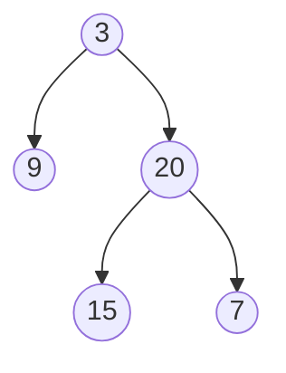
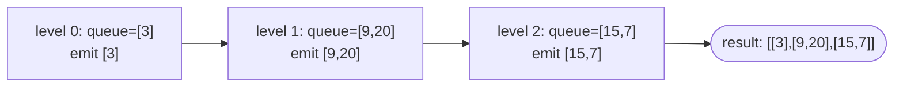

# Problem: Binary Tree Level Order Traversal

## Problem Statement

Given the root of a binary tree, return the values of its nodes as a list
of lists, one inner list per level, ordered top to bottom and left to right
within each level.

## Difficulty

Easy

## Technique

BFS (Breadth-First Search)

## Problem Type

Tree

## Key Insight

BFS naturally visits nodes level by level using a queue. The trick to
grouping output *by level* is to snapshot the current queue's length before
processing it — that length is exactly the number of nodes in the current
level, since every node enqueued during this level's processing belongs to
the *next* level.

## Visual Overview





## How to Recognize This Pattern

- "Level by level," "row by row," or "level order" in the problem statement
  is a direct BFS signal.
- Any tree/graph problem needing to distinguish "distance from the start"
  groups is a BFS-with-level-tracking problem.

## Approach 1 — Brute Force (DFS with Depth Tracking)

### Idea
DFS while tracking the current depth; append each node's value to
`result[depth]`, growing `result` as deeper levels are first reached.

### Algorithm
Recursive preorder DFS passing the current depth; append to (or create) the
list at that depth's index.

### Complexity
Time: O(n)
Space: O(h) recursion stack (h = tree height)

## Approach 2 — Optimized / Idiomatic (Iterative BFS)

### Idea
Use a queue starting with the root. Repeatedly snapshot the queue's current
length as `levelSize`, dequeue exactly that many nodes (collecting their
values and enqueueing their children), then move to the next level.

### Algorithm
1. If `root == nil`, return `nil`.
2. `queue := []*TreeNode{root}`.
3. While `len(queue) > 0`:
   - `levelSize := len(queue)`.
   - `level := []int{}`.
   - For `i` from `0` to `levelSize-1`: dequeue a node, append its value to
     `level`, enqueue its non-nil children.
   - Append `level` to the result.
4. Return the result.

### Complexity
Time: O(n)
Space: O(w) for the queue (w = max width of the tree), plus O(n) for the
output.

## Sample Solution

See [`solution.go`](./solution.go).

## Dry Run

Tree:
```
    3
   / \
  9  20
    /  \
   15   7
```

- `queue=[3]`. `levelSize=1`: dequeue `3`, enqueue `9, 20`. `level=[3]`.
  `result=[[3]]`.
- `queue=[9,20]`. `levelSize=2`: dequeue `9` (no children), dequeue `20`
  (enqueue `15, 7`). `level=[9,20]`. `result=[[3],[9,20]]`.
- `queue=[15,7]`. `levelSize=2`: dequeue `15`, dequeue `7`. `level=[15,7]`.
  `result=[[3],[9,20],[15,7]]`.
- `queue` empty → return `result`.

## Edge Cases

- Empty tree (`root == nil`) → return `nil`/empty result.
- Single node → one level containing just that value.
- Skewed tree (essentially a linked list) → one node per level, `n` levels
  total.

## Common Mistakes

- Computing `levelSize` *inside* the inner loop (or not snapshotting it at
  all) — since children get enqueued during the loop, this causes the loop
  to run over both the current and next levels combined.
- Forgetting the `nil` check before enqueueing children.
- Using a slice as a queue with `queue = queue[1:]` in a hot loop across a
  huge tree — fine for interview-sized inputs, but worth mentioning the
  O(n) amortized cost concern for a true production queue (a ring buffer or
  `container/list` would avoid repeated re-slicing overhead in perf-critical code).

## Interview Follow-ups

- Zigzag Level Order Traversal — same template, reverse alternate levels.
- Return the average value per level, or the rightmost value per level
  (both trivial modifications of the per-level aggregation step).

## Related Problems

- Binary Tree Zigzag Level Order Traversal
- Average of Levels in Binary Tree
- Minimum Depth of Binary Tree (BFS to first leaf)
