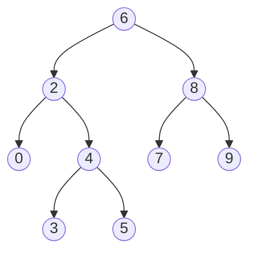

# Problem: Lowest Common Ancestor of a Binary Search Tree

🔗 **[Try it on LeetCode](https://leetcode.com/problems/lowest-common-ancestor-of-a-binary-search-tree/)**

## Problem Statement

Given a binary search tree (BST) and two nodes `p` and `q` known to exist in
it, find their lowest common ancestor (LCA) — the deepest node that has
both `p` and `q` as descendants (a node can be a descendant of itself).

## Difficulty

Easy

## Technique

BST property exploitation

## Problem Type

Tree / BST

## Key Insight

In a generic binary tree, finding the LCA requires searching both subtrees
from every node (O(n)). In a BST, ordering tells you the direction to go
without searching both sides: if both `p.Val` and `q.Val` are less than the
current node's value, the LCA must be in the left subtree; if both are
greater, it must be in the right subtree. The first node where they *don't*
both go the same direction is exactly the split point — the LCA.

## Visual Overview



`LCA(2, 8)`: at node `6`, `2 < 6` and `8 > 6` — they split, so `6` is
the LCA. `LCA(0, 3)`: at node `6`, both `0 < 6` and `3 < 6` → descend
left to `2`; at node `2`, `0 < 2` but `3 > 2` — they split, so `2` is
the LCA.

## How to Recognize This Pattern

- The problem explicitly states (or the input guarantees) a BST, not just
  any binary tree — that's the cue to use ordering instead of a generic
  two-subtree search.
- "Lowest common ancestor" + "BST" together should immediately suggest an
  O(height) iterative solution instead of the O(n) generic-tree DFS
  approach.

## Approach 1 — Brute Force (Generic Binary Tree LCA)

### Idea
DFS from the root; a node is the LCA if `p` and `q` are found in different
subtrees of it, or the node itself is one of `p`/`q` and the other is
found in a subtree. Works on any binary tree, ignoring the BST property.

### Algorithm
Recursive DFS returning whether the current subtree contains `p`, `q`,
neither, or is itself the LCA (typically implemented by returning the LCA
node or `nil` and combining left/right results).

### Complexity
Time: O(n)
Space: O(h) recursion stack

## Approach 2 — Optimized (BST Property, Iterative)

### Idea
Start at the root. Compare both `p.Val` and `q.Val` to the current node's
value. If both are smaller, move left. If both are larger, move right.
Otherwise (they split, or one equals the current node), the current node is
the LCA.

### Algorithm
1. `node := root`.
2. While true:
   - If `p.Val < node.Val && q.Val < node.Val`, `node = node.Left`.
   - Else if `p.Val > node.Val && q.Val > node.Val`, `node = node.Right`.
   - Else, return `node`.

### Complexity
Time: O(h) — h = tree height (O(log n) balanced, O(n) worst case skewed)
Space: O(1) iterative (O(h) if written recursively)

## Sample Solution

See [`solution.go`](https://github.com/xudipta/prep/blob/main/dsa/trees/problems/lowest-common-ancestor-bst/solution.go).

It also has a C++ port at [`cpp/solution.cpp`](https://github.com/xudipta/prep/blob/main/dsa/trees/problems/lowest-common-ancestor-bst/cpp/solution.cpp), a self-contained file with its own `assert`-based `main()` as its test suite.

## Dry Run

BST:
```
        6
      /   \
     2     8
    / \   / \
   0   4 7   9
      / \
     3   5
```
`p = 2`, `q = 8`

- `node=6`: `p.Val=2 < 6` and `q.Val=8 > 6` — split → return `6`.

`p = 2`, `q = 4`

- `node=6`: both `2` and `4` are `< 6` → go left, `node=2`.
- `node=2`: `p.Val=2` equals `node.Val` (not strictly less) and
  `q.Val=4 > 2` — this is the "otherwise" case (not both-less, not
  both-greater) → return `2`.

## Edge Cases

- `p` or `q` is an ancestor of the other — the algorithm correctly stops as
  soon as the values no longer both go the same direction (including when
  one equals the current node exactly).
- `p == q` → returns `p` itself (trivially its own ancestor).
- A completely skewed BST (linked-list shape) → O(h) degrades to O(n).

## Common Mistakes

- Using strict `<`/`>` everywhere without handling the case where one of
  `p`/`q` equals the current node's value (must still count as "split" and
  return the current node, not keep descending).
- Applying this BST-specific shortcut to a tree that isn't guaranteed to be
  a BST — falls back silently to wrong answers.
- Forgetting this only needs O(h) space if implemented iteratively — a
  recursive version isn't wrong, but loses the O(1) space benefit.

## Interview Follow-ups

- Lowest Common Ancestor of a Binary Tree (no BST guarantee) — requires the
  generic O(n) DFS approach instead.
- What if the tree also supports parent pointers? Then you can walk both
  `p` and `q` up to the root, storing one path in a set, and find the first
  overlap — a different but equally valid O(h) approach.

## Related Problems

- Lowest Common Ancestor of a Binary Tree
- Validate Binary Search Tree (same "exploit BST ordering" family)
