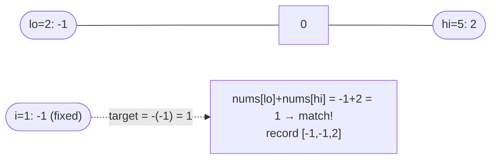

# Problem: 3Sum

🔗 **[Try it on LeetCode](https://leetcode.com/problems/3sum/)**

## Problem Statement

Given an integer array `nums`, return all unique triplets `[a, b, c]` such
that `a + b + c == 0`. The solution set must not contain duplicate triplets.

## Difficulty

Medium

## Technique

Two Pointers (with a fixed anchor)

## Problem Type

Array

## Key Insight

Sort the array. Fix the smallest element of a candidate triplet at index
`i`, and the problem reduces to "Two Sum" on the remaining sorted subarray
`nums[i+1:]` with target `-nums[i]` — which converging two pointers solves in
O(n). Doing this for every `i` gives O(n²) total, down from the brute
force's O(n³).

## Visual Overview

Sorted `nums = [-4,-1,-1,0,1,2]`, anchor `i=1` (`nums[i]=-1`) — a Two-Sum
converging scan over the rest of the array:

## How to Recognize This Pattern

- "Find k numbers that sum to a target" for small fixed `k` (3, 4) is a sign
  to fix `k-2` elements and two-pointer the rest.
- The "no duplicate results" requirement, combined with a summable
  condition, is a strong signal to sort first (duplicates become adjacent
  and easy to skip).

## Approach 1 — Brute Force

### Idea
Check every triplet with three nested loops, dedupe using a set of sorted
triplets.

### Algorithm
1. For each `i < j < k`, check if `nums[i]+nums[j]+nums[k]==0`; if so, add
   the sorted triplet to a result set.

### Complexity
Time: O(n³)
Space: O(n) for dedup storage

## Approach 2 — Optimized (Sort + Two Pointers)

### Idea
Sort `nums`. For each index `i` (skipping duplicates), run converging two
pointers on `(i+1, n-1)` looking for pairs summing to `-nums[i]`, skipping
duplicate values for both pointers after a match.

### Algorithm
1. Sort `nums` ascending.
2. For `i` from `0` to `n-3`:
   - Skip if `nums[i] == nums[i-1]` (avoid duplicate triplets starting the same way).
   - If `nums[i] > 0`, break — no triplet with a positive smallest element can sum to 0 in a sorted ascending array.
   - `lo, hi := i+1, n-1`; while `lo < hi`:
     - `sum := nums[i] + nums[lo] + nums[hi]`
     - If `sum == 0`: record `[nums[i], nums[lo], nums[hi]]`; advance `lo`
       and retreat `hi` past duplicates; then `lo++`, `hi--`.
     - If `sum < 0`: `lo++` (need a larger sum).
     - Else: `hi--` (need a smaller sum).

### Complexity
Time: O(n²) (O(n log n) sort + O(n) two-pointer scan per anchor)
Space: O(1) extra (excluding the output and the space used by sorting)

## Sample Solution

See [`solution.go`](./solution.go).

## Dry Run

`nums = [-1, 0, 1, 2, -1, -4]` → sorted: `[-4, -1, -1, 0, 1, 2]`

- `i=0 (-4)`: `lo=1(-1), hi=5(2)`: sum=`-3` < 0 → `lo++`. `lo=2(-1), hi=5(2)`:
  sum=`-3` → `lo++`. `lo=3(0), hi=5(2)`: sum=`-2` → `lo++`. `lo=4(1), hi=5(2)`:
  sum=`-1` → `lo++`. `lo==hi`, stop. No triplet with `-4`.
- `i=1 (-1)`: `lo=2(-1), hi=5(2)`: sum=`0` → record `[-1,-1,2]`; skip
  duplicates, `lo=3(0), hi=4(1)`: sum=`0` → record `[-1,0,1]`; `lo++, hi--`,
  loop ends.
- `i=2 (-1)`: equals `nums[1]`, skip (avoid duplicate triplets).
- `i=3 (0)`: `nums[i] > 0`? No (`0` is not `> 0`), continue: `lo=4(1), hi=5(2)`:
  sum=`3` → `hi--`; loop ends, no triplet.
- Result: `[[-1,-1,2], [-1,0,1]]`.

## Edge Cases

- Fewer than 3 elements → no triplets possible.
- All zeros → exactly one triplet `[0,0,0]` (dedup must catch repeats).
- No triplet sums to zero → empty result.
- Multiple duplicate values requiring careful skip logic on both `i`, `lo`,
  and `hi`.

## Common Mistakes

- Forgetting to skip duplicate values for `i`, `lo`, and `hi`, producing
  duplicate triplets.
- Not sorting first, which breaks the two-pointer convergence logic.
- Breaking too early on `nums[i] > 0` without confirming the array is sorted
  ascending (the optimization relies on it).

## Interview Follow-ups

- Extend to 4Sum: fix two anchors, two-pointer the rest — O(n³).
- What if the array is huge and doesn't fit in memory sorted? Discuss
  external sorting or streaming approaches (out of scope for the core
  pattern, but a good follow-up discussion).

## Related Problems

- Two Sum (unsorted, hashing) / Two Sum II (sorted, two pointers)
- 4Sum
- 3Sum Closest
