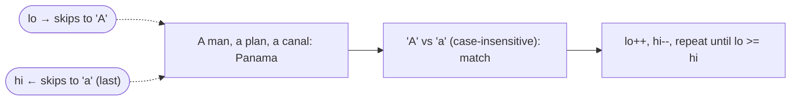

# Problem: Valid Palindrome

🔗 **[Try it on LeetCode](https://leetcode.com/problems/valid-palindrome/)**

## Problem Statement

Given a string `s`, determine if it is a palindrome after converting all
uppercase letters to lowercase and removing all non-alphanumeric characters.

Example: `"A man, a plan, a canal: Panama"` → `true`.

## Difficulty

Easy

## Technique

Two Pointers

## Problem Type

String

## Key Insight

You don't need to build a cleaned copy of the string first. Walk two pointers
inward from both ends, skipping non-alphanumeric characters as you go, and
compare characters directly.

## Visual Overview

`s = "A man, a plan, a canal: Panama"` — `lo` and `hi` converge inward,
skipping punctuation/spaces, comparing letters case-insensitively:

## How to Recognize This Pattern

- The question is about symmetry (palindrome, mirroring) — compare the
  string against a reversed version of itself.
- You're told to ignore certain characters — a sign you can filter "in line"
  with two pointers rather than pre-processing.

## Approach 1 — Brute Force

### Idea
Build a new string containing only lowercased alphanumeric characters, then
compare it to its reverse.

### Algorithm
1. Filter and lowercase `s` into `clean`.
2. Reverse `clean` into `rev`.
3. Return `clean == rev`.

### Complexity
Time: O(n)
Space: O(n) — extra strings

## Approach 2 — Optimized (Two Pointers)

### Idea
Use two pointers starting at both ends of the original string. Advance each
pointer past non-alphanumeric characters, then compare the characters
(case-insensitively). Stop early on a mismatch.

### Algorithm
1. `lo := 0`, `hi := len(s) - 1`.
2. While `lo < hi`:
   - Advance `lo` while `s[lo]` is not alphanumeric.
   - Retreat `hi` while `s[hi]` is not alphanumeric.
   - If `lo < hi` and `lower(s[lo]) != lower(s[hi])`, return `false`.
   - `lo++`, `hi--`.
3. Return `true`.

### Complexity
Time: O(n)
Space: O(1) extra (no copy of the string)

## Sample Solution

See [`solution.go`](./solution.go).

## Dry Run

`s = "A man, a plan, a canal: Panama"`

- `lo` skips to `'A'` (index 0), `hi` skips to `'a'` (last `a` in "Panama").
- Compare `'a' == 'a'` ✓ → move inward.
- Continue skipping spaces/commas/colons on both sides, comparing letters;
  every pair matches → return `true`.

## Edge Cases

- Empty string or string with no alphanumeric characters → palindrome
  (`true`) by definition (`lo` and `hi` cross without ever comparing).
- Single character → trivially `true`.
- Mixed case (`"Aa"`) → must compare case-insensitively.

## Common Mistakes

- Forgetting to lowercase before comparing.
- Using `unicode.IsLetter`/`IsDigit` inconsistently, or forgetting digits
  count as alphanumeric.
- Off-by-one: not re-checking `lo < hi` after skipping non-alphanumeric
  characters (both pointers could cross while skipping).

## Interview Follow-ups

- What if we could delete at most one character (Valid Palindrome II)? →
  Requires a helper that checks palindrome-ness of a subrange, tried twice
  (skip left char, skip right char) on first mismatch.
- What about Unicode / non-ASCII letters? → Use `unicode.IsLetter` and
  `unicode.IsDigit` plus `unicode.ToLower` instead of ASCII-only checks.

## Related Problems

- Valid Palindrome II (allow one deletion)
- Palindromic Substrings (different technique: expand-around-center)
