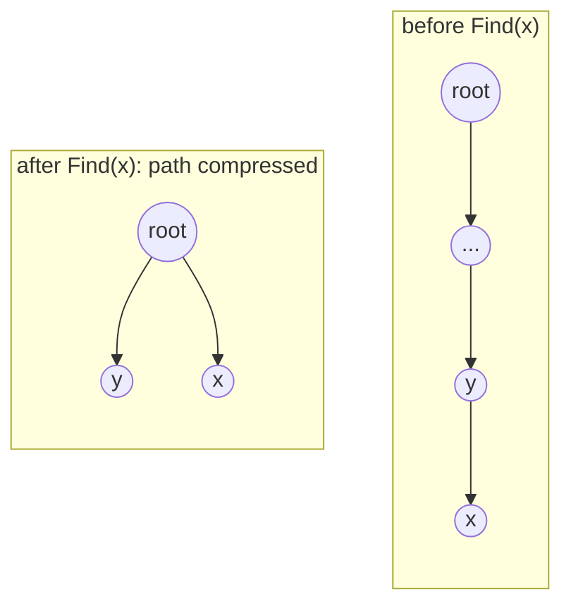
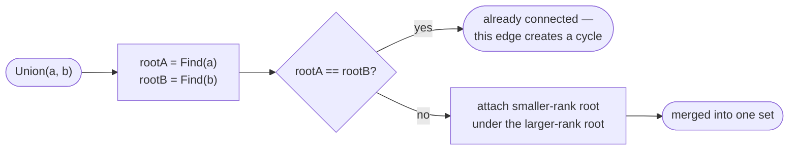

# Union-Find (Disjoint Set Union)

For the data structure itself — operations, complexity, and a full Go
reference implementation with path compression and union by rank — see
[`data-structures/disjoint-set-union.md`](../../data-structures/disjoint-set-union.md).
This section focuses on the *problem-solving pattern*: recognizing when
Union-Find is the right tool and how it's applied.

## Core Intuition

Union-Find answers one question extremely efficiently, repeatedly, as
connections are added over time: **"are these two elements in the same
group?"** Whenever a problem is fundamentally about grouping elements via
pairwise relationships that arrive incrementally (edges, equivalences,
merges), and you need to query or count groups *without* re-running a full
graph traversal from scratch after every addition, Union-Find is almost
always faster and simpler than repeated BFS/DFS.

## Recognition Patterns

- "Given a list of pairs that are connected/equivalent, group them" —
  Accounts Merge, Number of Provinces.
- "Detect the edge that creates a cycle" when building a graph
  incrementally — Redundant Connection.
- "Count connected components" as edges are added one at a time —
  static BFS/DFS would need to be rerun after every addition; Union-Find
  updates incrementally in near-O(1).
- Kruskal's MST algorithm uses Union-Find directly to skip edges that
  would form a cycle.

## Visual Overview

Path compression: after `Find(x)`, every node on the path points directly
to the root, so the *next* `Find` on any of them is O(1):





## Generic Template

See the full implementation in `data-structures/disjoint-set-union.md`.
The pattern for using it:

```go
dsu := NewDSU(n)
components := n
for _, edge := range edges {
    if dsu.Union(edge[0], edge[1]) {
        components-- // successfully merged two previously-separate groups
    }
    // if Union returns false, edge[0] and edge[1] were already connected
    // — this edge would create a cycle
}
```

## Variations

- **Cycle detection while building a graph** (Redundant Connection): the
  first edge whose `Union` call returns `false` is the one creating a
  cycle.
- **Counting/grouping** (Number of Provinces, Accounts Merge): track a
  running component count, decrementing on each successful union; or map
  each element to its root to reconstruct final groupings.
- **Kruskal's MST**: sort edges by weight, greedily union endpoints,
  skipping any edge that would connect an already-unified pair.

## Complexity

O(α(n)) amortized per `Find`/`Union` operation with both path compression
and union by rank/size — effectively constant for any practical `n` (α is
the inverse Ackermann function, which is ≤ 4 for `n` up to numbers far
larger than the observable universe's atom count).

## Common Mistakes

- Forgetting path compression and/or union by rank — without both,
  worst-case degrades to O(n) per operation on adversarial input (a long
  chain).
- Checking `Find(x) == Find(y)` and then separately calling `Union(x, y)`
  — wasteful; a well-written `Union` already returns whether a merge
  happened, avoiding a redundant `Find` pair.
- Using Union-Find for problems where the relationships are *removed*
  over time, not just added — Union-Find only supports efficient merging,
  not splitting, so a "remove an edge" requirement needs a different
  approach (often processing removals in reverse as additions).

## Interview Tips

- State explicitly why Union-Find is a better fit than re-running BFS/DFS
  here: the workload is incremental (edges arrive one at a time) and you
  need cheap connectivity queries between additions, not just one final
  answer.
- Mention path compression and union by rank as the two optimizations that
  get amortized-near-O(1) performance — a Union-Find without them is
  correct but not the intended complexity.

## Example

Redundant Connection: process edges in order, union-ing their endpoints;
the first edge whose endpoints are *already* connected before the union is
the one creating a cycle — return it immediately. See
[`problems/redundant-connection`](problems/redundant-connection/README.md).

## When to Use

- Dynamic connectivity: edges/relationships arrive incrementally and you
  need efficient "same group?" queries between arrivals.
- Cycle detection while incrementally building an undirected graph.
- As a subroutine in Kruskal's MST algorithm.

## When NOT to Use

- The graph is static and you only need connectivity information once —
  a single BFS/DFS pass is simpler and equally efficient.
- Relationships need to be *removed*, not just added (Union-Find has no
  efficient "split" operation).

## Quick Revision

- **What it answers**: "are x and y in the same group?" — efficiently,
  as groups merge incrementally over time.
- **Complexity**: O(α(n)) amortized per operation with path compression +
  union by rank.
- **Cycle detection**: `Union` returning `false` means the two nodes were
  already connected — the edge just processed creates a cycle.
- **Used in**: Kruskal's MST, dynamic connectivity, grouping-by-equivalence
  problems.
- **Representative problems**: Redundant Connection (cycle detection),
  Number of Provinces (component counting).
