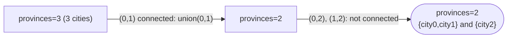

# Problem: Number of Provinces

🔗 **[Try it on LeetCode](https://leetcode.com/problems/number-of-provinces/)**

## Problem Statement

There are `n` cities. `isConnected` is an `n x n` matrix where
`isConnected[i][j] == 1` if city `i` and city `j` are directly connected,
and `0` otherwise (direct connections are given as an adjacency matrix,
not just a list of edges). A **province** is a group of directly or
indirectly connected cities. Return the total number of provinces.

## Difficulty

Medium

## Technique

Union-Find (Component Counting)

## Problem Type

Graph

## Key Insight

This is a connected-components counting problem. Union-Find tracks
components incrementally: start with `n` separate components (one per
city), and every successful `Union` (merging two previously-separate
components) decreases the component count by exactly one. After
processing every direct connection in the matrix, the running count is the
answer.

## Visual Overview

```
isConnected = [[1,1,0],
               [1,1,0],
               [0,0,1]]
```



## How to Recognize This Pattern

- "Count groups of directly/indirectly connected items" is a direct
  connected-components signal — solvable equally well with BFS/DFS (see
  `dsa/graphs/problems/number-of-islands` for the flood-fill approach) or
  Union-Find; Union-Find is often simpler when the input is naturally a
  list of pairwise connections (or, as here, an adjacency matrix) rather
  than an already-built adjacency-list graph.
- An adjacency **matrix** input (as opposed to an edge list) is a hint that
  either approach works, but Union-Find avoids explicitly building an
  adjacency list first.

## Approach 1 — Brute Force (BFS/DFS)

### Idea
Treat the matrix as an adjacency-matrix graph; run BFS/DFS from each
unvisited city, counting one province per run — structurally identical to
`dsa/graphs/problems/number-of-islands`.

### Algorithm
For each unvisited city, flood-fill via BFS/DFS over the matrix, marking
all reached cities visited; increment a counter per flood fill.

### Complexity
Time: O(n²) (scanning the full adjacency matrix)
Space: O(n) for visited tracking + recursion/queue

## Approach 2 — Optimized (Union-Find)

### Idea
Initialize a DSU with `n` components. For every pair `(i, j)` with
`isConnected[i][j] == 1` (and `i != j`), union them, decrementing the
component count on each successful merge. Return the final count.

### Algorithm
1. `dsu := NewDSU(n)`; `provinces := n`.
2. For `i` from `0` to `n-1`, for `j` from `i+1` to `n-1`:
   - If `isConnected[i][j] == 1` and `dsu.Union(i, j)` succeeds:
     `provinces--`.
3. Return `provinces`.

### Complexity
Time: O(n² · α(n)) ≈ O(n²) — dominated by scanning the matrix itself, which
is unavoidable given the input format
Space: O(n)

## Sample Solution

See [`solution.go`](./solution.go).

## Dry Run

```
isConnected = [[1,1,0],
               [1,1,0],
               [0,0,1]]
```

- `provinces = 3` initially.
- `(0,1)`: connected, `dsu.Union(0,1)` succeeds → `provinces = 2`.
- `(0,2)`: not connected, skip.
- `(1,2)`: not connected, skip.
- Final: `provinces = 2` (city 2 is its own province; cities 0 and 1 form
  the other).

## Edge Cases

- All cities isolated (identity matrix except the diagonal) → `provinces =
  n` (no unions ever succeed).
- All cities connected → `provinces = 1`.
- `n = 1` → trivially `1` province.

## Common Mistakes

- Iterating over the full matrix including `isConnected[i][i]`
  (self-connections, always `1` by definition) and accidentally unioning a
  node with itself — harmless since `Union` on the same root just returns
  `false`, but wasted work; skipping `i == j` is cleaner.
- Double-processing each pair by iterating the *full* matrix (`j` from `0`
  to `n-1` instead of `j` from `i+1`) — not incorrect (Union-Find handles
  redundant unions safely by returning `false`), but doubles unnecessary
  work; only the upper triangle needs to be checked since the matrix is
  symmetric.

## Interview Follow-ups

- What if the input were an edge list instead of an adjacency matrix? The
  Union-Find approach is unchanged; only the iteration over the input
  format differs.
- Return the actual groupings (which cities belong to which province), not
  just the count — map each city to its root and group by root.

## Related Problems

- Number of Islands (same connected-components idea, grid-based, solved
  with BFS/DFS)
- Redundant Connection (Union-Find for cycle detection instead of
  counting)
- Accounts Merge (Union-Find for equivalence-class grouping)
