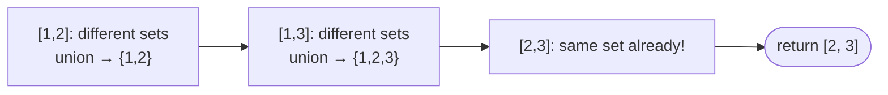

# Problem: Redundant Connection

## Problem Statement

A tree with `n` nodes originally had exactly `n-1` edges. One extra edge
was added, creating exactly one cycle. Given the list of `n` edges (as
`[u, v]` pairs, 1-indexed), find the edge that can be removed to restore a
tree — if multiple such edges exist, return the one that appears **last**
in the input.

## Difficulty

Medium

## Technique

Union-Find (Cycle Detection)

## Problem Type

Graph

## Key Insight

Process edges in the given order, union-ing their endpoints. Because a
tree has no cycles, the first edge whose two endpoints are **already**
connected (i.e., `Union` reports they were already in the same set) must
be the redundant one — it's the edge that closes the one cycle, and since
edges are processed in input order, the first such edge found is
automatically also the last one that would need to be removed among any
ties (there's only one cycle, so there's exactly one such edge here, but
the "process in order" framing generalizes correctly to the tie-breaking
requirement).

## Visual Overview

`edges = [[1,2],[1,3],[2,3]]` — the third edge connects two nodes
already in the same set:

## How to Recognize This Pattern

- "Find the edge that creates a cycle" while building a graph
  incrementally is close to a textbook Union-Find cycle-detection
  application.
- "Return the one that appears last" is a strong hint to process edges in
  their given order rather than sorting them first.

## Approach 1 — Brute Force

### Idea
For each edge, remove it, then check via BFS/DFS whether the remaining
graph is a valid tree (connected, `n-1` edges, no cycle).

### Algorithm
For each candidate edge, rebuild the graph without it and run a full
connectivity + cycle check.

### Complexity
Time: O(n²) (n candidate removals, each needing an O(n) check)
Space: O(n)

## Approach 2 — Optimized (Union-Find)

### Idea
Initialize a DSU over the `n` nodes. Process edges in order; for each
edge, attempt to union its endpoints. The first edge where the endpoints
are already in the same set is the answer — return it immediately.

### Algorithm
1. `dsu := NewDSU(n+1)` (1-indexed nodes).
2. For each edge `[u, v]` in order:
   - If `dsu.Find(u) == dsu.Find(v)`: return `[u, v]` (already connected —
     this edge creates the cycle).
   - Else: `dsu.Union(u, v)`.
3. (The problem guarantees exactly one such edge exists, so a return
   inside the loop always fires.)

### Complexity
Time: O(n · α(n)) ≈ O(n)
Space: O(n)

## Sample Solution

See [`solution.go`](./solution.go).

## Dry Run

`edges = [[1,2], [1,3], [2,3]]`

- `[1,2]`: different sets → union. `{1,2}, {3}`.
- `[1,3]`: different sets (`1`'s root ≠ `3`'s root) → union. `{1,2,3}`.
- `[2,3]`: same set already (`2` and `3` both root to the same tree) →
  return `[2, 3]`.

## Edge Cases

- The redundant edge is the very first one that would create a
  self-referential structure — still correctly detected as soon as its
  endpoints are found to already be connected.
- Multiple edges *could* be removed to fix connectivity in graphs with more
  than one extra edge — but this specific problem guarantees exactly one
  redundant edge, so the "first detected = the answer" logic holds exactly
  as specified.

## Common Mistakes

- Off-by-one on 1-indexed node labels (allocate the DSU with `n+1` slots,
  or remap to 0-indexed).
- Sorting edges before processing — this problem specifically requires
  processing in the *given* order, since the tie-breaking rule ("return
  the one that appears last" when multiple valid answers could exist in
  more general variants) depends on it.
- Forgetting path compression/union by rank, which would still be
  *correct* but not achieve the intended near-linear complexity.

## Interview Follow-ups

- Redundant Connection II: the graph is now **directed**, and a valid
  "rooted tree" has additional constraints (each node has at most one
  parent) — significantly more casework (a node with two parents, a cycle
  with no node having two parents, or both simultaneously).
- Given the redundant edge, reconstruct the original tree (trivial: just
  remove that edge).

## Related Problems

- Redundant Connection II (directed graph variant)
- Number of Provinces (component counting via Union-Find)
- Kruskal's MST algorithm (Union-Find as a cycle-avoidance subroutine)
