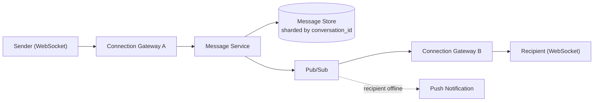

# Case Study: Chat System

## Requirements

### Functional Requirements

- One-on-one and group messaging.
- Message delivery status: sent, delivered, read.
- Online/offline presence indicators.
- Message history persisted and retrievable when a user reopens a
  conversation or comes back online.
- Push notifications for offline users.

### Non-Functional Requirements

- **Low latency** for message delivery (users expect near-real-time,
  typically well under a second for online recipients).
- **High availability**: a chat outage is highly visible and disruptive.
- **Ordering**: messages within a single conversation must be delivered in
  a consistent order to all participants.
- **At-least-once delivery** with client-side deduplication is generally
  preferred over risking dropped messages — most chat systems favor a
  duplicate message (rare, deduplicable) over a silently lost one.
- Eventual consistency is acceptable for presence status (a few seconds of
  staleness on "online" indicators is an acceptable trade-off), but message
  content/ordering within a conversation should not be lost or reordered.

## Visual Overview



The sender and recipient can be connected to **different** gateway
instances — that's exactly why pub/sub fan-out sits between the message
service and every gateway, instead of the gateway talking directly to
other gateways.

## Capacity Estimation

Assume 50 million daily active users, each sending an average of 40
messages/day, average message size 100 bytes:

- Total messages/day: `50,000,000 × 40 = 2` billion.
- Average write QPS: `2,000,000,000 / 86,400 ≈ 23,150` messages/sec; with a
  3x peak factor, ~70,000 peak messages/sec.
- Storage/day (message content only): `2,000,000,000 × 100 bytes = 200 GB/
  day`; over a year, ~73 TB before replication (~220 TB at 3x replication).
- Concurrent WebSocket connections at peak: a meaningful fraction of DAU
  online simultaneously — say 20% → 10 million concurrent connections,
  which by itself is a major driver of the connection-layer architecture
  below (a single machine can hold at most a few hundred thousand
  concurrent WebSocket connections, so this alone requires many
  connection-handling servers).

## API / Protocol Design

Chat is inherently a **push** use case (the server must notify a client of
a new message without the client asking), so the primary transport is
**WebSockets** (see `computer-science/networking/README.md`), not plain
REST — though REST/HTTP is still used for non-realtime operations:

```
WebSocket (persistent connection per online client):
  client -> server: { type: "send_message", conversationId, text, clientMsgId }
  server -> client: { type: "new_message", conversationId, messageId, senderId, text, timestamp }
  server -> client: { type: "delivery_ack", messageId, status: "delivered" | "read" }

REST (non-realtime operations):
  GET  /api/v1/conversations/{id}/messages?before={messageId}&limit=50   -- message history, paginated
  POST /api/v1/conversations                                             -- create a conversation
  GET  /api/v1/users/{id}/presence                                       -- (rarely polled directly; presence is normally pushed)
```

`clientMsgId` (a client-generated idempotency key) lets the client safely
retry a send without risking a duplicate message if the first attempt's
acknowledgment was lost — see `system-design/fundamentals/README.md` on
idempotency.

## High-Level Architecture

```
Client (WebSocket) -> Connection Gateway (stateful, holds open sockets)
                            |
                            v
                     Message Service  ---> Message Store (per-conversation, ordered)
                            |
                            v
                     Pub/Sub / Message Queue  ---> fans out to other Connection Gateway
                            |                       instances holding the recipient's socket
                            v
                     Push Notification Service (for offline recipients)

Presence Service (tracks online/offline, backed by a fast key-value store with short TTLs)
```

**Why a separate Connection Gateway layer**: WebSocket connections are
long-lived and stateful (which specific server instance holds a given
user's socket matters), which is fundamentally different from the
stateless request/response app servers used elsewhere in this repo's other
case studies. The gateway layer's only job is holding connections and
routing messages to/from them; the Message Service stays stateless and
horizontally scalable behind it.

## Data Model

```
messages
  message_id       UUID/Snowflake PRIMARY KEY  -- see note below on ID generation
  conversation_id  VARCHAR (partition/shard key)
  sender_id        VARCHAR
  content          TEXT
  created_at       TIMESTAMP
  status           ENUM(sent, delivered, read)

conversations
  conversation_id  VARCHAR PRIMARY KEY
  participant_ids  ARRAY<VARCHAR>
  last_message_at  TIMESTAMP  -- for sorting a user's conversation list

presence
  user_id          VARCHAR PRIMARY KEY
  status           ENUM(online, offline)
  last_seen_at     TIMESTAMP
  gateway_node_id  VARCHAR  -- which Connection Gateway instance holds this user's socket, if online
```

Message IDs should be **time-sortable** (e.g., Snowflake-style IDs or
ULIDs) rather than random UUIDs, so that ordering within a conversation is
implicit in the ID itself and doesn't require a separate sequence number
service — directly supporting the ordering requirement above.

## Core Components

### Connection Gateway

Holds the actual WebSocket connections and maintains a mapping of
`userID -> gateway instance` (in the `presence` store above) so other
services know which gateway instance to route a message through to reach a
specific online user.

### Message Service

Stateless; receives a "send message" request, persists it to the message
store (ordered by conversation), publishes it to a pub/sub topic keyed by
recipient(s), and returns an acknowledgment to the sender.

### Pub/Sub Fan-Out

When a message is published, the pub/sub layer delivers it to whichever
Connection Gateway instance(s) currently hold sockets for the recipient(s)
— necessary because the sender and recipient may be connected to
*different* gateway instances behind the load balancer.

### Presence Service

Tracks online/offline status with a short TTL (a client sends periodic
heartbeats; if none arrive within the TTL window, the user is marked
offline). Eventual consistency here is an accepted trade-off (see Non-
Functional Requirements) in exchange for a much simpler, high-throughput
implementation than trying to keep presence strongly consistent.

## Data Flow

**Sending a message (recipient online)**: client sends over its WebSocket
→ Connection Gateway forwards to Message Service → persisted to the
message store → published to pub/sub → routed to the recipient's
Connection Gateway instance → pushed to the recipient's socket → delivery
acknowledgment flows back to the sender.

**Sending a message (recipient offline)**: same until the pub/sub fan-out
step — since no Connection Gateway holds an active socket for the
recipient, the message is still persisted (so it's available on next
login) and a push notification is triggered instead of a live delivery.

## Scaling Strategy

- **Connection Gateway**: scales horizontally by adding instances behind a
  load balancer with **sticky sessions** (or a routing layer aware of
  which instance holds which user's socket) — a client's WebSocket must
  stay connected to the same instance for the connection's lifetime.
- **Message store**: shard by `conversation_id` — all messages for a given
  conversation land on one shard, keeping per-conversation ordering
  trivial (no cross-shard coordination needed for a single conversation's
  message order) while distributing overall load across shards.
- **Pub/Sub**: partition by recipient/conversation to distribute fan-out
  load, similar to the message store's sharding.

## Failure Scenarios

- **A Connection Gateway instance crashes**: every user connected to it
  loses their WebSocket and must reconnect (typically automatic on the
  client side) to a different instance; the presence store's
  `gateway_node_id` for those users must be updated (or expire via TTL and
  be re-established on reconnect) so future messages route correctly.
- **Message store shard failure**: replicate each shard (as in the other
  case studies) so a single node failure doesn't lose message history for
  the conversations on that shard.
- **Pub/Sub delivery failure**: since delivery isn't guaranteed exactly
  once, the client-side `clientMsgId` deduplication (mentioned in API
  Design) is what makes at-least-once delivery safe to rely on.

## Bottlenecks

- Connection Gateway capacity (concurrent WebSocket connections per
  instance) is often the binding constraint at very large scale, more so
  than message throughput itself — sizing this layer correctly (per the
  10 million concurrent connection estimate above) is usually the first
  thing to get right.
- A single very active group conversation (many participants, high message
  rate) can create a hot shard if sharded purely by `conversation_id` —
  worth flagging as a known limitation with a possible secondary
  partitioning strategy for exceptionally large groups.

## Trade-offs

- **WebSockets vs. long polling**: WebSockets give lower latency and less
  overhead per message but require a stateful connection layer; long
  polling is simpler to scale (stateless) but adds latency and repeated
  connection overhead — most modern chat systems choose WebSockets despite
  the added operational complexity, given the latency requirement.
- **At-least-once + client dedup vs. exactly-once**: exactly-once delivery
  across a distributed system is expensive to guarantee; at-least-once
  with idempotency keys is simpler and sufficient for chat, where an
  occasional duplicate is easy for the client to filter but a lost message
  is not acceptable.
- **Eventually consistent presence**: chosen deliberately over strongly
  consistent presence, since a few seconds of staleness on "online" status
  is imperceptible to users but strong consistency there would add
  unjustified coordination overhead.

## Possible Improvements

- End-to-end encryption (changes where message content can be
  inspected/searched — a significant architectural implication worth
  raising even if not implemented).
- Typing indicators and read receipts as additional lightweight real-time
  events over the same WebSocket channel.
- Message search (would need a separate search index, since the primary
  message store is optimized for ordered retrieval by conversation, not
  full-text search).

## Interview Discussion Points

- Why does this system need a stateful Connection Gateway layer, unlike
  the URL Shortener or Rate Limiter case studies' fully stateless app
  servers?
- How does sharding the message store by `conversation_id` keep
  per-conversation ordering simple, and what's the trade-off (potential
  hot shards for very large groups)?
- Walk through what happens end-to-end when the sender and recipient are
  connected to two different Connection Gateway instances.
- Why is at-least-once delivery with client-side deduplication preferred
  over trying to guarantee exactly-once delivery?
