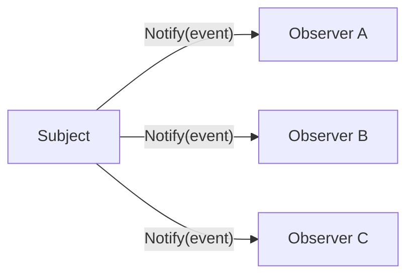
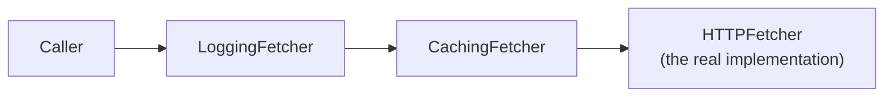

# Design Patterns

Structure, motivation, and a minimal idiomatic Go example for each pattern
covered so far. See `PROGRESS.md` for patterns still planned (Abstract
Factory, Facade, Proxy, Command, State, Template Method, Chain of
Responsibility).

Note: several classical GoF patterns exist specifically to work around the
lack of first-class functions/interfaces in older OO languages. Go's
first-class functions and structural interfaces make some of them (e.g.,
Strategy) almost trivial to express — worth mentioning explicitly in an
interview to show you understand the pattern's *purpose*, not just its
textbook structure.

## Visual Overview

**Observer** — the subject holds a list of observers and calls each on a
state change, without knowing their concrete types:



**Decorator** — each layer wraps the same interface, adding behavior
before/after delegating inward:



## Singleton

**Problem it solves**: ensure a type has exactly one instance, with a
global access point to it (e.g., a single shared configuration object or
connection pool).

**Structure**: a private constructor (or, in Go, an unexported
constructor) plus lazy or eager initialization guarded against concurrent
access.

**When to use**: truly global, expensive-to-create, stateless-or-carefully-
synchronized resources (a connection pool, a logger).

**When not to use**: as a substitute for proper dependency injection —
singletons introduce hidden global state, making code harder to test
(can't easily substitute a fake) and reason about. Prefer passing a shared
instance explicitly via dependency injection where practical.

**Go example** (`sync.Once` guarantees the initializer runs exactly once,
safely across concurrent callers):

```go
type Config struct{ Value string }

var (
    instance *Config
    once     sync.Once
)

func GetConfig() *Config {
    once.Do(func() {
        instance = &Config{Value: "loaded"}
    })
    return instance
}
```

**Trade-offs**: simple, but global mutable state complicates testing and
concurrent reasoning; prefer explicit DI unless the global-access property
is actually required.

**Interview question**: how would you make a singleton's initialization
thread-safe without `sync.Once`? (Double-checked locking with a mutex —
and explain why the naive non-locked lazy-init version is a data race.)

## Factory (Factory Method / Simple Factory)

**Problem it solves**: decouple object creation from the code that uses the
object, so the creation logic (which concrete type to build) can vary
independently of the calling code.

**Structure**: a function or method that returns an interface type, hiding
which concrete struct it actually constructs.

**When to use**: the concrete type to create depends on runtime input, or
you want calling code to depend only on an interface, not a concrete
constructor.

**When not to use**: when there's only ever one concrete implementation —
a plain constructor function is simpler and just as flexible in Go, since
callers can still depend on an interface if needed later.

**Go example**:

```go
type Notifier interface{ Send(msg string) error }

type EmailNotifier struct{}
func (EmailNotifier) Send(msg string) error { /* ... */ return nil }

type SMSNotifier struct{}
func (SMSNotifier) Send(msg string) error { /* ... */ return nil }

func NewNotifier(kind string) (Notifier, error) {
    switch kind {
    case "email":
        return EmailNotifier{}, nil
    case "sms":
        return SMSNotifier{}, nil
    default:
        return nil, fmt.Errorf("unknown notifier kind: %s", kind)
    }
}
```

**Trade-offs**: adds a layer of indirection — justified once there are
multiple implementations or the choice is runtime-driven; unnecessary
otherwise (see Open/Closed and YAGNI in `computer-science/oop`).

**Interview question**: how does this differ from Abstract Factory?
(Abstract Factory produces *families* of related objects through a shared
interface; Factory Method produces one product, typically via a single
method.)

## Builder

**Problem it solves**: construct a complex object step by step, especially
one with many optional parameters — avoids a constructor with a long list
of positional arguments (a "telescoping constructor") where most calls only
need to set a few of them.

**Structure**: a separate builder type accumulates configuration via
chained method calls, then a final `Build()` method produces the
fully-constructed object, validating required fields at that point.

**When to use**: an object has many optional configuration fields, or
construction requires several steps that benefit from being named/ordered
explicitly (readability) rather than a single large struct literal.

**When not to use**: a plain struct literal (Go's field-name struct
literals already solve most of "avoid positional-argument confusion") is
enough — don't add a builder for a handful of fields with no validation or
step-ordering requirements.

**Go example** (Go's named struct-literal fields already cover simple
cases; a builder earns its place when construction needs validation or
staged steps):

```go
type ServerConfig struct {
    Host    string
    Port    int
    Timeout time.Duration
    TLS     bool
}

type ServerConfigBuilder struct {
    cfg ServerConfig
}

func NewServerConfigBuilder() *ServerConfigBuilder {
    return &ServerConfigBuilder{cfg: ServerConfig{Port: 8080, Timeout: 30 * time.Second}}
}

func (b *ServerConfigBuilder) Host(h string) *ServerConfigBuilder { b.cfg.Host = h; return b }
func (b *ServerConfigBuilder) Port(p int) *ServerConfigBuilder    { b.cfg.Port = p; return b }
func (b *ServerConfigBuilder) TLS(enabled bool) *ServerConfigBuilder {
    b.cfg.TLS = enabled
    return b
}

func (b *ServerConfigBuilder) Build() (ServerConfig, error) {
    if b.cfg.Host == "" {
        return ServerConfig{}, fmt.Errorf("host is required")
    }
    return b.cfg, nil
}

// Usage: cfg, err := NewServerConfigBuilder().Host("api.example.com").TLS(true).Build()
```

**Trade-offs**: readable, chainable construction with validation at a
single point, at the cost of extra boilerplate — often unnecessary in Go
where named struct-literal fields (`ServerConfig{Host: "x", TLS: true}`)
already solve the "which argument is which" problem that Builder solves in
languages without named arguments.

**Interview question**: why is Builder less commonly needed in Go than in
Java, where it's ubiquitous? (Go's struct literals already support named
fields with defaults via zero values, covering most of what Builder solves
in languages that only have positional constructor arguments — Builder in
Go earns its place mainly when there's real validation or staged/ordered
construction logic, not just "many optional fields.")

## Strategy

**Problem it solves**: select an algorithm's behavior at runtime, without
the caller needing to know which concrete algorithm is in use.

**Structure**: an interface representing "the algorithm," with multiple
implementations swappable via composition (a field of that interface
type).

**When to use**: multiple interchangeable algorithms/behaviors for the same
task (sorting comparators, pricing rules, compression algorithms).

**When not to use**: only one algorithm will ever be needed — a plain
function suffices without the interface indirection.

**Go example** (this pattern is nearly free in Go — a function value or a
one-method interface *is* a strategy):

```go
type DiscountStrategy func(price float64) float64

func NoDiscount(price float64) float64      { return price }
func TenPercentOff(price float64) float64   { return price * 0.9 }

func Checkout(price float64, discount DiscountStrategy) float64 {
    return discount(price)
}

// Usage: Checkout(100, TenPercentOff)
```

**Trade-offs**: extremely lightweight in Go via function values; use an
interface instead of a bare function type when the strategy needs
additional state or multiple methods.

**Interview question**: why is Strategy often implemented as a plain
function type in Go instead of a single-method interface? (Because Go has
first-class functions — a function type already satisfies the "swappable
behavior" need without declaring an interface at all, though an interface
is still useful if implementations need to carry their own state.)

## Observer

**Problem it solves**: notify multiple dependent objects automatically
when a subject's state changes, without the subject needing to know
concrete details about its observers.

**Structure**: a subject maintains a list of observer interfaces and calls
a notification method on each when relevant state changes.

**When to use**: event-driven systems — UI event handling, pub/sub within
a single process, cache invalidation triggers.

**When not to use**: cross-process/distributed notification — use a real
message queue or pub/sub system (see `system-design/fundamentals`) instead
of hand-rolling an in-process Observer across process boundaries.

**Go example**:

```go
type Observer interface{ Notify(event string) }

type Subject struct {
    observers []Observer
}

func (s *Subject) Subscribe(o Observer) {
    s.observers = append(s.observers, o)
}

func (s *Subject) Publish(event string) {
    for _, o := range s.observers {
        o.Notify(event)
    }
}

type LoggingObserver struct{}
func (LoggingObserver) Notify(event string) { fmt.Println("log:", event) }
```

**Trade-offs**: decouples subject from observers, but synchronous
notification means a slow observer blocks the subject (or all other
observers) — consider notifying via goroutines/channels if that's a
concern, with appropriate synchronization.

**Interview question**: how would you make `Publish` non-blocking with
respect to slow observers? (Dispatch each `Notify` call in its own
goroutine, or push events onto a channel each observer consumes
independently — discuss the trade-off of losing delivery-order guarantees.)

## Decorator

**Problem it solves**: add behavior to an individual object dynamically,
without affecting other instances of the same type or requiring
subclassing (which Go doesn't have anyway) for every combination of
behaviors.

**Structure**: a decorator implements the same interface as the object it
wraps, adding behavior before/after delegating to the wrapped instance —
decorators can be nested/composed.

**When to use**: cross-cutting concerns layered onto a core behavior
(logging, caching, retries, metrics) that you want to combine flexibly.

**When not to use**: the added behavior is intrinsic to the type itself,
not an optional cross-cutting layer — just put it directly in the type.

**Go example**:

```go
type Fetcher interface{ Fetch(url string) (string, error) }

type HTTPFetcher struct{}
func (HTTPFetcher) Fetch(url string) (string, error) { /* real HTTP call */ return "", nil }

// LoggingFetcher decorates a Fetcher with logging.
type LoggingFetcher struct{ Wrapped Fetcher }
func (f LoggingFetcher) Fetch(url string) (string, error) {
    log.Println("fetching", url)
    return f.Wrapped.Fetch(url)
}

// Usage: composing decorators
fetcher := LoggingFetcher{Wrapped: HTTPFetcher{}}
```

**Trade-offs**: composable and open/closed-friendly, but deeply nested
decorators can make debugging/stack traces harder to follow.

**Interview question**: how is Decorator different from just embedding a
struct? (Embedding is static — fixed at compile time in the struct
definition. Decorator composes interface *values* at runtime, so which
decorators wrap an object — and in what order — can be decided
dynamically.)

## Adapter

**Problem it solves**: make an existing type usable where a different
interface is expected, without modifying the existing type — typically
because you don't own it (a third-party library, generated code) or don't
want to change its existing callers.

**Structure**: a wrapper type implements the target interface and
translates calls into the wrapped type's actual method signatures.

**When to use**: integrating a third-party type (or legacy code) with an
interface your code already depends on, where changing either side isn't
practical.

**When not to use**: you control both sides and could simply make the
existing type implement the interface directly — an adapter adds an
unnecessary layer of indirection when a direct implementation would do.

**Go example**:

```go
// Target interface your code depends on.
type Logger interface{ Log(msg string) }

// ThirdPartyLogger has an incompatible method signature/name — imagine
// this type comes from an external package you can't modify.
type ThirdPartyLogger struct{}
func (ThirdPartyLogger) WriteEntry(level, msg string) { /* ... */ }

// LoggerAdapter adapts ThirdPartyLogger to the Logger interface.
type LoggerAdapter struct{ Wrapped ThirdPartyLogger }
func (a LoggerAdapter) Log(msg string) { a.Wrapped.WriteEntry("INFO", msg) }

// Usage: var logger Logger = LoggerAdapter{Wrapped: ThirdPartyLogger{}}
```

**Trade-offs**: lets incompatible interfaces work together without
modifying either side, at the cost of an extra indirection layer — fine
when you don't own one side, wasteful when you do.

**Interview question**: how is Adapter different from Decorator, given
both "wrap another type"? (Adapter changes the *interface* — the wrapped
type didn't originally satisfy what's needed. Decorator keeps the *same*
interface on both sides and adds behavior around it. Adapter answers "how
do I make this fit?"; Decorator answers "how do I add to this?")

## Quick Revision

- **Singleton**: one instance, global access — `sync.Once`; prefer DI when
  possible.
- **Factory**: hide concrete-type selection behind a function/interface
  return type.
- **Builder**: step-by-step construction with validation — often
  unnecessary in Go given named struct-literal fields, unless real
  validation/staged construction is involved.
- **Strategy**: swappable algorithm — often just a function value in Go.
- **Observer**: subject notifies a list of observer interfaces on state
  change — watch for blocking/slow observers.
- **Decorator**: wrap the same interface to layer behavior (logging,
  caching) composably, without subclassing.
- **Adapter**: wrap a type to satisfy a *different* interface than it
  natively implements — for integrating code you don't own.
