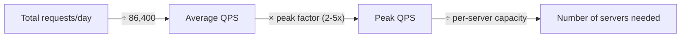

# Back-of-the-Envelope Estimation Cheatsheet

Goal: get within an order of magnitude quickly, state assumptions
explicitly, and show the arithmetic — precision matters less than
demonstrating you can reason about scale.

## Useful Reference Numbers

| Quantity | Approximate value |
|---|---|
| 1 day | ~86,400 seconds (~100,000 for quick mental math) |
| 1 month | ~2.6 million seconds (~30 days) |
| 1 year | ~31.5 million seconds |
| L1 cache reference | ~1 ns |
| Main memory reference | ~100 ns |
| SSD random read | ~100 µs (0.1 ms) |
| Round trip within same datacenter | ~0.5 ms |
| Round trip, cross-region | ~50–150 ms |
| Reading 1 MB sequentially from memory | ~µs range |
| Reading 1 MB sequentially from SSD | ~1 ms |
| Reading 1 MB over a 1 Gbps network | ~10 ms |

(Exact values drift with hardware generation — the point is the *relative*
order of magnitude: memory ≪ SSD ≪ network, each roughly 100-1000x apart.)

## Visual Overview



## Requests Per Second (QPS)

```
QPS = total requests per day / 86,400
Peak QPS ≈ average QPS × peak factor (commonly 2-5x for typical traffic patterns)
```

Example: 100 million requests/day → average QPS ≈ 100,000,000 / 86,400 ≈
1,160 QPS. With a 3x peak factor, peak QPS ≈ 3,500.

## Storage Estimation

```
Total storage = number of items × average size per item × replication factor
```

Example: 500 million users, each with a 1 KB profile, replicated 3x:
`500,000,000 × 1 KB × 3 ≈ 1.5 TB`.

Always account for:
- **Replication factor** (durability/availability — commonly 3x).
- **Metadata overhead** (indexes, timestamps) — a rough +10-30% buffer is a
  reasonable starting assumption.
- **Growth over time** — multiply by expected growth rate over the
  planning horizon (e.g., 1 year, 5 years).

## Bandwidth

```
Bandwidth = QPS × average request/response size
```

Example: 5,000 QPS, 100 KB average response size: `5,000 × 100 KB = 500
MB/s` — compare against a single machine's NIC capacity (e.g., 1 Gbps ≈
125 MB/s) to see how many machines/load balancers are needed just for
bandwidth, independent of CPU.

## Memory / Cache Sizing

```
Cache size = hot data set size (working set), not total data size
```

Rule of thumb: cache the "hot" fraction of data that accounts for most
traffic (often following a power-law/Pareto distribution — e.g., 20% of
items may account for 80% of reads). Estimate hot-set size, not total
dataset size, when sizing a cache — caching everything is usually
unnecessary and uneconomical.

## Number of Servers

```
Number of servers ≈ peak QPS / QPS a single server can handle
```

A single server's capacity depends heavily on what the request does
(a cached key lookup vs. a heavy DB join vs. video transcoding) — state
your assumption explicitly (e.g., "assuming 1,000 QPS per application
server for this workload") rather than presenting a bare number.

## Data Growth

```
Data after N years = current data × (1 + growth rate)^N
```

Example: 10 TB today, growing 50%/year, after 3 years:
`10 TB × 1.5³ ≈ 33.75 TB`.

## Replication Overhead

Replication factor `R` multiplies both storage and (for synchronous
replication) write latency/bandwidth by roughly `R`. A common trade-off:
higher `R` improves durability/availability but increases storage cost and
write coordination overhead (especially for strongly consistent
replication requiring acknowledgment from a quorum of replicas).

## Worked Example: URL Shortener Capacity

Assume: 100 million new URLs/month, 10:1 read:write ratio, URLs stored for
5 years, each record ~500 bytes.

- Write QPS: `100,000,000 / (30 × 86,400) ≈ 39` writes/sec average.
- Read QPS: `39 × 10 ≈ 390` reads/sec average (multiply by a peak factor,
  e.g., 3x, for capacity planning: ~1,170 peak reads/sec).
- Total URLs after 5 years: `100,000,000 × 12 × 5 = 6` billion.
- Storage: `6,000,000,000 × 500 bytes ≈ 3 TB` (before replication);
  `≈ 9 TB` with a 3x replication factor.

## Quick Revision

- **QPS**: total/day ÷ 86,400 for average; multiply by a peak factor (2-5x)
  for capacity planning.
- **Storage**: items × size × replication factor, plus a metadata buffer
  and growth projection.
- **Bandwidth**: QPS × average payload size; compare against per-machine
  NIC limits.
- **Cache size**: size for the hot working set, not the full dataset.
- **Servers**: peak QPS ÷ per-server capacity, with the per-server number
  stated as an explicit assumption.
- **Always state assumptions out loud** — the interviewer is grading your
  reasoning process, not the exact final number.
