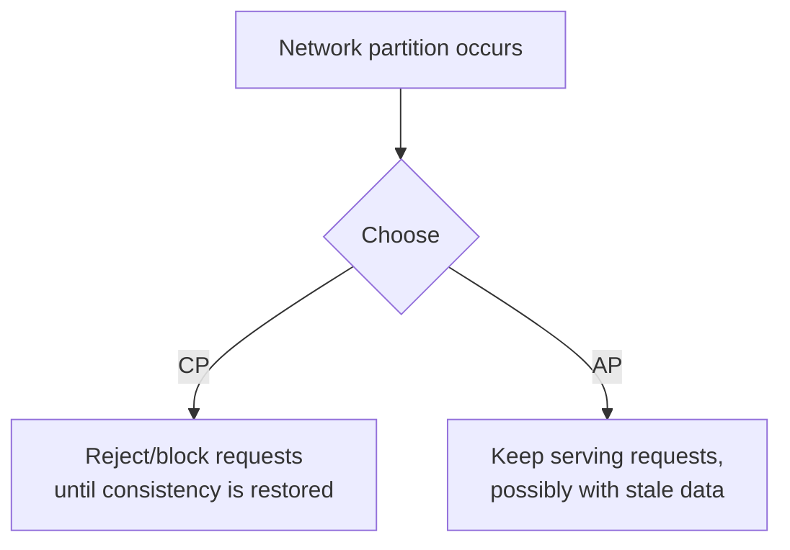
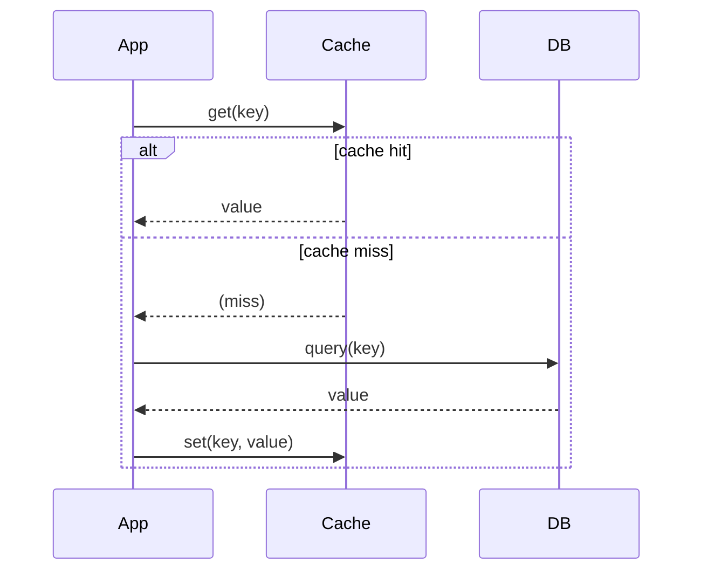

# System Design Fundamentals

## Scalability

The ability of a system to handle increased load by adding resources.
**Vertical scaling** (bigger machines) is simple but hits a hard ceiling
and doesn't improve availability. **Horizontal scaling** (more machines)
has no hard ceiling and improves availability, but requires the system to
be designed for it (statelessness, data partitioning, coordination).

## Availability vs. Reliability

**Availability**: the fraction of time a system is operational and able to
serve requests (often expressed as "nines" — 99.9% = ~8.7 hours downtime/
year, 99.99% = ~52 minutes/year). **Reliability**: the probability a system
performs *correctly* over a given time period — a system can be available
(responding) while being unreliable (returning wrong answers).

## CAP Theorem

In the presence of a network **P**artition, a distributed system must
choose between **C**onsistency (every read sees the latest write) and
**A**vailability (every request gets a response, possibly stale). You
cannot have all three of C, A, and P simultaneously when a partition
occurs — but partitions are a fact of distributed systems, so in practice
you're choosing **CP** or **AP** for how the system behaves *during a
partition* (outside of a partition, you can have both C and A).

- **CP example**: a system that returns an error rather than stale data
  during a partition (e.g., systems built on ZooKeeper/etcd for
  configuration/leader election).
- **AP example**: a system that keeps serving requests with possibly stale
  data during a partition, reconciling later (e.g., DNS, many NoSQL stores
  configured for high availability).

## Visual Overview

**CAP**, during a network partition — you can keep responding
(Availability) or refuse to risk a stale answer (Consistency), not both:

**Cache-aside**, the default read pattern:

## Consistency Models

- **Strong consistency**: all reads reflect the latest write immediately.
- **Eventual consistency**: reads may return stale data temporarily, but
  will converge to the latest value if no new writes occur.
- **Read-your-writes**: a specific weaker guarantee often sufficient in
  practice — a user always sees their own writes, even if other users see
  them with delay.

## Latency vs. Throughput

**Latency**: time to complete a single request. **Throughput**: requests
processed per unit time. They're related but distinct — you can improve
throughput (e.g., batching, more parallel workers) while making individual
latency worse (waiting to fill a batch), and vice versa. Always clarify
which one a requirement is actually about ("fast" is ambiguous).

## Load Balancing

Distributes requests across multiple backend instances. See
`computer-science/networking/README.md` for L4 vs. L7 and algorithms
(round robin, least connections, IP hash / consistent hashing for session
affinity or cache locality).

## Caching

Store frequently accessed data in a faster-access layer to reduce load on
the primary data store and reduce latency.

- **Cache-aside (lazy loading)**: application checks cache first; on a
  miss, reads from the DB and populates the cache. Simple, but the first
  request after a miss pays full latency, and stale reads are possible
  until TTL expiry or explicit invalidation.
- **Write-through**: writes go to the cache and the DB together (or cache
  writes through to DB) — keeps cache consistent, at the cost of write
  latency.
- **Write-back**: writes go to the cache first and are asynchronously
  flushed to the DB — fast writes, but risk of data loss if the cache
  fails before flushing.
- **Eviction policies**: LRU is the most common default (see
  `data-structures/heap.md` / `data-structures/linked-list.md` for the
  hash map + doubly linked list implementation).
- **Cache invalidation**: "there are only two hard things in computer
  science: cache invalidation and naming things" — decide up front whether
  staleness (TTL-based expiry) or complexity (explicit invalidation on
  write) is the better trade for your use case.

## Databases (Design-Level Choices)

- **SQL (relational)**: strong consistency, joins, transactions — good fit
  when data is structured and relationships/integrity matter.
- **NoSQL**: several sub-categories chosen for specific access patterns —
  key-value (simple, fast lookups), document (flexible schema, nested
  data), column-family (wide-column, huge scale, e.g., Cassandra),
  graph (relationship-heavy queries).
- Choice depends on: consistency needs, query patterns (point lookups vs.
  complex joins vs. range scans), scale, and schema flexibility needs.

## Message Queues & Pub/Sub

**Queue** (e.g., SQS, RabbitMQ): each message is typically consumed by
exactly one consumer — used for decoupling producers/consumers and
smoothing load spikes (a burst of writes queues up instead of overwhelming
downstream services). **Pub/Sub** (e.g., Kafka, SNS): each message can be
delivered to multiple independent subscribers — used for fan-out and event
streaming/broadcasting.

## Replication

Copying data across multiple nodes for availability and read scaling. See
`computer-science/databases/README.md` for leader-follower vs. multi-leader
trade-offs.

## Sharding

Horizontal partitioning of data across nodes by a shard key, needed once a
single node can't hold or serve the full dataset. Key design decision: the
shard key must distribute load evenly (avoid hot spots) and align with the
most common query patterns (queries that must span shards are much more
expensive).

## Rate Limiting

Controls how many requests a client can make in a time window, protecting a
system from overload and enforcing fair usage. Common algorithms: token
bucket, leaky bucket, fixed window counter, sliding window log/counter —
see `system-design/case-studies/rate-limiter.md` for a full design.

## Distributed Locks

Coordinate exclusive access to a resource across multiple machines (as
opposed to a single-process mutex). Typically built on a strongly
consistent store (e.g., using Redis with the Redlock algorithm, or
ZooKeeper/etcd, which are designed for exactly this). Key risks: lock
expiry racing with the holder still working (mitigate with fencing tokens),
and clock drift across nodes.

## Idempotency

An operation is idempotent if performing it multiple times has the same
effect as performing it once. Critical for retry-safe APIs in distributed
systems (a client can't always tell if a request failed before or after
the server processed it, so it must be safe to retry) — typically achieved
with a client-supplied idempotency key that the server deduplicates
against.

## Observability

- **Logging**: discrete events, useful for debugging specific incidents.
- **Metrics**: aggregated numeric time series (request rate, error rate,
  latency percentiles) — useful for dashboards, alerting, trend detection.
- **Tracing**: follows a single request's path across multiple services in
  a distributed system, useful for diagnosing where latency/errors
  originate in a multi-hop call chain.

## Quick Revision

- **CAP**: during a partition, choose Consistency or Availability — not
  both.
- **Caching**: cache-aside is the default; know eviction (LRU) and
  invalidation trade-offs.
- **Replication**: read scaling + availability. **Sharding**: write/storage
  scaling, adds cross-shard complexity.
- **Queue vs. Pub/Sub**: one consumer per message vs. fan-out to many
  subscribers.
- **Idempotency**: essential for safe retries in a distributed system.
- **Observability**: logs (specific events) → metrics (aggregated trends)
  → traces (cross-service request path).

See also `system-design/estimation/estimation-cheatsheet.md` for
back-of-the-envelope math, and `system-design/case-studies/` for full
worked designs.
